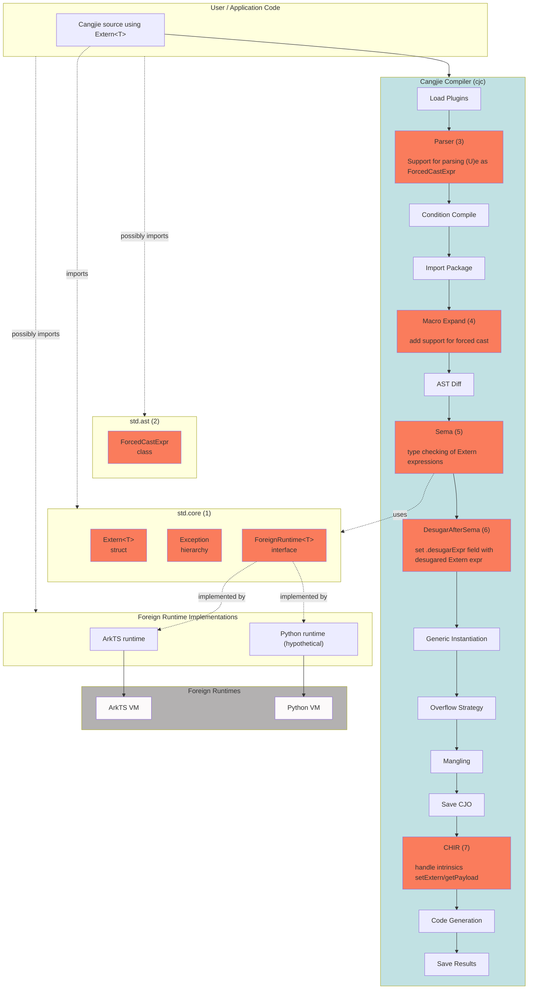

# Architecture/Feature Design Document: Cangjie `Extern<T>` Type

**Feature:** Language-level dynamic interoperability via `Extern<T>` and `ForeignRuntime<T>`
**Proposal:** [The Cangjie Extern type](https://wiki.huawei.com/domains/4014/wiki/11230/WIKI2026040810696277)
**Implementation MR:** [cangjie_compiler#1871 — feat: extern runtime](https://gitcode.com/Cangjie/cangjie_compiler/merge_requests/1871)
**SDK branch:** [CJPLUK/cangjie_sdk — feature_extern_runtime](https://github.com/CJPLUK/cangjie_sdk/tree/feature_extern_runtime) (cangjie_compiler, cangjie_runtime, cangjie_test, and cangjie_tools git submodules at matching commits)

---

# Changes/fixes since last architecture meeting (16/07/2026)


<details>
<summary> 1. Be more precise about implementation: diagram should mention all compilation stages. </summary>

<br/>

Fixed the diagram and added more details in [Feature Impact Analysis](#feature-impact-analysis)

<br/>
<br/>

</details>

<details>
<summary> 2. Implicit conversion to Extern </summary>

<br/>

Make it explicit what we mean by "is in a context where an expression of type Extern<T> is expected".

Made it clear in [Implicit conversion to Extern](#implicit-conversion-to-externt).

1. right-hand side of variable declaration
2. right-hand side of assignment
3. argument for function-like calls
4. argument to return
5. last expression of body of function

<br/>
<br/>

</details>

<details>

<summary> 3. Check if multiple assignment is compatible with Extern desugaring </summary>

<br/>

Yes, it does. it is now mentioned in [Multiple Assignment Expression](#multiple-assignment-expression).

<br/>
<br/>

</details>

<details>
<summary> 4. How to handle compound assignment? </summary>

<br/>

Desugaring proposal in [Compound Assignment](#compound-assignment).

</details>


<details>
<summary> 5. Forced cast: namespace for types is the same as namespace for expressions </summary>

<br/>


`If U is both an expression and a type (because U could be an identifier, and both the name of a type and a variable/function declaration) then (U)(e) is a function application`

is not allowed. Type and expression identifiers share the same namespace.

It's always known if an identifier refers to a `type` or `expression`. Fixed in [Support for forced cast `(U)e`.](#support-for-forced-cast-ue)

<br/>
<br/>

</details>

<details>

<summary> 6. Is forced cast compatible with a possible proposal for generic forced cast? </summary>

<br/>

We don't expect any issues if the desugaring is as below.

<br/>

For a type `U` and an expression `exp`, `(U)exp` is desugared as

1. `T.fromExtern<U>(exp)`, if `exp: Extern<T>` for any `T <: ForeignRuntime`
2. `(exp as U).getOrThrow()`, otherwise

<br/>
<br/>

</details>

<details>
<summary> 7. Use intrinsics in Extern methods instead of compiler hacks </summary>

<br/>

Call intrinsic functions in the body of the constructor and `getPayload` instead of having the compiler handling them as a special case. Also specify explicitly that `getPayload(Extern<T>(x)) = x`.

Fixed. See [`Extern<T>` struct](#externt-struct).

<br/>
<br/>

</details>

<details>
<summary> 8. Rename Exception</summary>

<br/>

MemberAccessException -> ExternMemberAccessException	
FunctionAccessException	-> ExternFunctionAccessException
FunctionCallException -> ExternFunctionCallException
IndexAccessException -> ExternIndexedAccessException
ExternConversionException -> ExternConversionException
ExternDynamicException	-> ForeignRuntimeException

Fixed. See [Exception hierarchy](#exception-hierarchy-all-in-stdcore)

<br/>
<br/>

</details>


<details>
<summary> 9. Is extern_runtime.cj in line with std.core style? </summary>

<br/>

We believe it's in line with current style. Fine grained review will take place when PR is merged.

https://gitcode.com/claudio_/cangjie_runtime/blob/feature_extern_runtime/stdlib/libs/std/core/extern_runtime.cj

<br/>
<br/>

</details>


---


## 1. Source and Value of Feature Requirements/Problems/Motivation

### Background

Existing interoperability mechanisms are language-specific, reflection-based, and require significant boilerplate. The `Extern<T>` feature addresses this by providing a lightweight, generic representation of foreign objects that enables direct interaction with external runtimes while keeping runtime-specific behavior encapsulated.

`Extern<T>` introduces a runtime-agnostic abstraction for references to values managed outside the Cangjie runtime. Rather than assuming a foreign object's type system or memory layout, Cangjie treats these values as opaque references and relies on the associated ForeignRuntime implementation to define conversion semantics and dynamic operations. This approach provides a lightweight alternative to wrapper-based interop while remaining extensible to multiple foreign runtimes.

The requirements for improved interop are captured in [Dynamic and gradual types for improved Cangjie–ArkTS interop](https://onebox.huawei.com/v/13b0bf0281118cb4b9ac3bd0366436eb?type=0) and the proposal document [The Cangjie Extern type](https://wiki.huawei.com/domains/4014/wiki/11230/WIKI2026040810696277). Together they motivate a language-level mechanism inspired by C# `dynamic`, but scoped explicitly to foreign runtimes rather than suspending all static typing.

### Before vs after (user perspective)

**Before** — reflection-based ArkTS interop:

```cangjie
func testCJ(runtime: JSContext, callInfo: JSCallInfo): Unit {
    let api = callInfo[0].asObject()
    let addF = api["add"].asFunction()
    let args = [runtime.number(2).toJSValue(), runtime.number(3.5).toJSValue()]
    let receiver = runtime.null().toJSValue()
    let result = addF.call(args, thisArg: receiver).asNumber().toFloat64()
    println("Result: ${result}")
}
```

**After** — `Extern<T>` for some generic runtime `T`, e.g. ArkTS:

```cangjie
func testCJ(vm: Extern<T>): Unit where T <: ForeignRuntime<T> {
    let calculator = vm.calculator
    let result: Float64 = (Float64)(calculator.add(2, 3.5))
    println("Result: ${result}")
}
```

### Design philosophy

`Extern<T>` is inspired by C# `dynamic` but deliberately scoped:

- `T` must implement `ForeignRuntime<T>` — the type parameter distinguishes runtimes.
- Cangjie makes no assumptions about foreign value layout; the runtime owns semantics.
- Dynamic features (member access, call, index) are compiler-desugared to static `ForeignRuntime` calls.
- Cangjie values are implicitly converted to `Extern<T>` when an `Extern<T>` is expected.
- `e: Extern<T>` needs to be explicitly converted to Cangjie through a forced cast operator of the form `(U)e`.

### Major benefits

1. **Productivity:** Eliminate reflection-based API or IDLize-like approaches
2. **Ergonomics:** Idiomatic Cangjie syntax for member access, calls, and indexing on foreign values.
3. **Generality:** Same mechanism works for ArkTS, Python, SQL engines, JSON parsers, or any dynamically invocable evaluator.
4. **Safety vs `dynamic`:** `Extern<T>` is explicitly tied to runtime `T`, reducing the abuse surface of unconstrained dynamic typing.


---

## 2. Feature Impact Analysis <span id="feature-impact-analysis"></span>

### Position in the system <span id="position-in-the-system"></span>

Compilation stages according to [cangjie_compiler/src/Frontend/CompilerInstance.cpp](https://gitcode.com/Cangjie/cangjie_compiler/blob/main/src/Frontend/CompilerInstance.cpp).

This document is mostly about the boxes in red.



### Changes 

| Component | Role |
| --- | --- |
| `cangjie_runtime` - std.core | (1) New file [`extern_runtime.cj`](https://gitcode.com/claudio_/cangjie_runtime/blob/feature_extern_runtime/stdlib/libs/std/core/extern_runtime.cj) in `std.core` with `Extern<T>` struct, `ForeignRuntime<T>` interface, 6 new exceptions, and documentation about new public declarations. |
| `cangjie_runtime` - std.ast | (2) New `ForcedCastExpr <: Expr` class. Class declaration, flatbuffers serialization. |
| `cangjie_compiler` - Parser | (3) Parse forced cast `(U)e` expressions as `ForcedCastExpr`. Note, that at this point we still don't know if we have a forced cast or a call expression of the form `(f)(x)` - this decision is postponed to the type checking stage. |
| `cangjie_compiler` - Macro Expand | (4) Add support for new ForcedCastExpr expressions, including flatbuffers serialization. |
| `cangjie_compiler` - Sema | (5) Type checking of Extern expressions and annotate Extern expression that need desugaring. |
| `cangjie_compiler` - Desugar After Sema | (6) Additional pass to desugar annotated Extern expressions. |
| `cangjie_compiler` - CHIR | (7) Translate `getPayload` intrinsic function call as a normal member field access, and `setExtern` intrinsic function call as a normal member field update.  |
| `cangjie_tools` | Consequence of (1). Some LSP tests golden files need to be updated because of additional new public declarations in std.core. |

No changes in the compiler backend or any specific OS-specific features.

### ABI/API compatibility

- **New std.core API:** `Extern<T>`, `ForeignRuntime<T>`, six exception classes — additive, no breaking change to existing APIs.
- **New syntax:** Forced cast `(U)e` — purely additive.
- **ABI:** `Extern<T>` is a `struct` holding an `Any` payload (similar to `Array`); stable across versions once released.
- **Backward compatibility:** Full compatible, including `ohos.ark_interop` code continues to work; migration is opt-in.

### External user perception

External developers will see new `Extern<T>`, `ForeignRuntime<R>` types and `(U)e` forced cast in the language documentation.

### Performance impact

| Aspect | Impact |
| --- | --- |
| **Compile time** | Parsing forced-cast, typing of Extern expressions and additional pass to desugar Extern expressions (+1300 loc); should negligible for typical projects |
| **Runtime** | Each dynamic operation is a static call to `ForeignRuntime` method; runtime implementer is responsible for the design, implementation, and optimization of these methods |
| **Space** | `Extern<T>` is a single `Any` payload per handle |

---

## 3. Design/Implementation Plan

### 3.1 Standard library (`std.core`)

**New file:** `stdlib/libs/std/core/extern_runtime.cj`

#### `ForeignRuntime<T>` interface

```cangjie
public interface ForeignRuntime<T> where T <: ForeignRuntime<T> {
    static func memberAccess(e: Extern<T>, field: String): Extern<T>
    static func functionCall(e: Extern<T>, args: Array<Any>): Extern<T>
    static func indexedAccess(e: Extern<T>, index: Any): Extern<T>

    static func memberUpdate(e: Extern<T>, field: String, value: Any): Unit
    static func indexedUpdate(e: Extern<T>, index: Any, value: Any): Unit

    static func fromExtern<R>(h: Extern<T>): R
    static func toExtern<R>(v: R): Extern<T>
}
```

#### `Extern<T>` struct <span id="externt-struct"></span>

```cangjie
@Intrinsic
private func setExtern(e: Extern<T>, payload: Any)

@Intrinsic
private func getPayload(e: Extern<T>): Any

public struct Extern<T> where T <: ForeignRuntime<T> {
    private var payload: Any = ()
    public Extern(payload: Any) {
        setExtern(this, payload)
    }

    public static func getPayload(e: Extern<T>): Any {
        getPayload(e)
    }
}
```

**Note:** the property `getPayload(Extern<T>(v)) = v` holds for any value `v: Any`, and `T <: ForeignRuntime<T>`.

#### Exception hierarchy (all in `std.core`) <span id="exception-hierarchy-all-in-stdcore"></span>

| Exception | When raised |
| --- | --- |
| `ExternMemberAccessException` | Non-existing member access/update |
| `ExternFunctionAccessException` | Non-existing function access |
| `ExternFunctionCallException` | Wrong arguments to function call |
| `ExternIndexedAccessException` | Wrong index or out-of-bounds |
| `ExternConversionException` | `fromExtern` / `toExtern` conversion failure |
| `ForeignRuntimeException` | Foreign runtime throws (includes foreign stack trace) |

### 3.2 Compiler changes

#### Type checking rules

| Expression | Rule |
| --- | --- |
| `(U)e` | Succeeds if `e: Extern<T>` and `U` a type. If `U` is a valid expression and `e` is of the form `(...)` then fallback into normal workflow. |
| `e` where `Extern<T>` expected | Always succeeds; either `e` is already `Extern<T>` or it is desugared into `T.toExtern<U>(e)` if `e: U` and `U ≠ Extern<T>` |
| `e.f`, `e[i]`, `e(...)` when `e: Extern<T>` | Result type is `Extern<T>`; no check on `f`, `i`, or arguments |
| `e.f = v`, `e[i] = v` when `e: Extern<T>` | Result type is `Unit`; no check on `f`, `i`, or `v` |

#### Support for forced cast `(U)e` <span id="support-for-forced-cast-ue"></span>

- **Parse:** `ForcedCastExpr` AST node holds both readings (e.g. during parsing we don't know if `(U)(e)` is forced cast or function call).
- **Type check:** If `U` is confirmed to be a type, then `e` must be `Extern<T>` for some `T <: ForeignRuntime`.; otherwise error: `invalid forced cast: '(U)e' requires 'U' to be a type and 'e' to be an expression of 'Extern' type; use 'as' for ordinary type conversions`.
- **Disambiguation:** If `U` is a type, `(U)(e)` is a forced cast; if `U` is an expression, then `(U)(e)` is function application.
- **Desugar:** `(U)e` → `T.fromExtern<U>(e)`.

#### Implicit conversion to `Extern<T>` <span id="implicit-conversion-to-externt"></span>

When `cjexp` of type `U` (with `U != Extern<T>`) is in a context where an expression of type `Extern<T>` is expected (either as (1) right-hand side of variable declaration; (2) right-hand side of assignment; (3) argument for function-like calls; (4) argument to return; (5) last expression of body of function) we desugar it into `T.toExtern<U>(cjexp)`.

**Example 1**:
Assume `cjexp` has type `U` with `U != Extern<T>`. Then:

`let x: Extern<R> = cjexp` is desugared into `let x: Extern<R> = R.toExtern<U>(cjexp)`


**Example 2**:

```cangjie
func foo(..., x: Extern<R>, ...) {...}
foo(..., 42, ...)
```

is desugared into

```cangjie
func foo(x: Extern<R>) {...}
foo(..., R.toExtern<Int64>(42), ...)
```

#### Dynamic expression desugaring

Let `e: Extern<T>`. Then:

| Surface syntax | Is desugared into |
| --- | --- |
| `e.f` | `T.memberAccess(e, "f")` |
| `e.f = v` | `T.memberUpdate(e, "f", v)` |
| `e[i]` | `T.indexedAccess(e, i)` |
| `e[i] = v` | `T.indexedUpdate(e, i, v)` |
| `e(a, b, ...)` | `T.functionCall(e, [a, b, ...])` |

#### Clarifications on assignment

##### Multiple Assignment Expression <span id="multiple-assignment-expression"></span>

Multiple assignment of the form `(x1, ..., x3) = ...` remains consistent with the current specification/implementation. This occurs naturally because the desugaring of multiple assignment occurs before the desugaring of Extern.

##### Compound Assignment <span id="compound-assignment"></span>

Compound assignment are not desugared in the compiler and thus need to be handled with care.

We desugar these as follows, depending on the shape of the left-hand side expression:

###### Case 1

Let `x: Extern<T>` and `e2: Extern<T>`, then:

```
x += e2
```

is desugared into

```cangjie
let tmp1 = T.memberAccess(x, "+")
x = T.functionCall(tmp1, [e2])
```

###### Case 2

Let `e1: Extern<T>` and `e2: Extern<T>`, then:

```cangjie
e1.foo += e2
```

is desugared into

```cangjie
let tmp1 = e1
let tmp2 = T.memberAccess(T.memberAccess(tmp1, "foo"), "+")
T.memberUpdate(tmp1, "foo", T.functionCall(tmp2, [e2]))
```

###### Case 3

Let `e1: Extern<T>`, `e2: Extern<T>`, and `idx: Any`, then:

```cangjie
e1[idx] += e2
```

is desugared into


```cangjie
let tmp1 = e1
let tmp2 = idx
let tmp3 = Runtime.indexedAccess(tmp1, tmp2)
let tmp4 = Runtime.memberAccess(tmp3, "+")
Runtime.indexedUpdate(tmp1, tmp2, Runtime.functionCall(tmp4, [e2]))
```

### 3.3 Foreign runtime implementer API

A foreign runtime can be implemented as follows. It's totally up to the runtime implementer the decision about how this runtime must be implemented.

```cangjie
public class ArkTS <: ForeignRuntime<ArkTS> {
    static func memberAccess(e: Extern<ArkTS>, field: String): Extern<ArkTS> { ... }
    static func functionCall(e: Extern<ArkTS>, args: Array<Any>): Extern<ArkTS> { ... }
    static func indexedAccess(e: Extern<ArkTS>, index: Any): Extern<ArkTS> { ... }
    static func memberUpdate(e: Extern<ArkTS>, field: String, value: Any): Unit { ... }
    static func indexedUpdate(e: Extern<ArkTS>, index: Any, value: Any): Unit { ... }
    static func fromExtern<R>(h: Extern<ArkTS>): R { ... }
    static func toExtern<R>(v: R): Extern<ArkTS> { ... }
}
```

**Multiple instances of same language:**

```cangjie
public open class PythonRT<T> <: ForeignRuntime<T> where T <: PythonRT<T> { ... }
public class PythonRT1 <: PythonRT<PythonRT1> {}
public class PythonRT2 <: PythonRT<PythonRT2> {}
```

## 4. Summary of Key DT Test Cases

For some valid implementation `class MockRT <: ForeignRuntime<MockRT> { ... }` the following is expected.

|  | Preconditions | Key Test Steps | Expected Result |
| --- | --- | --- | --- |
| Implicit toExtern | | `let x: Extern<MockRT> = 42` | Desugars to `MockRT.toExtern(42)` |
| Forced cast success | `e: Extern<MockRT>`, `MockRT.fromExtern<String>` implemented | `let s: String = (String)e` | Desugars to `let s: String = MockRT.fromExtern<String>(e)` |
| Forced cast type error |  | `(String)42` | Compile error:  `invalid forced cast: '(U)e' requires 'U' to be a type and 'e' to be an expression of 'Extern' type; use 'as' for ordinary type conversions` |
| Member access | `e: Extern<MockRT>` | `e.foo` | Desugars to `MockRT.memberAccess(e, "foo")`; type is `Extern<MockRT>` |
| Member update | `e: Extern<MockRT>` | `e.foo = 42` | Desugars to `MockRT.memberUpdate(e, "foo", 42)`; type is Unit |
| Index access | `e: Extern<MockRT>` | `e[0]` | Desugars to `MockRT.indexedAccess(e, 0)`; type is `Extern<MockRT>` |
| Index update | `e: Extern<MockRT>` | `e[0] = "x"` | Desugars to `MockRT.indexedUpdate(e, 0, "x")`; type is Unit |
| Function call | `e: Extern<MockRT>` | `e(1, 2)` | Desugars to `MockRT.functionCall(e, [1, 2])`; type is `Extern<MockRT>` |
| Chained access | `e: Extern<MockRT>` | `e.a.b.c` | `MockRT.memberAccess(MockRT.memberAccess(MockRT.memberAccess(e, "a"), "b"), "c")` |
| Conversion failure | `e: Extern<MockRT>`; `MockRT.fromExtern` doesn't know how to convert `e` to `Int32` | `(Int32)e` | Desugars to `MockRT.fromExtern<Int32>(e)`; type is `Int32`; throws `ExternConversionException` at runtime; |
| Missing member | `e: Extern<MockRT>`; `MockRT.memberAccess` cannot access dynamic method `foo` | `e.foo` | Desugars to `MockRT.memberAccess(e, "foo")`; type is `Extern<MockRT>`; throws `ExternMemberAccessException` at runtime |
| Ambiguous parse | `f` is a function, not a type | `(f)(args)` | Parsed as ordinary call, not forced cast |
| Ambiguous parse — call wins | `f` is a function, and a type | `(f)(args)` | Parsed as ordinary call, not forced cast |
| Get payload | `e: Extern<MockRT>` | `Extern<MockRT>.getPayload(e)` | Returns `e.payload` |
| Extern assign same type | `e1, e2: Extern<MockRT>` | `e1 = e2` | Normal assignment, no conversion |

Test suite location: `cangjie_test/testsuites/LLT/Runtime/CJNative/extern/`

---

## 5. Conclusion

The `Extern<T>` feature introduces a language-level interoperability mechanism that:

1. Replaces verbose reflection-based interop with idiomatic Cangjie syntax.
2. Desugars dynamic operations to static `ForeignRuntime<T>` calls at compile time.
3. Provides precise, typed exceptions for foreign operation failures.
4. Generalizes beyond ArkTS to any foreign runtime.

The compiler implementation ([Git code PR #1871](https://gitcode.com/Cangjie/cangjie_compiler/merge_requests/1871)) adds forced cast parsing, `DesugarExtern.cpp`, and Sema support. The standard library adds `Extern<T>`, `ForeignRuntime<T>`, and six exception classes to `std.core`. CI validation has passed.