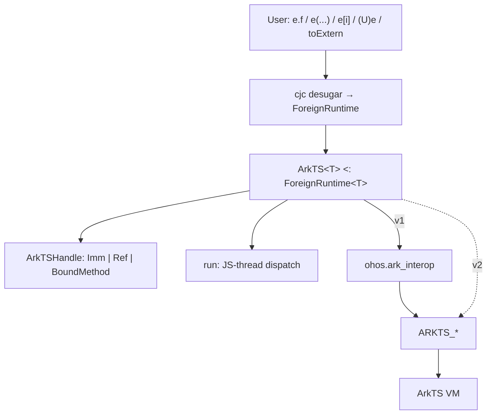
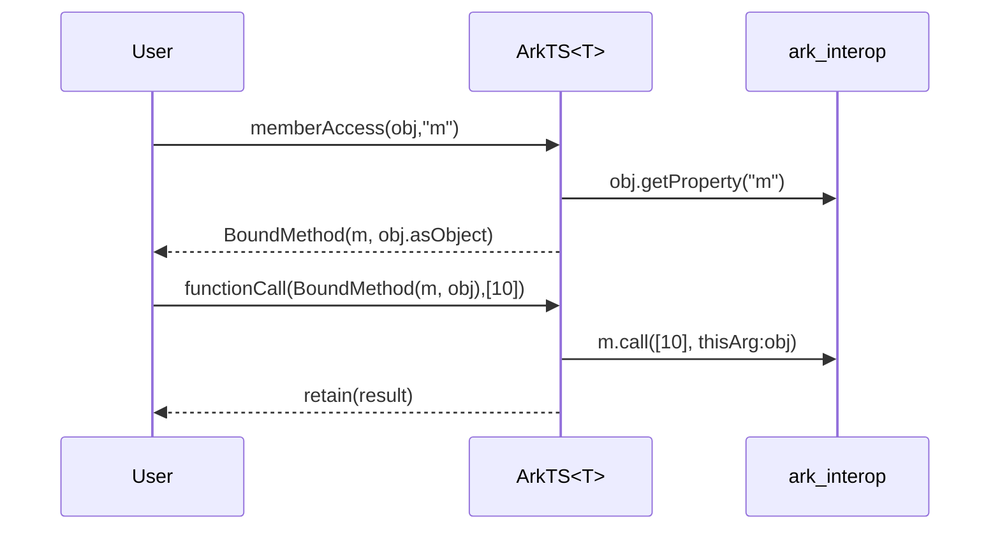

# ArkTS foreign runtime

This document specifies a generic `ArkTS<T>` foreign-runtime abstraction for accessing ArkTS/JS values from Cangjie.

**Background.** Cangjie’s `Extern<T>` is an opaque reference to a value that lives in a *foreign memory space* — memory managed by a different VM than Cangjie (here, the ArkTS/JS engine). The type parameter `T` must implement `ForeignRuntime<T>`; that interface is the set of static methods the compiler desugars dynamic syntax onto (`memberAccess`, `functionCall`, `toExtern`, ...). `ArkTS<T>` supplies the ArkTS implementation of that contract for concrete, self-typed runtime classes.

Version 1 uses ohos.ark_interop as its backend. A later version will replace that backend with direct Cangjie FFI bindings to OpenHarmony’s native ARKTS_* interface.

A prototype of this design is in [GitHub](https://github.com/belolourenco/cangjie_interop_arkts_prototype/blob/main/entry/src/main/cangjie/arkts_runtime_v1/ark_ts.cj).

---

## 1. Layering

User-facing dynamic syntax on `Extern<T>` never calls the VM directly. The compiler rewrites it to static `ForeignRuntime` methods inherited by the concrete runtime type `T`. Those methods hold an internal handle (`ArkTSHandle`) and enter the JS engine only through the thread-safe `run` wrapper. This version of the library goes through `ohos.ark_interop`; later versions may call the `ARKTS_*` FFI directly.



```cangjie
ArkTS.bind(context)                  // bind this runtime instance at entry

// ...

let api: Extern<ArkTS> = ArkTS.requireArkModule("test.ets")
let blob = api.createRectangle()
blob.width = 3.0
let a: Float64 = (Float64)blob.area()
```

In this snippet `api.createRectangle()` and `blob.width = ...` are desugared as `ForeignRuntime` operations on `ArkTS`; `(Float64)...` is a forced cast that desugars to `ArkTS.fromExtern<Float64>(...)`; assigning `3.0` where an `Extern` is expected desugars to `ArkTS.toExtern(3.0)`.

---

## 2. Context

`ArkTS<T>` is an abstract generic base class whose type parameter identifies a concrete ArkTS runtime. 

`JSContext` is the ark_interop handle to one ArkTS/JS engine instance. Each concrete specialization can be bound to its own context. This permits multiple ArkTS foreign runtimes, for example `ArkTS1 <: ArkTS<ArkTS1>` and `ArkTS2 <: ArkTS<ArkTS2>`, without mixing their `Extern` values: `Extern<ArkTS1>` and `Extern<ArkTS2>` are different types. `bind` installs the context for that runtime specialization. Every operation reads it through the private `context` property, which throws an exception if that runtime was never bound.

```cangjie
public class ArkTSContextNotBoundException <: Exception {
    public ArkTSContextNotBoundException(message: String) {
        super(message)
    }
}

abstract open public class ArkTS<T> <: ForeignRuntime<T> where T <: ArkTS<T> {
    private static var context_: ?JSContext = None

    public static func bind(context: JSContext): Unit {
        context_ = context
    }

    private static prop context: JSContext {
        get() {
            match (context_) {
                case Some(context) => context
                case None => throw ArkTSContextNotBoundException(
                    "ArkTS is not associated with a host JSContext")
            }
        }
    }
}
```

Concrete runtime specializations are defined by subclassing `ArkTS<T>` and can be bound to their own context.

```cangjie
internal class ArkTS1 <: ArkTS<ArkTS1> {}
internal class ArkTS2 <: ArkTS<ArkTS2> {}
```

These can then be binded to their own context.

```cangjie
ArkTS1.bind(context1)
ArkTS2.bind(context2)
```

---

## 3. Thread dispatch

ArkTS FFI is *bind-thread-affine*: engine calls are only valid on the thread that bound the context (the JS thread). Every public op and helper therefore runs its engine work inside `run`, which looks synchronous to the caller no matter which Cangjie thread called it.

When calling `run` either the call occurs on the bind thread and the operation is executed directly (as in `(a)` below), or the call occurs off the bind thread and the operation is posted to the JS thread and the caller blocks until the result is available (as in `(b)` below).

```cangjie
private static func run<R>(operation: () -> R): R {
    if (context.isInBindThread()) {
        return operation()                       // (a) already on JS thread: run inline
    }

    // (b) other thread: hand the work to the JS thread and block for its result
    let result = Box(None<ArkTSResult<R>>)
    let mutex = Mutex()
    let done: Condition
    synchronized(mutex) {
        done = mutex.condition()
    }

    context.postJSTask {
        let completed: ArkTSResult<R> =
            try {
                ArkTSResult.Ok(operation())
            } catch (e: Exception) {
                ArkTSResult.Err(e)
            }
        synchronized(mutex) {
            result.value = Some(completed)
            done.notify()
        }
    }

    synchronized(mutex) {
        done.waitUntil({ => result.value.isSome() })
        match (result.value.getOrThrow()) {
            case Ok(value) => value              // return the JS-thread value, or...
            case Err(error) => throw error       // ...rethrow the JS-thread exception here
        }
    }
}
```

Two cases:

- **(a) On the bind thread** — call `operation()` directly.
- **(b) Off the bind thread** — post `operation` with `postJSTask`, wait on a `Mutex`/`Condition`, and once the JS thread finishes, either return its value or rethrow the exception it captured. `ArkTSResult<R>` is the internal `Ok(R) | Err(Exception)` carrier used to move that outcome across threads.

---

## 4. Handle model

`Extern<T>` stores an opaque `payload: Any`. For a concrete `T <: ArkTS<T>`, that payload is always an `ArkTSHandle` defined below.

```cangjie
private enum ArkTSHandle {
    | Imm(JSValue)                          // undefined / null / boolean / number
    | Ref(JSHeapObject)                     // string / bigint / symbol / object / array / function / ...
    | BoundMethod(JSFunction, JSHeapObject) // callable member + its receiver
}
```

| Variant | Holds | Why |
| --- | --- | --- |
| `Imm` | a `JSValue` | Immediates have no heap identity, so the value is stored as-is. |
| `Ref` | a `JSHeapObject` | Heap values are pinned as a process-global so they survive across calls. |
| `BoundMethod` | a `JSFunction` + its `JSHeapObject` receiver | A function read off an object, remembered together with the object to use as `this` on a later call. |

`JSValue` is ark_interop’s tagged engine value (an immediate, or a pointer into the heap). Three small helpers move between an `Extern`, its handle, and a `JSValue`:

```cangjie
// Extern<T> -> ArkTSHandle: read the payload back as a handle.
private static func getHandle(e: Extern<T>): ArkTSHandle {
    (Extern<T>.getPayload(e) as ArkTSHandle).getOrThrow()
}

// ArkTSHandle -> Extern<T>: wrap a handle as the opaque payload.
private static func extern(handle: ArkTSHandle): Extern<T> {
    Extern<T>(handle)
}

// ArkTSHandle -> JSValue: project a handle to a plain engine value for FFI.
private static func jsValue(handle: ArkTSHandle): JSValue {
    match (handle) {
        case Imm(value) => value
        case Ref(owner) => owner.toJSValue()
        case BoundMethod(function, _) => function.toJSValue()   // receiver dropped here; used only on call
    }
}
```

### Wrapping a JSValue as an Extern

`retain` is the single entry that turns a `JSValue` produced by the engine into an `Extern`. It inspects the value’s runtime type and picks the handle variant. An optional `receiver` (the object a function was read from) turns a function into a `BoundMethod`.

```cangjie
private static func retain(value: JSValue, receiver!: ?JSHeapObject = None): Extern<T> {
    if (value.isFunction()) {
        let function = value.asFunction()
        return match (receiver) {
            case Some(object) => extern(BoundMethod(function, object))  // remember `this`
            case None => extern(Ref(function))                         // plain function reference
        }
    }
    if (value.isArray())   { return extern(Ref(value.asArray()))  }
    if (value.isSymbol())  { return extern(Ref(value.asSymbol())) }
    if (value.isString())  { return extern(Ref(value.asString())) }
    if (value.isBigInt())  { return extern(Ref(value.asBigInt())) }
    if (value.isObject())  { return extern(Ref(value.asObject())) }
    extern(Imm(value))     // undefined / null / boolean / number: engine immediates
}
```

Something to note here is that heap-allocated values are always made global with `asX` methods. This is a deliberate decision so that the user can use `Extern` values freely without worrying about their lifetime or having to manually retain them as in the current `ohos.ark_interop` library, e.g. `value.asObject()`.

---

## 5. Dynamic operations

These five methods are the `ForeignRuntime` hooks the compiler emits for dynamic surface syntax:

```cangjie
e.f       → memberAccess(e, "f")
e[i]      → indexedAccess(e, i)
e.f = v   → memberUpdate(e, "f", v)
e[i] = v  → indexedUpdate(e, i, v)
e(a, b)   → functionCall(e, [a, b])
```

### Member / index reads

A read projects the handle to a `JSValue`, fetches the property/element, and re-wraps the result with `retain`. If the fetched value is a function, `retain` is given the target object as receiver so the method stays bound.

```cangjie
public static func memberAccess(e: Extern<T>, field: String): Extern<T> {
    run {
        let target = jsValue(getHandle(e))
        let value = target.getProperty(field)
        if (value.isFunction()) {
            retain(value, receiver: target.asObject())   // bind receiver → BoundMethod
        } else {
            retain(value)
        }
    }
}

public static func indexedAccess(e: Extern<T>, index: Any): Extern<T> {
    run {
        let target = jsValue(getHandle(e))
        match (index) {
            case position: Int64 =>
                retain(target.getElement(position))
            case position: Int32 =>
                retain(target.getElement(Int64(position)))
            case propertyName: String =>
                let property = target.getProperty(propertyName)
                if (property.isFunction()) {
                    retain(property, receiver: target.asObject())
                } else {
                    retain(property)
                }
            case externalIndex: Extern<T> =>
                // ...
            case _ => throw ExternIndexedAccessException("Unsupported ArkTS index type")
        }
    }
}
```

So `indexedAccess` accepts three key shapes — an integer index, a `String` property name, or an `Extern<T>` from the same runtime — and rejects anything else.

### Member / index writes

Writes convert the right-hand side with `toJSValue` (§6) and store it through the same `JSValue` APIs. No new `Extern` is created.

```cangjie
public static func memberUpdate(e: Extern<T>, field: String, value: Any): Unit {
    run { jsValue(getHandle(e)).setProperty(field, toJSValue(value)) }
}

public static func indexedUpdate(e: Extern<T>, index: Any, value: Any): Unit {
    run {
        let target = jsValue(getHandle(e))
        let converted = toJSValue(value)
        match (index) {
            case position: Int64 =>
                target.setElement(position, converted)
            case position: Int32 =>
                target.setElement(Int64(position), converted)
            case propertyName: String =>
                target.setProperty(propertyName, converted)
            case externalIndex: Extern<T> =>
                // ....
            case _ => throw ExternIndexedAccessException("Unsupported ArkTS index type")
        }
    }
}
```

### Call & receiver

Because `memberAccess` records the receiver, an extracted method keeps its `this` even if it is stored in a variable first — unlike bare JS, where `let x = obj.m; x()` loses the receiver.

```cangjie
a.m(10)           // MemberAccess → BoundMethod, then FuncCall → thisArg = a
let x = a.m; x()  // same BoundMethod; this preserved (≠ bare JS)
```

`functionCall` converts each argument with `toJSValue`, then dispatches on the handle variant:

```cangjie
public static func functionCall(e: Extern<T>, args: Array<Any>): Extern<T> {
    run {
        let converted = Array<JSValue>(args.size) { index => toJSValue(args[index]) }
        match (getHandle(e)) {
            case BoundMethod(function, receiver) =>
                retain(function.call(converted, thisArg: receiver.toJSValue()))     // call with saved this
            case Ref(owner) =>
                retain(owner.toJSValue().asFunction().call(
                    converted, thisArg: context.undefined().toJSValue()))           // plain function: this = undefined
            case Imm(_) =>
                throw ExternFunctionAccessException(
                    "Cannot call an ArkTS immediate value")                         // numbers/booleans aren't callable
        }
    }
}
```

Example flow for `obj.m(10)`:



---

## 6. Conversions

Language rules (from the Extern design): a Cangjie value used where `Extern<T>` is expected desugars to `T.toExtern`; a forced cast `(U)e` on that `Extern` desugars to `T.fromExtern<U>(e)`. This section shows how the generic ArkTS base implements those two, plus the shared internal helper `toJSValue`.

### `toJSValue`: Cangjie value → `JSValue`

Bind-thread helper used wherever a Cangjie value must become a plain engine value (property/element sets, call args, and the core of `toExtern`). It matches on the *runtime* type of the input and builds the corresponding `JSValue` through `context`. It does **not** decide Imm vs Ref — that only happens later in `retain`.

```cangjie
private static func toJSValue(value: Any): JSValue {
    if (value is Extern<T>) {
        return jsValue(getHandle((value as Extern<T>).getOrThrow()))
    }
    if (value is (Extern<T>) -> Extern<T>) {
        let callback = (value as ((Extern<T>) -> Extern<T>)).getOrThrow()
        return context.function({ _, info =>
            let arguments = Array<JSValue>(info.count) { index => info[index] }
            let externalArguments = retain(context.array(arguments).toJSValue())
            let result = callback(externalArguments)
            jsValue(getHandle(result))
        }).toJSValue()
    }
    if (value is Bool)    { return context.boolean((value as Bool).getOrThrow()).toJSValue() }
    if (value is Int32)   { return context.number((value as Int32).getOrThrow()).toJSValue() }
    if (value is Int64)   { return context.number(Float64((value as Int64).getOrThrow())).toJSValue() }
    if (value is Float64) { return context.number((value as Float64).getOrThrow()).toJSValue() }
    if (value is String)  { return context.string((value as String).getOrThrow()).toJSValue() }
    if (value is BigInt)  { return context.bigint((value as BigInt).getOrThrow()).toJSValue() }
    if (value is Array<Nothing>)       { return arrayJSValue(Array<Nothing>()) }
    if (value is Array<Int64>)         { return arrayJSValue((value as Array<Int64>).getOrThrow()) }
    if (value is Array<Float64>)       { return arrayJSValue((value as Array<Float64>).getOrThrow()) }
    if (value is Array<Bool>)          { return arrayJSValue((value as Array<Bool>).getOrThrow()) }
    if (value is Array<String>)        { return arrayJSValue((value as Array<String>).getOrThrow()) }
    if (value is Array<Extern<T>>)     { return arrayJSValue((value as Array<Extern<T>>).getOrThrow()) }
    throw ExternConversionException("Unsupported conversion to ArkTS")
}
```

Notes:

- An existing `Extern<T>` from the same concrete runtime is passed through by projecting its handle (no copy). An `Extern` belonging to another ArkTS specialization does not match this branch.
- A Cangjie callback of type `(Extern<T>) -> Extern<T>` becomes a JS function. On invocation, all JS arguments are collected into one JS array, retained as an `Extern<T>`, and passed as the callback's single argument. The returned `Extern<T>` is projected back to a `JSValue`; the JS `this` argument is currently ignored.
- `Int64` is widened to `Float64` because JS numbers are doubles.
- The explicitly supported arrays are empty `Array<Nothing>`, plus arrays of `Int64`, `Float64`, `Bool`, `String`, or same-runtime `Extern<T>`. `arrayJSValue<E>` maps each element through `toJSValue` and builds a `JSArray`; anything not listed throws.

### `toExtern`: Cangjie value → `Extern<T>`

The implicit-conversion hook. If the value is already an `Extern<T>`, return it unchanged; otherwise convert it to a `JSValue` and `retain` it (which is where the Imm/Ref decision is made).

```cangjie
public static func toExtern<R>(value: R): Extern<T> {
    run {
        if (value is Extern<T>) {
            return (value as Extern<T>).getOrThrow()   // pass-through
        }
        retain(toJSValue(value))                       // convert, then classify
    }
}
```

### `fromExtern`: `Extern<T>` → Cangjie type `R`

The forced-cast hook `(R)e`. It projects the handle to a `JSValue`, then reads it with the ark_interop reader that matches the **target type `R`**.

```cangjie
public static func fromExtern<R>(e: Extern<T>): R {
    run {
        let value = jsValue(getHandle(e))
        match (None<R>) {    // dummy `None<R>` to match the type parameter
            case _: Option<Bool>    => (value.toBoolean() as R).getOrThrow()
            case _: Option<Int32>   => (Int32(value.toNumber()) as R).getOrThrow()   // read JS number, narrow to Int32
            case _: Option<Int64>   => (Int64(value.toNumber()) as R).getOrThrow()   // read JS number, narrow to Int64
            case _: Option<Float64> => (value.toNumber() as R).getOrThrow()
            case _: Option<String>  => (value.toString() as R).getOrThrow()
            case _: Option<BigInt>  => (value.toBigInt() as R).getOrThrow()
            case _: Option<Unit> => (() as R).getOrThrow()
            case _: Option<Array<String>> =>
                let array = value.asArray()
                let converted = Array<String>(array.size) { index =>
                    array[index].toString()
                }
                (converted as R).getOrThrow()
            case _: Option<Extern<T>> => (e as R).getOrThrow()                       // identity: no conversion
            case _ => throw ExternConversionException("Unsupported conversion from ArkTS")
        }
    }
}
```

Reading the cases: for `Bool`/`String`/`BigInt`/`Float64` the matching reader (`toBoolean` / `toString` / `toBigInt` / `toNumber`) is called directly. For `Int32`/`Int64` the JS value is read as a number (a double) and then narrowed to the integer type. Converting to `Unit` discards the JS value and returns `()`. Converting to `Array<String>` requires a JS array and converts each element with `toString()`. Casting `e` to the same `Extern<T>` is the identity case. Any other target type throws.

### Putting it together

```cangjie
let n: Extern<ArkTS1> = 3.0         // ArkTS1.toExtern(3.0) → retain(toJSValue(3.0)) → Imm
blob.width = n                      // memberUpdate → toJSValue(n) projects the handle
let s: String = (String)blob.name   // fromExtern<String> → value.toString()
```

---

## 7. Helpers

Extra ArkTS APIs that are **not** part of the desugared `ForeignRuntime` surface — value constructors, equality, object metadata, and module loading. Each still runs inside `run` for bind-thread safety, and each returns via `retain` when it produces a new foreign value.

```cangjie
public static func undefined(): Extern<T> { run { retain(context.undefined().toJSValue()) } }
public static func null(): Extern<T>      { run { retain(context.null().toJSValue()) } }
public static func object(): Extern<T>    { run { retain(context.object().toJSValue()) } }
public static func global(): Extern<T>    { run { retain(context.global.toJSValue()) } }
public static func symbol(description!: String = ""): Extern<T> {
    run { retain(context.symbol(description: description).toJSValue()) }
}

public static func strictEqual(lhs: Extern<T>, rhs: Extern<T>): Bool {
    run { jsValue(getHandle(lhs)).strictEqual(jsValue(getHandle(rhs))) }
}
public static func isNull(value: Extern<T>): Bool      { run { jsValue(getHandle(value)).isNull() } }
public static func isUndefined(value: Extern<T>): Bool { run { jsValue(getHandle(value)).isUndefined() } }

public static func requireSystemNativeModule(moduleName: String): Extern<T> {
    requireSystemNativeModule(moduleName, None)
}

public static func requireSystemNativeModule(
    moduleName: String,
    prefix: ?String
): Extern<T> {
    run { retain(context.requireSystemNativeModule(moduleName, prefix: prefix)) }
}
```

| API | Role |
| --- | --- |
| `undefined()` / `null()` / `object()` / `symbol(...)` | Construct a JS value, then `retain` it. |
| `global()` | Return the context's global object through `retain`. |
| `strictEqual(a, b)` | JS `===` on the two projected `JSValue`s. |
| `isNull` / `isUndefined` | Predicates on the projected `JSValue`. |
| `objectHasProperty` / `objectKeys` / `objectDefineOwnProperty` | Object metadata; `defineOwnProperty` converts its value with `toJSValue`. |
| `requireArkModule` | Load an Ark module, then `retain` the result. |
| `requireSystemNativeModule(moduleName)` | Load a system native module without a prefix; delegates to the two-argument overload with `None`. |
| `requireSystemNativeModule(moduleName, prefix)` | Load a system native module with an explicit optional prefix, then `retain` the result. |

---

## 8. Lifetime

Immediates need no disposal. Heap handles are held as engine globals and released when the owning Cangjie `Extern` is finalized. There is no scope-local `JSValue` mode in this design.

| Kind | Storage | Dispose |
| --- | --- | --- |
| `Imm` | engine immediate | none |
| `Ref` / `BoundMethod` | `JSHeapObject` global | finalizer → `ARKTS_DisposeGlobal` |
