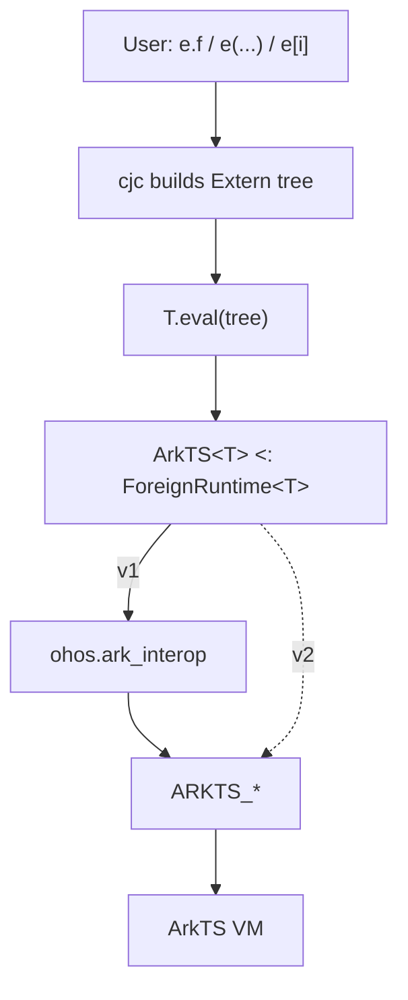
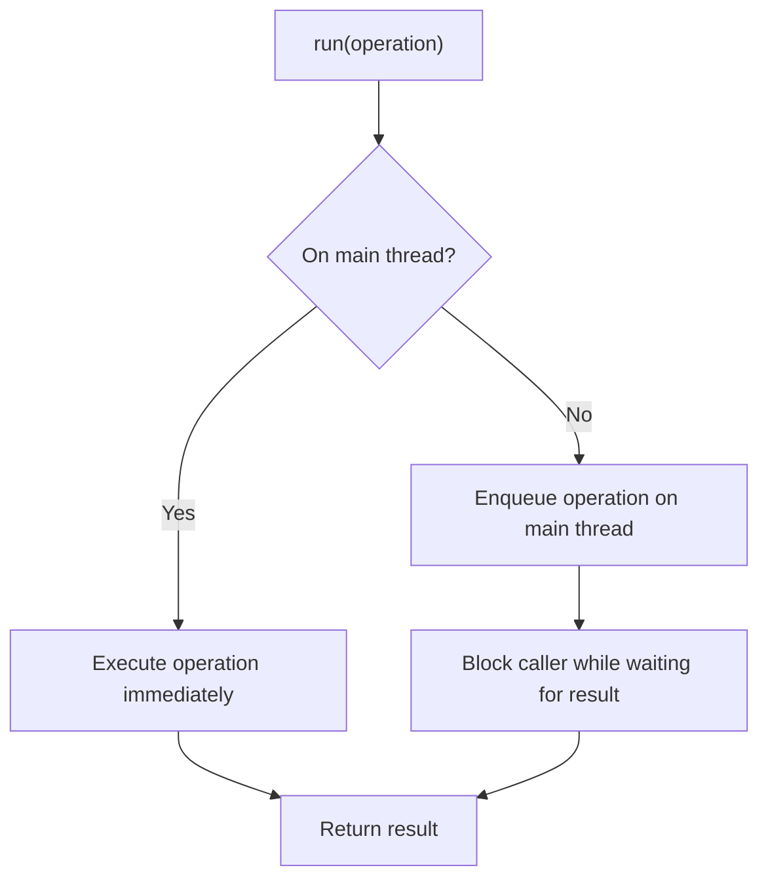
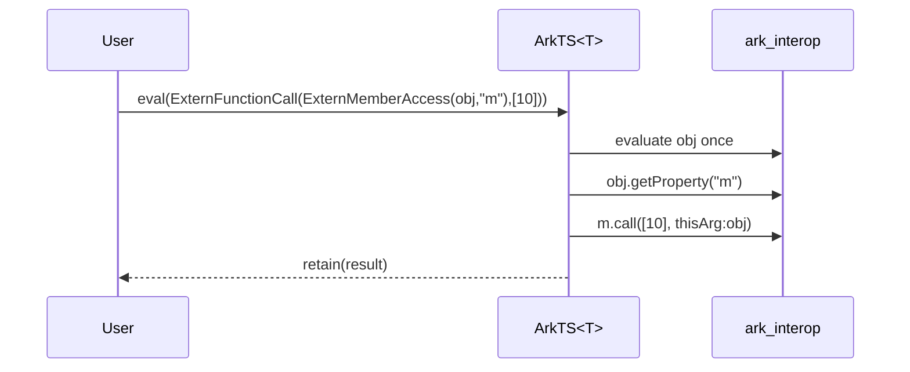

# ArkTS foreign runtime

This document specifies a generic `ArkTS<T>` foreign-runtime abstraction for accessing
ArkTS/JS values from Cangjie.

**Background.** `Extern<T>` represents either an evaluated value in a *foreign memory
space* or a deferred operation on such a value. It is a recursive enum whose leaf is
`ExternPayload(Any)` and whose other variants describe member access, indexed access, updates,
and calls. The compiler builds these trees from dynamic syntax and passes them to
`T.eval`. The type parameter `T` implements `ForeignRuntime<T>`; `ArkTS<T>` supplies the
ArkTS implementation for concrete, self-typed runtime classes.

Version 1 uses `ohos.ark_interop` as its backend. A later version will replace that backend
with direct Cangjie FFI bindings to OpenHarmony’s native `ARKTS_*` interface.

---

## 1. Layering

User-facing dynamic syntax on `Extern<T>` never calls the VM directly. The compiler builds
an `Extern<T>` expression tree and passes it to `T.eval`. `ArkTS<T>` evaluates the complete
tree through the thread-safe `run` wrapper and stores evaluated values as an internal
`ArkTSHandle` inside `ExternPayload`. This version goes through `ohos.ark_interop`; later versions
may call the `ARKTS_*` FFI directly.



```cangjie
ArkTS.bind(context)                  // bind this runtime instance at entry

// ...

let api: Extern<ArkTS> = ArkTS.requireArkModule("test.ets")
let blob = api.createRectangle()
blob.width = 3.0
let a: Float64 = (Float64)blob.area()
```

The compiler lowers the dynamic operations as follows:

```cangjie
ArkTS.bind(context)                  // bind this runtime instance at entry

// ...

let blob = ArkTS.eval(
    ExternFunctionCall(ExternMemberAccess(api, "createRectangle"), []))

ArkTS.eval(ExternMemberUpdate(blob, "width", 3.0))

let a: Float64 = ArkTS.fromExtern<Float64>(
                    ExternFunctionCall(ExternMemberAccess(blob, "area"), [])
                 )
```

The assigned `3.0` remains an `Any` operand in the tree and is converted by the ArkTS
evaluator when it performs the update.

---

## 2. `ArkTS<T>` interface

`ArkTS<T>` is an abstract base class implementing `ForeignRuntime<T>`. Its public surface
is summarized below; method bodies are omitted, and the following sections describe the
semantics and implementation details.

```cangjie
abstract open public class ArkTS<T> <: ForeignRuntime<T> where T <: ArkTS<T> {
    // Associate this runtime specialization with one JS context.
    public static func bind(newContext: JSContext): Unit

    // Evaluate an Extern expression tree.
    public static func eval(tree: Extern<T>): Extern<T>

    // Convert between Cangjie and ArkTS values.
    public static func fromExtern<R>(value: Extern<T>): R
    public static func toExtern<R>(value: R): Extern<T>

    // Create or obtain common ArkTS values.
    public static func undefined(): Extern<T>
    public static func null(): Extern<T>
    public static func object(): Extern<T>
    public static func global(): Extern<T>
    public static func symbol(description!: String = ""): Extern<T>

    // Compare or classify ArkTS values.
    public static func strictEqual(lhs: Extern<T>, rhs: Extern<T>): Bool
    public static func isNull(value: Extern<T>): Bool
    public static func isUndefined(value: Extern<T>): Bool

    // Inspect or define an object's own properties.
    public static func objectHasProperty(value: Extern<T>, key: String): Bool
    public static func objectKeys(value: Extern<T>): Array<String>
    public static func objectDefineOwnProperty(
        value: Extern<T>,
        key: String,
        propertyValue: Any,
        isWritable!: Bool = true,
        isEnumerable!: Bool = true,
        isConfigurable!: Bool = true
    ): Bool

    // Load ArkTS or system-native modules.
    public static func requireArkModule(specifier: String): Extern<T>
    public static func requireSystemNativeModule(
        moduleName: String,
        prefix: ?String
    ): Extern<T>
}
```

The `eval`, `fromExtern`, and `toExtern` methods form the compiler-facing
`ForeignRuntime<T>` contract. The remaining methods are ArkTS-specific entry points used
directly by applications and generated bindings.

---

## 3. Context

`ArkTS<T>` is an abstract generic base class whose type parameter identifies a concrete
ArkTS runtime.

`JSContext` is the `ark_interop` handle to one ArkTS/JS engine instance. Each concrete
specialization can be bound to exactly one context. This permits multiple ArkTS foreign
runtimes, such as `ArkTS1 <: ArkTS<ArkTS1>` and `ArkTS2 <: ArkTS<ArkTS2>`, without mixing
their values: `Extern<ArkTS1>` and `Extern<ArkTS2>` are different types. The first
successful call to `bind` permanently installs the context for that specialization. Every
later call throws `ArkTSContextAlreadyBoundException`, even if it supplies the same
`JSContext`. The evaluator and helpers read the installed context through the private
`context` property, which throws if the runtime was never bound.

```cangjie
public class ArkTSContextNotBoundException <: Exception {}
public class ArkTSContextAlreadyBoundException <: Exception {}

abstract open public class ArkTS<T> <: ForeignRuntime<T> where T <: ArkTS<T> {
    private static let contextMutex = Mutex()
    private static var context_: ?JSContext = None

    public static func bind(newContext: JSContext): Unit {
        synchronized(contextMutex) {
            match (context_) {
                case None => context_ = Some(newContext)
                case Some(_) => throw ArkTSContextAlreadyBoundException(
                    "ArkTS runtime is already associated with a host JSContext")
            }
        }
    }

    private static prop context: JSContext {
        get() {
            match (context_) {
                case Some(context) => context
                case None => throw ArkTSContextNotBoundException(
                    "ArkTS runtime is not associated with a host JSContext")
            }
        }
    }

    // ...

}
```

Concrete runtime specializations subclass `ArkTS<T>`:

```cangjie
internal class ArkTS1 <: ArkTS<ArkTS1> {}
internal class ArkTS2 <: ArkTS<ArkTS2> {}
```

Each specialization can then be bound to its own context:

```cangjie
ArkTS1.bind(context1)
ArkTS2.bind(context2)

ArkTS1.bind(context1) // throws ArkTSContextAlreadyBoundException
```

There is deliberately no `unbind` or context-replacement operation. Code that needs a
different `JSContext` must define and bind a different concrete specialization. This keeps
every `ArkTSHandle` associated with the same engine for its entire lifetime. The mutex
makes the initial check-and-install atomic, ensuring that exactly one concurrent call to
`bind` can succeed. A context lookup that races with the successful initial bind may still
observe `None` and throw `ArkTSContextNotBoundException`; a caller that requires the bind
to be visible must wait until `bind` has completed before using the runtime.

---

## 4. Thread dispatch

ArkTS FFI is *bind-thread-affine*: engine calls are valid only on the thread that bound the
context (the JS thread). Each `eval` call and public helper therefore runs its engine work
inside `run`, which looks synchronous to the caller regardless of which Cangjie thread
called it. Recursive evaluation stays inside that single `run` invocation.

If `run` is called on the bind thread, it executes the operation directly, as in `(a)`
below. Otherwise, it posts the operation to the JS thread and blocks the caller until the
result is available, as in `(b)`.



```cangjie
private static func run<R>(operation: () -> R): R {
    if (context.isInBindThread()) {
        return operation()                       // (a) already on JS thread: run immediately
    }

    // (b) other thread: hand the work to the JS thread and block for its result
    let result = Box(None<ArkTSResult<R>>)
    let mutex = Mutex()
    let done: Condition
    synchronized(mutex) {
        done = mutex.condition()
    }

    context.postJSTask {
        let completed: ArkTSResult<R> =
            try {
                ArkTSResult.Ok(operation())
            } catch (e: Exception) {
                ArkTSResult.Err(e)
            }
        synchronized(mutex) {
            result.value = Some(completed)
            done.notify()
        }
    }

    synchronized(mutex) {
        done.waitUntil({ => result.value.isSome() })
        match (result.value.getOrThrow()) {
            case Ok(value) => value              // return the JS-thread value, or...
            case Err(error) => throw error       // ...rethrow the JS-thread exception here
        }
    }
}
```

Two cases:

- **(a) On the bind thread** — call `operation()` directly.
- **(b) Off the bind thread** — post `operation` with `postJSTask`, wait on a
  `Mutex`/`Condition`, then return its value or rethrow its exception. `ArkTSResult<R>` is
  the internal `Ok(R) | Err(Exception)` carrier used to move the outcome across threads.

**Possible optimization.** The runtime could expose a configuration option asserting that
all operations are invoked on the main thread. When enabled, `run` could execute the
operation directly, avoiding the thread check and dispatch overhead. This option would be
valid only when the context is bound to the main thread and the caller guarantees that all
operations originate there. A similar approach is followed by the current `ohos.ark_interop`
library.

---

## 5. Handle model

`Extern<T>` is the expression tree defined by the standard library:

```cangjie
public enum Extern<T> where T <: ForeignRuntime<T> {
    | ExternPayload(Any)
    | ExternMemberAccess(Extern<T>, String)
    | ExternIndexedAccess(Extern<T>, Any)
    | ExternMemberUpdate(Extern<T>, String, Any)
    | ExternIndexedUpdate(Extern<T>, Any, Any)
    | ExternFunctionCall(Extern<T>, Array<Any>)
    // derived constructors
    | ...
}
```

For `T <: ArkTS<T>`, an evaluated `Extern<T>` is a `ExternPayload` containing an
`ArkTSHandle`:

```cangjie
private enum ArkTSHandle {
    | Imm(JSValue)      // undefined / null / boolean / number
    | Ref(JSHeapObject) // string / bigint / symbol / object / array / function / ...
}
```

| Variant | Holds | Why |
| --- | --- | --- |
| `Imm` | a `JSValue` | Immediates have no heap identity, so the value is stored as-is. |
| `Ref` | a `JSHeapObject` | Heap values are pinned as an engine-global so they survive across calls. |

`JSHeapObject` finalizers queue `ARKTS_DisposeGlobal` for execution on the context's bind
thread, so the finalizers themselves may run on any thread.

### Wrapping a JSValue as an Extern

`retain` is the single entry that turns a `JSValue` produced by the engine into an
evaluated `Extern`. It inspects the runtime type, promotes heap values to global handles,
and wraps the resulting `ArkTSHandle` in `ExternPayload`.

```cangjie
private static func retain(value: JSValue): Extern<T> {
    if (value.isFunction()) { return ExternPayload(Ref(value.asFunction())) }
    if (value.isArray())   { return ExternPayload(Ref(value.asArray()))  }
    if (value.isSymbol())  { return ExternPayload(Ref(value.asSymbol())) }
    if (value.isString())  { return ExternPayload(Ref(value.asString())) }
    if (value.isBigInt())  { return ExternPayload(Ref(value.asBigInt())) }
    if (value.isObject())  { return ExternPayload(Ref(value.asObject())) }
    ExternPayload(Imm(value))     // undefined / null / boolean / number: engine immediates
}
```

Heap values are made global only when `retain` produces the final result of an evaluation
or helper call. Intermediate values remain local to the evaluation. This lets users keep
evaluated `Extern` values without manually retaining them through operations such as
`value.asObject()`.

---

## 6. Dynamic operations

The compiler represents dynamic syntax as nested `Extern<T>` nodes and calls `T.eval` once
for the complete expression:

```cangjie
e.f                   → T.eval(ExternMemberAccess(e, "f"))
e[i]                  → T.eval(ExternIndexedAccess(e, i))
e.f = v               → T.eval(ExternMemberUpdate(e, "f", v))
e[i] = v              → T.eval(ExternIndexedUpdate(e, i, v))
e(a, b)               → T.eval(ExternFunctionCall(e, [a, b]))

a.b.c                 → T.eval(ExternMemberAccess(ExternMemberAccess(a, "b"), "c"))
a.m(10)               → T.eval(ExternFunctionCall(ExternMemberAccess(a, "m"), [10]))

a.b(42).c = d.e().f() → T.eval(
    ExternMemberUpdate(
        ExternFunctionCall(
            ExternMemberAccess(a, "b"),
            [42]
        ),
        "c",
        ExternFunctionCall(
            ExternMemberAccess(
                ExternFunctionCall(
                    ExternMemberAccess(
                        d,
                        "e"
                    ),
                    []
                ),
                "f"
            ),
            []
        )
    )
)
```

Constructing the tree performs no engine work. For a primitive operation, `eval` enters
`run` once, evaluates the operation to a `JSValue`, and retains its result. `evalTree`
performs the same operations recursively, so top-level and nested primitive operations
have identical semantics while only the top-level result is retained. An existing `ExternPayload` is already
evaluated and can be returned unchanged. A derived constructor is delegated to the
standard `ForeignRuntime<T>.evalDerived` implementation, as required by the
`ForeignRuntime` contract.

```cangjie
public static func eval(tree: Extern<T>): Extern<T> {
    match (tree) {
        case ExternPayload(_) => tree
        case ExternMemberAccess(target, field) =>
            run { retain(evalTree(target).getProperty(field)) }
        case ExternIndexedAccess(target, index) =>
            run { retain(readIndex(evalTree(target), index)) }
        case ExternMemberUpdate(target, field, value) =>
            run { retain(evalMemberUpdate(target, field, value)) }
        case ExternIndexedUpdate(target, index, value) =>
            run { retain(evalIndexedUpdate(target, index, value)) }
        case ExternFunctionCall(callee, arguments) =>
            run { retain(call(callee, arguments)) }
        case _ => ForeignRuntime<T>.evalDerived(tree)
    }
}

private static func evalTree(tree: Extern<T>): JSValue {
    match (tree) {
        case ExternPayload(handle) => evalPayload(handle)
        case ExternMemberAccess(target, field) =>
            evalTree(target).getProperty(field)
        case ExternIndexedAccess(target, index) =>
            readIndex(evalTree(target), index)
        case ExternMemberUpdate(target, field, value) =>
            evalMemberUpdate(target, field, value)
        case ExternIndexedUpdate(target, index, value) =>
            evalIndexedUpdate(target, index, value)
        case ExternFunctionCall(callee, arguments) =>
            call(callee, arguments)
        case _ =>
            evalTree(ForeignRuntime<T>.evalDerived(tree))
    }
}

private static func evalPayload(handle: Any): JSValue {
    match ((handle as ArkTSHandle).getOrThrow()) {
        case Imm(value) => value
        case Ref(owner) => owner.toJSValue()
    }
}

private static func evalMemberUpdate(target: Extern<T>, field: String, value: Any): JSValue {
    let receiver = evalTree(target)
    receiver.setProperty(field, toJSValue(value))
    context.undefined().toJSValue()
}

private static func evalIndexedUpdate(target: Extern<T>, index: Any, value: Any): JSValue {
    let receiver = evalTree(target)
    writeIndex(receiver, index, value)
    context.undefined().toJSValue()
}

```

When a derived constructor is nested inside a primitive tree, `evalTree` delegates that
subtree to `evalDerived` and projects the evaluated `Extern<T>` result back to a local
`JSValue`. Any `T.eval` calls made by `evalDerived` use the normal ArkTS dispatch and scope
policy; for a nested derived constructor, dispatch already runs on the bind thread.

### Indexed access

Index operations accept an integer position, a `String` property name, or an `Extern<T>`
from the same runtime. The `Extern<T>` is a tree node like any other, so it may be an
unevaluated expression; `toJSKeyable` reduces it with `evalTree`, inside the same scope as
the surrounding evaluation, and maps the result onto one of the `JSKeyable` types accepted
by `getProperty` and `setProperty`: a string becomes a `JSString`, a symbol a `JSSymbol`,
and a number a `Float64`. `writeIndex` resolves this key before converting the assigned
value, preserving target–index–value evaluation order.

```cangjie
private static func readIndex(target: JSValue, index: Any): JSValue {
    match (index) {
        case position: Int64 => target.getElement(position)
        case position: Int32 => target.getElement(Int64(position))
        case propertyName: String => target.getProperty(propertyName)
        case externalIndex: Extern<T> =>
            target.getProperty(toJSKeyable(externalIndex))
        case _ => throw ExternIndexedAccessException("Unsupported ArkTS index type")
    }
}

private static func writeIndex(target: JSValue, index: Any, value: Any): Unit {
    match (index) {
        case position: Int64 => target.setElement(position, toJSValue(value))
        case position: Int32 => target.setElement(Int64(position), toJSValue(value))
        case propertyName: String => target.setProperty(propertyName, toJSValue(value))
        case externalIndex: Extern<T> =>
            let key = toJSKeyable(externalIndex)
            target.setProperty(key, toJSValue(value))
        case _ => throw ExternIndexedAccessException("Unsupported ArkTS index type")
    }
}

private static func toJSKeyable(index: Extern<T>): JSKeyable {
    let value = evalTree(index)
    if (value.isString()) { return value.asString() }  // JSString
    if (value.isSymbol()) { return value.asSymbol() }  // JSSymbol
    if (value.isNumber()) { return value.toNumber() }  // Float64
    throw ExternIndexedAccessException("Unsupported ArkTS index type")
}
```

### Calls and receivers

The call tree retains the distinction between a member call and a call through an already
evaluated function. `call` uses the target of a `ExternMemberAccess` or `ExternIndexedAccess` as
`this`; every other callee receives `undefined`. The target is evaluated exactly once.

```cangjie
a.m(10)           // ExternFunctionCall(ExternMemberAccess(a, "m"), [10]): this = a

let x = a.m
x(20)             // ExternFunctionCall(x, [20]): this = undefined
```

```cangjie
private static func call(callee: Extern<T>, arguments: Array<Any>): JSValue {
    match (callee) {
        case ExternMemberAccess(receiver, field) =>
            let target = evalTree(receiver)
            let function = target.getProperty(field).asFunction()
            let converted = Array<JSValue>(arguments.size) { index =>
                toJSValue(arguments[index])
            }
            function.call(converted, thisArg: target)
        case ExternIndexedAccess(receiver, index) =>
            let target = evalTree(receiver)
            let function = readIndex(target, index).asFunction()
            let converted = Array<JSValue>(arguments.size) { i =>
                toJSValue(arguments[i])
            }
            function.call(converted, thisArg: target)
        case _ =>
            let function = evalTree(callee).asFunction()
            let converted = Array<JSValue>(arguments.size) { index =>
                toJSValue(arguments[index])
            }
            function.call(converted, thisArg: context.undefined().toJSValue())
    }
}
```

Example flow for `obj.m(10)`:



---

## 7. Conversions

A Cangjie value used where
`Extern<T>` is expected becomes `T.toExtern`, while a forced cast `(U)e` becomes
`T.fromExtern<U>(e)`. This section covers those hooks and the internal `toJSValue` helper.

### `toJSValue`: Cangjie value → `JSValue`

This bind-thread helper converts assigned values, call arguments, indexes, and values passed
to `toExtern`. An `Extern<T>` input is reduced with `evalTree`, so it may be an unevaluated
expression node. Other values are converted according to their runtime type. The `Imm`/`Ref`
decision is deferred to `retain`.

```cangjie
private static func toJSValue(value: Any): JSValue {
    match (value) {
        case external: Extern<T> => evalTree(external)
        case callback: ((Extern<T>) -> Extern<T>) =>
            context.function({ _, info =>
                let arguments = Array<JSValue>(info.count) { index => info[index] }
                let externalArguments = retain(context.array(arguments).toJSValue())
                let result = callback(externalArguments)
                toJSValue(result)
            }).toJSValue()
        case boolean: Bool    => context.boolean(boolean).toJSValue()
        case number: Int32    => context.number(number).toJSValue()
        case number: Int64    => context.number(Float64(number)).toJSValue()
        case number: Float64  => context.number(number).toJSValue()
        case text: String     => context.string(text).toJSValue()
        case number: BigInt   => context.bigint(number).toJSValue()
        case items: Array<Int64>      => arrayJSValue(items)
        case items: Array<Float64>    => arrayJSValue(items)
        case items: Array<Bool>       => arrayJSValue(items)
        case items: Array<String>     => arrayJSValue(items)
        case items: Array<Extern<T>>  => arrayJSValue(items)
        case _ => throw ExternConversionException("Unsupported conversion to ArkTS")
    }
}
```

Notes:

- An `Extern<T>` from the same concrete runtime goes through `evalTree`: an evaluated
  payload is projected without a copy, and an unevaluated node is evaluated first, in the
  scope of the surrounding evaluation. An `Extern` belonging to another ArkTS
  specialization does not match this branch.
- A Cangjie callback of type `(Extern<T>) -> Extern<T>` becomes a JS function. On
  invocation, all JS arguments are collected into one array and passed to the callback as
  an evaluated `Extern<T>`. Its result goes through `toJSValue`, so the callback may return
  either a payload or an unevaluated node.
- `Int64` is widened to `Float64` because JS numbers are doubles.
- Supported arrays are arrays of `Int64`, `Float64`, `Bool`,
  `String`, or same-runtime `Extern<T>`. `arrayJSValue<E>` maps each element through
  `toJSValue`; other array types are rejected for now.

### `toExtern`: Cangjie value → `Extern<T>`

The implicit-conversion `toExtern` simply calls `toJSValue` and `retain`s the value.

```cangjie
public static func toExtern<R>(value: R): Extern<T> {
    run { retain(toJSValue(value)) }
}
```

### `fromExtern`: `Extern<T>` → Cangjie type `R`

The forced-cast hook `(R)e` reduces its argument with `evalTree`, so it accepts a payload
as well as an unevaluated node, then uses the `ark_interop` reader for target type `R`.

```cangjie
public static func fromExtern<R>(e: Extern<T>): R {
    run {
        let value = evalTree(e)
        match (None<R>) {    // dummy `None<R>` to match the type parameter
            case _: Option<Bool>    => (value.toBoolean() as R).getOrThrow()
            case _: Option<Int32>   => (Int32(value.toNumber()) as R).getOrThrow()   // read JS number, narrow to Int32
            case _: Option<Int64>   => (Int64(value.toNumber()) as R).getOrThrow()   // read JS number, narrow to Int64
            case _: Option<Float64> => (value.toNumber() as R).getOrThrow()
            case _: Option<String>  => (value.toString() as R).getOrThrow()
            case _: Option<BigInt>  => (value.toBigInt() as R).getOrThrow()
            case _: Option<Unit> => (() as R).getOrThrow()
            case _: Option<Array<String>> =>
                let array = value.asArray()
                let converted = Array<String>(array.size) { index =>
                    array[index].toString()
                }
                (converted as R).getOrThrow()
            case _: Option<Extern<T>> => (retain(value) as R).getOrThrow()           // identity: no conversion
            case _ => throw ExternConversionException(
                "Unsupported conversion from ArkTS")
        }
    }
}
```

For `Bool`, `String`, `BigInt`, and `Float64`, the matching reader is called directly.
`Int32` and `Int64` read a JS number and narrow it. Converting to `Unit` discards the value;
converting to `Array<String>` converts each element; and conversion to the same `Extern<T>`
is the identity case. Other target types are rejected.

---

## 8. Helpers

These ArkTS APIs are not part of the compiler-desugared `ForeignRuntime` surface. They
still use `run` for bind-thread safety and `retain` when returning a foreign value. Helpers
that consume an `Extern<T>` use `evalTree`, so callers may pass either a payload or a tree.

| API | Role |
| --- | --- |
| `undefined()` / `null()` / `object()` / `symbol(...)` | Construct a JS value, then `retain` it. |
| `global()` | Return the context's global object through `retain`. |
| `strictEqual(a, b)` | Evaluate both operands and apply JS `===`. |
| `isNull` / `isUndefined` | Evaluate the operand and test the resulting `JSValue`. |
| `objectHasProperty` / `objectKeys` / `objectDefineOwnProperty` | Object metadata; `defineOwnProperty` converts its value with `toJSValue`. |
| `requireArkModule` | Load an Ark module, then `retain` the result. |
| `requireSystemNativeModule(moduleName, prefix)` | Load a system native module with an explicit optional prefix, then `retain` the result. |

```cangjie
public static func undefined(): Extern<T> { run { retain(context.undefined().toJSValue()) } }
public static func null(): Extern<T>      { run { retain(context.null().toJSValue()) } }
public static func object(): Extern<T>    { run { retain(context.object().toJSValue()) } }
public static func global(): Extern<T>    { run { retain(context.global.toJSValue()) } }
public static func symbol(description!: String = ""): Extern<T> {
    run { retain(context.symbol(description: description).toJSValue()) }
}

public static func strictEqual(lhs: Extern<T>, rhs: Extern<T>): Bool {
    run { evalTree(lhs).strictEqual(evalTree(rhs)) }
}
public static func isNull(value: Extern<T>): Bool      { run { evalTree(value).isNull() } }
public static func isUndefined(value: Extern<T>): Bool { run { evalTree(value).isUndefined() } }

public static func requireSystemNativeModule(
    moduleName: String,
    prefix: ?String
): Extern<T> {
    run { retain(context.requireSystemNativeModule(moduleName, prefix: prefix)) }
}
```

---

## 9. Optimizations

### Support for ExternSequence

`ExternSequence` is a derived constructor that the compiler introduces when it folds two
consecutive evaluations into one:

```cangjie
T.eval(E1)
T.eval(E2)
// →
T.eval(ExternSequence(E1, E2))
```

A runtime is not required to handle it. The `case _` branches of `eval` and `evalTree`
delegate to `ForeignRuntime<T>.evalDerived`, whose default implementation evaluates `E1`,
discards its result, and returns `T.eval(E2)`. That is already correct, but for `ArkTS<T>`
it re-enters `eval` twice: two `run` dispatches, two engine scopes, and a global handle for
the result of `E1` that no Cangjie code can observe.

Handling the constructor directly makes the sequence behave like any other tree — one
dispatch, one scope, and only the final result retained:

```cangjie
public static func eval(tree: Extern<T>): Extern<T> {
    match (tree) {
        case ...
        case ExternSequence(_, _) =>
            run { retain(evalTree(tree)) }
        case _ => ForeignRuntime<T>.evalDerived(tree)
    }
}

private static func evalTree(tree: Extern<T>): JSValue {
    match (tree) {
        case ...
        case ExternSequence(first, second) =>
            evalTree(first)          // local handle
            evalTree(second)
        case _ =>
            evalTree(ForeignRuntime<T>.evalDerived(tree))
    }
}
```

Operands are evaluated left to right, and an exception raised while evaluating `first`
propagates without evaluating `second`, so the observable behaviour matches the two
separate `eval` calls the compiler started from.

For example:

```cangjie
e1.a = e2.foo()
e1.a
// →
ArkTS.eval(ExternSequence(
    ExternMemberUpdate(e1, "a", ExternFunctionCall(ExternMemberAccess(e2, "foo"), [])),
    ExternMemberAccess(e1, "a")))
```

The update, the call, and the final read all run inside a single `run`, and only the value
of `e1.a` is promoted to a global.

### Batched member access

`evalTree` sees the whole member chain:

```cangjie
a.b.c.d
// →
ExternMemberAccess(
    ExternMemberAccess(
        ExternMemberAccess(a, "b"),
        "c"),
    "d")
```

It can flatten adjacent `ExternMemberAccess` nodes and evaluate them as one path. Walking from
the outer node produces `d, c, b`, so the helper reverses the fields before returning:

```cangjie
private static func flattenMemberPath(
    tree: Extern<T>
): (Extern<T>, Array<String>) {
    let fields = ArrayList<String>()
    var root = tree

    while (true) {
        match (root) {
            case ExternMemberAccess(target, field) =>
                fields.add(field)
                root = target
            case _ =>
                fields.reverse()
                return (root, fields.toArray())
        }
    }
}

private static func evalTree(tree: Extern<T>): JSValue {
    match (tree) {
        case ExternMemberAccess(_, _) =>
            let (root, fields) = flattenMemberPath(tree)
            getPropertyPath(evalTree(root), fields)
        case ...
    }
}
```

This replaces:

```cangjie
a.getProperty("b").getProperty("c").getProperty("d")
```

with:

```cangjie
getPropertyPath(a, ["b", "c", "d"])
```

This needs a future path-based FFI such as `ARKTS_GetPropertyPath`; the current
`ARKTS_GetProperty` still requires one call per field. The path operation must preserve
normal property-read order, getters, proxy traps, and exceptions. Calls, updates, and
indexed accesses stop the batch.

### Batched member updates

The same path can include a final write:

```cangjie
a.b.c = value

// Current
a.getProperty("b").setProperty("c", toJSValue(value))

// Future
setPropertyPath(a, ["b", "c"], value)
```

`evalTree` can reuse `flattenMemberPath` by adding the updated field to the chain:

```cangjie
case ExternMemberUpdate(target, field, value) =>
    let update = ExternMemberAccess(target, field)
    let (root, fields) = flattenMemberPath(update)
    setPropertyPath(evalTree(root), fields, value)
```

A future `ARKTS_SetPropertyPath` must read every field except the last, convert `value`,
and then update the last field, preserving the existing evaluation and exception order.

### Name resolution caching

Repeated member access should cache only the conversion of a Cangjie field name to an
ArkTS property key. The cache belongs to the concrete `ArkTS<T>` specialization and is
used on the bind thread:

```cangjie
private static let propertyNames = HashMap<String, JSString>()

private static func propertyName(field: String): JSString {
    match (propertyNames.get(field)) {
        case Some(name) => name
        case None =>
            let name = context.string(field)
            propertyNames.add(field, name)
            name
    }
}

// Used by both a single access and every component of a batched path.
target.getProperty(propertyName(field))
```

Thus the first access to `a.foo` creates the ArkTS string for `"foo"`; later accesses
reuse it and avoid another string conversion. The resolved value of `a.foo` is never
cached: every access still performs normal ArkTS property lookup, preserving reassignment,
getters, proxy traps, and exceptions.

Examples that repeatedly use the same property key:

```cangjie
for (item in items) {
    total += (Float64)item.price
}

for (view in views) {
    view.render()
}
```

The ArkTS keys for `"price"` and `"render"` are created once and reused on every
iteration, even though each property lookup still happens normally.

### Caching immutable objects

Conversions may cache immutable values that have different Cangjie and ArkTS
representations. Strings are the primary case: the first conversion records both the
Cangjie `String` and a retained ArkTS string; later conversions in either direction reuse
that pair instead of copying the string again.

```cangjie
private static let strings = ImmutableCache<String, JSHeapObject>()

private static func stringToJS(text: String): JSValue {
    strings.foreignFor(text).getOrInsert({ => context.string(text) }).toJSValue()
}

private static func stringFromJS(value: JSValue): String {
    strings.cangjieFor(value).getOrInsert({ => value.toString() })
}

// Used by the String branches of toJSValue and fromExtern.
case text: String          => stringToJS(text)
case _: Option<String>     => (stringFromJS(value) as R).getOrThrow()
```

The cache is per concrete `ArkTS<T>` specialization because retained handles belong to
its bound context. It should be weak or bounded so cached globals do not live forever.
This is safe only for immutable values; mutable objects still require normal conversion
or an explicit invalidation policy.

Example with repeated conversion of the same immutable value:

```cangjie
for (event in events) {
    logger.tag("network").write(event) // reuse the ArkTS representation of "network"
}
```

### Not part of the current proposal, but possible: Send the entire `Extern` tree at once

Consider the following expression, where `e` has type `Extern<T>`:

```cangjie
e.a.b(42).c
```

The compiler desugars it to:

```cangjie
T.eval(ExternMemberAccess(FunctionCall(ExternMemberAccess(e, a), b, [42]), c))
```

Even in the best case, evaluating this tree requires three FFI calls:

1. `ExternMemberAccess(e, a)` via `ARKTS_GetProperty(...)`.
2. `FunctionCall(..., b, [42])` via `ARKTS_Call(...)`.
3. `ExternMemberAccess(..., c)` via `ARKTS_GetProperty(...)`.

To reduce this to a single FFI call, Cangjie can encode the entire expression tree as a
`@C`-compatible value (or simply serialize it) and send it to the C side for evaluation.

Because the C side ultimately interprets the expression, Cangjie can serialize the
`Extern` tree as a flat post-order sequence: each operand appears before the operation
that consumes it. The C-side interpreter can then evaluate the sequence in order,
without crossing the FFI boundary for every node.
