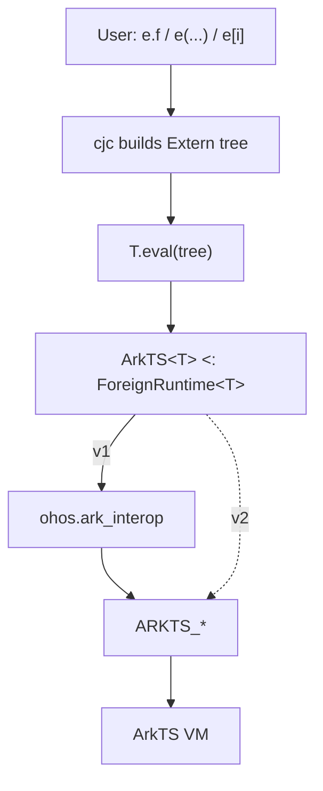
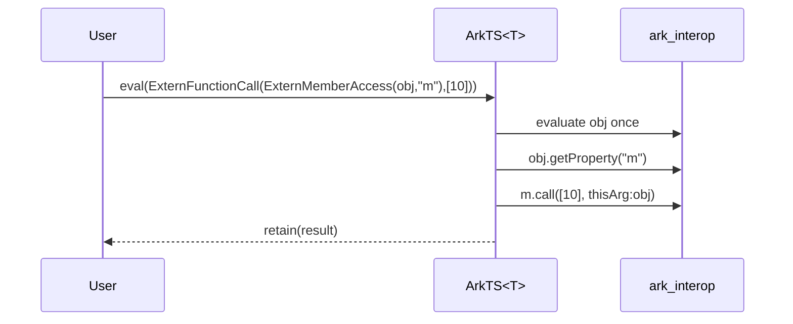

# ArkTS foreign runtime

This document specifies a generic `ArkTS<T>` foreign-runtime abstraction for accessing
ArkTS/JS values from Cangjie.

**Background.** `Extern<T>` represents either an evaluated value in a *foreign memory
space* or a deferred operation on such a value. It is a recursive enum whose leaf is
`ExternPayload(Any)` and whose other variants describe member access, indexed access, updates,
and calls. The compiler builds these trees from dynamic syntax and passes them to
`T.eval`. The type parameter `T` implements `ForeignRuntime<T>`; `ArkTS<T>` supplies the
ArkTS implementation for concrete, self-typed runtime classes.

Version 1 uses `ohos.ark_interop` as its backend. A later version will replace that backend
with direct Cangjie FFI bindings to OpenHarmony’s native `ARKTS_*` interface.

A prototype of this design is available
[TODO]().

---

## 1. Layering

User-facing dynamic syntax on `Extern<T>` never calls the VM directly. The compiler builds
an `Extern<T>` expression tree and passes it to `T.eval`. `ArkTS<T>` evaluates the complete
tree through the thread-safe `run` wrapper and stores evaluated values as an internal
`ArkTSHandle` inside `ExternPayload`. This version goes through `ohos.ark_interop`; later versions
may call the `ARKTS_*` FFI directly.

```cangjie
public interface ForeignRuntime<T> where T <: ForeignRuntime<T> {
    static func eval(tree: Extern<T>): Extern<T>
    static func fromExtern<R>(value: Extern<T>): R
    static func toExtern<R>(value: R): Extern<T>
}
```



```cangjie
ArkTS.bind(context)                  // bind this runtime instance at entry

// ...

let api: Extern<ArkTS> = ArkTS.requireArkModule("test.ets")
let blob = api.createRectangle()
blob.width = 3.0
let a: Float64 = (Float64)blob.area()
```

The compiler lowers the dynamic operations as follows:

```cangjie
ArkTS.bind(context)                  // bind this runtime instance at entry

// ...

let blob = ArkTS.eval(
    ExternFunctionCall(ExternMemberAccess(api, "createRectangle"), []))

ArkTS.eval(ExternMemberUpdate(blob, "width", 3.0))

let a: Float64 = ArkTS.fromExtern<Float64>(
                    ExternFunctionCall(ExternMemberAccess(blob, "area"), [])
                 )
```

The assigned `3.0` remains an `Any` operand in the tree and is converted by the ArkTS
evaluator when it performs the update.

---

## 2. Context

`ArkTS<T>` is an abstract generic base class whose type parameter identifies a concrete
ArkTS runtime.

`JSContext` is the `ark_interop` handle to one ArkTS/JS engine instance. Each concrete
specialization can be bound to its own context. This permits multiple ArkTS foreign
runtimes, such as `ArkTS1 <: ArkTS<ArkTS1>` and `ArkTS2 <: ArkTS<ArkTS2>`, without mixing
their values: `Extern<ArkTS1>` and `Extern<ArkTS2>` are different types. `bind` installs
the context for that specialization. The evaluator and helpers read it through the private
`context` property, which throws if the runtime was never bound.

```cangjie
public class ArkTSContextNotBoundException <: Exception {}

abstract open public class ArkTS<T> <: ForeignRuntime<T> where T <: ArkTS<T> {
    private static var context_: ?JSContext = None

    public static func bind(context: JSContext): Unit {
        context_ = context
    }

    private static prop context: JSContext {
        get() {
            match (context_) {
                case Some(context) => context
                case None => throw ArkTSContextNotBoundException(
                    "ArkTS is not associated with a host JSContext")
            }
        }
    }

    // ...

}
```

Concrete runtime specializations subclass `ArkTS<T>`:

```cangjie
internal class ArkTS1 <: ArkTS<ArkTS1> {}
internal class ArkTS2 <: ArkTS<ArkTS2> {}
```

Each specialization can then be bound to its own context:

```cangjie
ArkTS1.bind(context1)
ArkTS2.bind(context2)
```

---

## 3. Thread dispatch

ArkTS FFI is *bind-thread-affine*: engine calls are valid only on the thread that bound the
context (the JS thread). Each `eval` call and public helper therefore runs its engine work
inside `run`, which looks synchronous to the caller regardless of which Cangjie thread
called it. Recursive evaluation stays inside that single `run` invocation.

If `run` is called on the bind thread, it executes the operation directly, as in `(a)`
below. Otherwise, it posts the operation to the JS thread and blocks the caller until the
result is available, as in `(b)`.

```cangjie
private static func run<R>(operation: () -> R): R {
    if (context.isInBindThread()) {
        return operation()                       // (a) already on JS thread: run inline
    }

    // (b) other thread: hand the work to the JS thread and block for its result
    let result = Box(None<ArkTSResult<R>>)
    let mutex = Mutex()
    let done: Condition
    synchronized(mutex) {
        done = mutex.condition()
    }

    context.postJSTask {
        let completed: ArkTSResult<R> =
            try {
                ArkTSResult.Ok(operation())
            } catch (e: Exception) {
                ArkTSResult.Err(e)
            }
        synchronized(mutex) {
            result.value = Some(completed)
            done.notify()
        }
    }

    synchronized(mutex) {
        done.waitUntil({ => result.value.isSome() })
        match (result.value.getOrThrow()) {
            case Ok(value) => value              // return the JS-thread value, or...
            case Err(error) => throw error       // ...rethrow the JS-thread exception here
        }
    }
}
```

Two cases:

- **(a) On the bind thread** — call `operation()` directly.
- **(b) Off the bind thread** — post `operation` with `postJSTask`, wait on a
  `Mutex`/`Condition`, then return its value or rethrow its exception. `ArkTSResult<R>` is
  the internal `Ok(R) | Err(Exception)` carrier used to move the outcome across threads.

### UI-thread-bound alternative: `spawn (UIThread)`

When `context` is guaranteed to have been bound on the platform UI thread, the
`Future` returned by `spawn (UIThread)` can carry the result or exception and park the
caller without an explicit `Mutex`/`Condition`:

```cangjie
import ohos.base.UIThread

private static func run<R>(operation: () -> R): R {
    if (context.isInBindThread()) {
        return operation()
    }

    return (spawn (UIThread) {
        operation()
    }).get()
}
```

This is not a generic replacement for `postJSTask`: `UIThread` targets the platform UI
thread, which may differ from the bind thread of a worker or engine-owned `JSContext`.

---

## 4. Handle model

`Extern<T>` is the expression tree defined by the standard library:

```cangjie
public enum Extern<T> where T <: ForeignRuntime<T> {
    | ExternPayload(Any)
    | ExternMemberAccess(Extern<T>, String)
    | ExternIndexedAccess(Extern<T>, Any)
    | ExternMemberUpdate(Extern<T>, String, Any)
    | ExternIndexedUpdate(Extern<T>, Any, Any)
    | ExternFunctionCall(Extern<T>, Array<Any>)
}
```

For `T <: ArkTS<T>`, an evaluated `Extern<T>` is a `ExternPayload` containing an
`ArkTSHandle`:

```cangjie
private enum ArkTSHandle {
    | Imm(JSValue)      // undefined / null / boolean / number
    | Ref(JSHeapObject) // string / bigint / symbol / object / array / function / ...
}
```

| Variant | Holds | Why |
| --- | --- | --- |
| `Imm` | a `JSValue` | Immediates have no heap identity, so the value is stored as-is. |
| `Ref` | a `JSHeapObject` | Heap values are pinned as a process-global so they survive across calls. |

### Wrapping a JSValue as an Extern

`retain` is the single entry that turns a `JSValue` produced by the engine into an
evaluated `Extern`. It inspects the runtime type, promotes heap values to global handles,
and wraps the resulting `ArkTSHandle` in `ExternPayload`.

```cangjie
private static func retain(value: JSValue): Extern<T> {
    if (value.isFunction()) { return ExternPayload(Ref(value.asFunction())) }
    if (value.isArray())   { return ExternPayload(Ref(value.asArray()))  }
    if (value.isSymbol())  { return ExternPayload(Ref(value.asSymbol())) }
    if (value.isString())  { return ExternPayload(Ref(value.asString())) }
    if (value.isBigInt())  { return ExternPayload(Ref(value.asBigInt())) }
    if (value.isObject())  { return ExternPayload(Ref(value.asObject())) }
    ExternPayload(Imm(value))     // undefined / null / boolean / number: engine immediates
}
```

Heap values are made global only when `retain` produces the final result of an evaluation
or helper call. Intermediate values remain local to the evaluation. This lets users keep
evaluated `Extern` values without manually retaining them through operations such as
`value.asObject()`.

---

## 5. Dynamic operations

The compiler represents dynamic syntax as nested `Extern<T>` nodes and calls `T.eval` once
for the complete expression:

```cangjie
e.f                   → T.eval(ExternMemberAccess(e, "f"))
e[i]                  → T.eval(ExternIndexedAccess(e, i))
e.f = v               → T.eval(ExternMemberUpdate(e, "f", v))
e[i] = v              → T.eval(ExternIndexedUpdate(e, i, v))
e(a, b)               → T.eval(ExternFunctionCall(e, [a, b]))

a.b.c                 → T.eval(ExternMemberAccess(ExternMemberAccess(a, "b"), "c"))
a.m(10)               → T.eval(ExternFunctionCall(ExternMemberAccess(a, "m"), [10]))

a.b(42).c = d.e().f() → T.eval(
    ExternMemberUpdate(
        ExternFunctionCall(
            ExternMemberAccess(a, "b"),
            [42]
        ),
        "c",
        ExternFunctionCall(
            ExternMemberAccess(
                ExternFunctionCall(
                    ExternMemberAccess(
                        d,
                        "e"
                    ),
                    []
                ),
                "f"
            ),
            []
        )
    )
)
```

Constructing the tree performs no engine work. `eval` enters `run` once, recursively
reduces the tree to a local `JSValue`, and retains only the result. An existing `ExternPayload`
is already evaluated and can be returned unchanged.

```cangjie
public static func eval(tree: Extern<T>): Extern<T> {
    match (tree) {
        case ExternPayload(_) => tree
        case _ => run { retain(evalTree(tree)) }
    }
}

private static func evalTree(tree: Extern<T>): JSValue {
    match (tree) {
        case ExternPayload(h) => match ((h as ArkTSHandle).getOrThrow()) {
            case Imm(value) => value
            case Ref(owner) => owner.toJSValue()
        }
        case ExternMemberAccess(target, field) =>
            let v1 = evalTree(target)
            v1.getProperty(field)
        case ExternIndexedAccess(target, index) =>
            let v1 = evalTree(target)
            readIndex(v1, index)
        case ExternMemberUpdate(target, field, value) =>
            let v1 = evalTree(target)
            v1.setProperty(field, toJSValue(value))
            context.undefined().toJSValue()
        case ExternIndexedUpdate(target, index, value) =>
            let v1 = evalTree(target)
            writeIndex(v1, index, value)
            context.undefined().toJSValue()
        case ExternFunctionCall(callee, arguments) =>
            call(callee, arguments)
    }
}
```

### Indexed access

Index operations accept an integer position, a `String` property name, or an evaluated
`Extern<T>` from the same runtime. The `Extern<T>` must be a `ExternPayload`; another expression
node is rejected. Existing `JSKeyable` handles, such as strings and symbols, are reused;
other ArkTS values are converted to strings. `writeIndex` resolves this key before
converting the assigned value, preserving target–index–value evaluation order.

```cangjie
private static func readIndex(target: JSValue, index: Any): JSValue {
    match (index) {
        case position: Int64 => target.getElement(position)
        case position: Int32 => target.getElement(Int64(position))
        case propertyName: String => target.getProperty(propertyName)
        case externalIndex: Extern<T> =>
            target.getProperty(toJSKeyable(externalIndex))
        case _ => throw ExternIndexedAccessException("Unsupported ArkTS index type")
    }
}

private static func writeIndex(target: JSValue, index: Any, value: Any): Unit {
    match (index) {
        case position: Int64 => target.setElement(position, toJSValue(value))
        case position: Int32 => target.setElement(Int64(position), toJSValue(value))
        case propertyName: String => target.setProperty(propertyName, toJSValue(value))
        case externalIndex: Extern<T> =>
            let key = toJSKeyable(externalIndex)
            target.setProperty(key, toJSValue(value))
        case _ => throw ExternIndexedAccessException("Unsupported ArkTS index type")
    }
}

private static func toJSKeyable(index: Extern<T>): JSKeyable {
    match (index) {
        case ExternPayload(payload) =>
            match ((payload as ArkTSHandle).getOrThrow()) {
                case Imm(value) => value.toString()
                case Ref(owner) =>
                    match (owner) {
                        case key: JSKeyable => key
                        case _ => owner.toJSValue().toString()
                    }
            }
        case _ => throw ExternIndexedAccessException("Expected an evaluated ArkTS index")
    }
}
```

### Calls and receivers

The call tree retains the distinction between a member call and a call through an already
evaluated function. `call` uses the target of a `ExternMemberAccess` or `ExternIndexedAccess` as
`this`; every other callee receives `undefined`. The target is evaluated exactly once.

```cangjie
a.m(10)           // ExternFunctionCall(ExternMemberAccess(a, "m"), [10]): this = a
let x = a.m
x(20)             // ExternFunctionCall(x, [20]): this = undefined
```

```cangjie
private static func call(callee: Extern<T>, arguments: Array<Any>): JSValue {
    match (callee) {
        case ExternMemberAccess(receiver, field) =>
            let target = evalTree(receiver)
            let function = target.getProperty(field).asFunction()
            let converted = Array<JSValue>(arguments.size) { index =>
                toJSValue(arguments[index])
            }
            function.call(converted, thisArg: target)
        case ExternIndexedAccess(receiver, index) =>
            let target = evalTree(receiver)
            let function = readIndex(target, index).asFunction()
            let converted = Array<JSValue>(arguments.size) { i =>
                toJSValue(arguments[i])
            }
            function.call(converted, thisArg: target)
        case _ =>
            let function = evalTree(callee).asFunction()
            let converted = Array<JSValue>(arguments.size) { index =>
                toJSValue(arguments[index])
            }
            function.call(converted, thisArg: context.undefined().toJSValue())
    }
}
```

Example flow for `obj.m(10)`:



---

## 6. Conversions

A Cangjie value used where
`Extern<T>` is expected becomes `T.toExtern`, while a forced cast `(U)e` becomes
`T.fromExtern<U>(e)`. This section covers those hooks and the internal `toJSValue` helper.

### `toJSValue`: Cangjie value → `JSValue`

This bind-thread helper converts assigned values, call arguments, indexes, and values passed
to `toExtern`. An `Extern<T>` input must already be an evaluated `ExternPayload`; another
expression node is rejected. Other values are converted according to their runtime type.
The `Imm`/`Ref` decision is deferred to `retain`.

```cangjie
private static func toJSValue(value: Any): JSValue {
    if (value is Extern<T>) {
        let external = (value as Extern<T>).getOrThrow()
        return match (external) {
            case ExternPayload(payload) =>
                match ((payload as ArkTSHandle).getOrThrow()) {
                    case Imm(value) => value
                    case Ref(owner) => owner.toJSValue()
                }
            case _ => throw ExternConversionException("Expected an evaluated ArkTS value")
        }
    }
    if (value is (Extern<T>) -> Extern<T>) {
        let callback = (value as ((Extern<T>) -> Extern<T>)).getOrThrow()
        return context.function({ _, info =>
            let arguments = Array<JSValue>(info.count) { index => info[index] }
            let externalArguments = retain(context.array(arguments).toJSValue())
            let result = callback(externalArguments)
            toJSValue(result)
        }).toJSValue()
    }
    if (value is Bool)    { return context.boolean((value as Bool).getOrThrow()).toJSValue() }
    if (value is Int32)   { return context.number((value as Int32).getOrThrow()).toJSValue() }
    if (value is Int64)   { return context.number(Float64((value as Int64).getOrThrow())).toJSValue() }
    if (value is Float64) { return context.number((value as Float64).getOrThrow()).toJSValue() }
    if (value is String)  { return context.string((value as String).getOrThrow()).toJSValue() }
    if (value is BigInt)  { return context.bigint((value as BigInt).getOrThrow()).toJSValue() }
    if (value is Array<Int64>)         { return arrayJSValue((value as Array<Int64>).getOrThrow()) }
    if (value is Array<Float64>)       { return arrayJSValue((value as Array<Float64>).getOrThrow()) }
    if (value is Array<Bool>)          { return arrayJSValue((value as Array<Bool>).getOrThrow()) }
    if (value is Array<String>)        { return arrayJSValue((value as Array<String>).getOrThrow()) }
    if (value is Array<Extern<T>>)     { return arrayJSValue((value as Array<Extern<T>>).getOrThrow()) }
    throw ExternConversionException("Unsupported conversion to ArkTS")
}
```

Notes:

- An `Extern<T>` from the same concrete runtime is projected from its payload without a
  copy. An unevaluated node is rejected, and an `Extern` belonging to another ArkTS
  specialization does not match this branch.
- A Cangjie callback of type `(Extern<T>) -> Extern<T>` becomes a JS function. On
  invocation, all JS arguments are collected into one array and passed to the callback as
  an evaluated `Extern<T>`. The callback must also return an evaluated payload.
- `Int64` is widened to `Float64` because JS numbers are doubles.
- Supported arrays are arrays of `Int64`, `Float64`, `Bool`,
  `String`, or same-runtime `Extern<T>`. `arrayJSValue<E>` maps each element through
  `toJSValue`; other array types are rejected.

### `toExtern`: Cangjie value → `Extern<T>`

The implicit-conversion hook returns an existing `Extern<T>` unchanged, whether it is a
tree or a `ExternPayload`. Other values are converted and retained as evaluated payloads.

```cangjie
public static func toExtern<R>(value: R): Extern<T> {
    if (value is Extern<T>) {
        return (value as Extern<T>).getOrThrow()
    }
    run { retain(toJSValue(value)) }
}
```

### `fromExtern`: `Extern<T>` → Cangjie type `R`

The forced-cast hook `(R)e` receives the evaluated result of the dynamic expression. It
projects the payload to a `JSValue`, then uses the `ark_interop` reader for target type `R`.

```cangjie
public static func fromExtern<R>(e: Extern<T>): R {
    run {
        match (e) {
            case ExternPayload(p) =>
                let value = match ((p as ArkTSHandle).getOrThrow()) {
                    case Imm(value) => value
                    case Ref(owner) => owner.toJSValue()
                }
                match (None<R>) {    // dummy `None<R>` to match the type parameter
                    case _: Option<Bool>    => (value.toBoolean() as R).getOrThrow()
                    case _: Option<Int32>   => (Int32(value.toNumber()) as R).getOrThrow()   // read JS number, narrow to Int32
                    case _: Option<Int64>   => (Int64(value.toNumber()) as R).getOrThrow()   // read JS number, narrow to Int64
                    case _: Option<Float64> => (value.toNumber() as R).getOrThrow()
                    case _: Option<String>  => (value.toString() as R).getOrThrow()
                    case _: Option<BigInt>  => (value.toBigInt() as R).getOrThrow()
                    case _: Option<Unit> => (() as R).getOrThrow()
                    case _: Option<Array<String>> =>
                        let array = value.asArray()
                        let converted = Array<String>(array.size) { index =>
                            array[index].toString()
                        }
                        (converted as R).getOrThrow()
                    case _: Option<Extern<T>> => (e as R).getOrThrow()                       // identity: no conversion
                    case _ => throw ExternConversionException(
                        "Unsupported conversion from ArkTS")
                }
            case _ => throw ExternConversionException("Expected an evaluated ArkTS value")
        }
    }
}
```

For `Bool`, `String`, `BigInt`, and `Float64`, the matching reader is called directly.
`Int32` and `Int64` read a JS number and narrow it. Converting to `Unit` discards the value;
converting to `Array<String>` converts each element; and conversion to the same `Extern<T>`
is the identity case. Other target types are rejected.

### Putting it together

```cangjie
let n: Extern<ArkTS1> = 3.0         // toExtern → ExternPayload(Imm(...))
blob.width = n                      // eval(ExternMemberUpdate(...))
let s: String = (String)blob.name   // eval(ExternMemberAccess(...)) → fromExtern<String>
```

---

## 7. Helpers

These ArkTS APIs are not part of the compiler-desugared `ForeignRuntime` surface. They
still use `run` for bind-thread safety and `retain` when returning a foreign value. Helpers
that consume an `Extern<T>` use `evalTree`, so callers may pass either a payload or a tree.

```cangjie
public static func undefined(): Extern<T> { run { retain(context.undefined().toJSValue()) } }
public static func null(): Extern<T>      { run { retain(context.null().toJSValue()) } }
public static func object(): Extern<T>    { run { retain(context.object().toJSValue()) } }
public static func global(): Extern<T>    { run { retain(context.global.toJSValue()) } }
public static func symbol(description!: String = ""): Extern<T> {
    run { retain(context.symbol(description: description).toJSValue()) }
}

public static func strictEqual(lhs: Extern<T>, rhs: Extern<T>): Bool {
    run { evalTree(lhs).strictEqual(evalTree(rhs)) }
}
public static func isNull(value: Extern<T>): Bool      { run { evalTree(value).isNull() } }
public static func isUndefined(value: Extern<T>): Bool { run { evalTree(value).isUndefined() } }

public static func requireSystemNativeModule(moduleName: String): Extern<T> {
    requireSystemNativeModule(moduleName, None)
}

public static func requireSystemNativeModule(
    moduleName: String,
    prefix: ?String
): Extern<T> {
    run { retain(context.requireSystemNativeModule(moduleName, prefix: prefix)) }
}
```

| API | Role |
| --- | --- |
| `undefined()` / `null()` / `object()` / `symbol(...)` | Construct a JS value, then `retain` it. |
| `global()` | Return the context's global object through `retain`. |
| `strictEqual(a, b)` | Evaluate both operands and apply JS `===`. |
| `isNull` / `isUndefined` | Evaluate the operand and test the resulting `JSValue`. |
| `objectHasProperty` / `objectKeys` / `objectDefineOwnProperty` | Object metadata; `defineOwnProperty` converts its value with `toJSValue`. |
| `requireArkModule` | Load an Ark module, then `retain` the result. |
| `requireSystemNativeModule(moduleName)` | Load a system native module without a prefix; delegates to the two-argument overload with `None`. |
| `requireSystemNativeModule(moduleName, prefix)` | Load a system native module with an explicit optional prefix, then `retain` the result. |

---

## 8. Values Lifetime

Heap-valued `JSValue`s are local handles and must be created inside an engine scope. The
scope must remain open until an escaping result has passed through `retain`; closing it
then releases all intermediate handles while the retained `JSHeapObject` global remains
valid.

### Scope ownership

The scope policy must therefore cover every operation that enters `ark_interop`. There are two coherent
ownership models.

#### Runtime-managed scopes

The runtime can make `run` both the thread-dispatch and handle-scope boundary. The scope
is opened only after execution reaches the JS thread, and it encloses `operation()` in
both paths:

```cangjie
private static func run<R>(operation: () -> R): R {
    if (context.isInBindThread()) {
        return context.newScope {
            operation()
        }
    }

    let result = Box(None<ArkTSResult<R>>)
    let mutex = Mutex()
    let done: Condition
    synchronized(mutex) {
        done = mutex.condition()
    }

    context.postJSTask {
        let completed: ArkTSResult<R> =
            try {
                ArkTSResult.Ok(
                    context.newScope {
                        operation()
                    }
                )
            } catch (e: Exception) {
                ArkTSResult.Err(e)
            }
        synchronized(mutex) {
            result.value = Some(completed)
            done.notify()
        }
    }

    synchronized(mutex) {
        done.waitUntil({ => result.value.isSome() })
        match (result.value.getOrThrow()) {
            case Ok(value) => value
            case Err(error) => throw error
        }
    }
}
```

The `spawn (UIThread)` alternative from [Thread dispatch](#3-thread-dispatch) uses the
same scope boundary; only the off-thread dispatch changes:

```cangjie
import ohos.base.UIThread

private static func run<R>(operation: () -> R): R {
    if (context.isInBindThread()) {
        return context.newScope {
            operation()
        }
    }

    return (spawn (UIThread) {
        context.newScope {
            operation()
        }
    }).get()
}
```

Every public operation already goes through `run`, so this covers evaluation, conversion,
and helpers without relying on callers. `retain` executes inside `operation()` and creates
a global before the scope closes. Thus `run` may return a retained `Extern`, a global, an
immediate, or a Cangjie value, but it must never return an unretained heap `JSValue`.

This model opens one scope for every call to `run`, including calls that happen to use
only immediate values. Under the wood, the `newScope` is implemented by wrapping the 
execution of the lambda argument inside open/close `@FastNative` FFI function calls.

#### Caller-managed scopes

Alternatively, `run` can remain a dispatch-only primitive and the library can expose a
scope helper:

```cangjie
public static func withScope<R>(operation: () -> R): R {
    run {
        context.newScope(operation)
    }
}
```

The user can then group several operations under one dispatch and one scope:

```cangjie
let blob = ArkTS.withScope {
    let api = ArkTS.requireArkModule("test.ets")
    let result = api.createRectangle()
    result.width = 3.0
    let area: Float64 = (Float64)result.area()
    result
}
```

Calls made inside the block see that they are already on the bind thread, so their nested
calls to the dispatch-only `run` execute inline. Temporary local handles from all four
operations are released when `withScope` returns. The returned `blob` remains valid
because any heap value escaping in an `Extern` has been promoted to a global.

This approach amortizes both dispatch and scope creation across the block, but it makes
correctness depend on user discipline. An operation made outside `withScope` may have no
scope at all, and the compiler cannot force application code to use the helper. A scope
must also not span an asynchronous suspension or be closed on a different thread. For
those reasons, caller-managed scopes are better treated as an optimization than as the
only lifetime mechanism.

#### Automatic safety with optional batching

The two models can be combined by tracking scopes opened through `ArkTS<T>`. A normal
operation reuses the current ArkTS-managed scope; if none exists, it runs in a temporary
scope. The public `newScope` helper always opens a fresh scope, even when called inside
another one.

```cangjie
private static var scopeLevel = 0

public static func newScope<R>(operation: () -> R): R {
    run(operation, newScope:true)
}

private static func runInScope<R>(operation: () -> R, newScope!: Bool = false): R {
    // Only called on the JS bind thread.
    if (scopeLevel > 0 && !newScope) {
        return operation()
    } else {
        scopeLevel++
        try {
            context.newScope {
                operation()
            }
        } finally {
            scopeLevel--
        }
    }
}

private static func run<R>(operation: () -> R, newScope!: Bool = false): R {
    if (context.isInBindThread()) {
        return runInScope(operation, newScope)          // <--- creates new scope if no scope exists
    }
    ...
    context.postJSTask {
        let completed: ArkTSResult<R> =
            try {
                ArkTSResult.Ok(
                    runInScope(operation, newScope)   // <--- creates new scope if no scope exists
                )
            } catch (e: Exception) {
                ArkTSResult.Err(e)
            }
        ...
    }
    ...
}
```

`scopeLevel` is accessed only after `run` reaches the bind thread, so no synchronization
is needed. The `finally` restores it if opening the scope or executing the operation
throws. `newScope: true` forces `runInScope` to push a new engine scope; ordinary nested
operations see `scopeLevel > 0` and reuse the current one.

A standalone operation is therefore safe without any user-managed scope. Before its
temporary scope closes, `retain` promotes an escaping heap value to a global:

```cangjie
let e: Extern<ArkTS> = ArkTS.object()             // temporary scope; e owns a global
```

Several operations can instead share one ArkTS-managed scope, and explicit scopes can be
nested:

```cangjie
let blob = ArkTS.newScope {                       // scope A
    let api = ArkTS.requireArkModule("test.ets")
    let result = api.createRectangle()

    ArkTS.newScope {                              // scope B
        result.width = 3.0
        let area: Float64 = (Float64)result.area()
    }                                             // close B

    result.height = 4.0                           // scope A again
    result
}                                                 // close A
```

Local handles created inside scope B are registered in B and released when B closes;
scope A then becomes the top scope again. The returned `blob` remains valid because its
heap value escaped through an `Extern` and was promoted to a global before the scope
closed. Closing either scope does not release globals already owned by `Extern`s.

This gives standalone calls automatic safety, lets a batch share one dispatch and one
ArkTS-managed scope, and supports real nested cleanup boundaries. A scope callback must
remain synchronous on the JS thread, and a raw local heap `JSValue` must not escape it.

The counter deliberately tracks only scopes opened through this ArkTS runtime. It does
not attempt to infer whether external code has opened a scope because the public
`ark_interop` API does not expose that state.

Values produced while reducing a tree remain local and only its final result is retained.
Consequently, a chain such as `a.b.c.d` does not create a global handle for each member
access.

An evaluated `ExternPayload(Imm(...))` needs no disposal. `ExternPayload(Ref(...))` owns an engine
global and releases it when the payload is finalized. Unevaluated operation nodes own no
additional engine resources, although they may refer to payloads elsewhere in the tree.

| Kind | Storage | Dispose |
| --- | --- | --- |
| Intermediate `JSValue` | current engine scope | when that scope closes |
| `Imm` | engine immediate | none |
| `Ref` | `JSHeapObject` global | finalizer → `ARKTS_DisposeGlobal` |

## 9. Optimizations

### Batched member access

`evalTree` sees the whole member chain:

```cangjie
a.b.c.d
// →
ExternMemberAccess(
    ExternMemberAccess(
        ExternMemberAccess(a, "b"),
        "c"),
    "d")
```

It can flatten adjacent `ExternMemberAccess` nodes and evaluate them as one path. Walking from
the outer node produces `d, c, b`, so the helper reverses the fields before returning:

```cangjie
private static func flattenMemberPath(
    tree: Extern<T>
): (Extern<T>, Array<String>) {
    let fields = ArrayList<String>()
    var root = tree

    while (true) {
        match (root) {
            case ExternMemberAccess(target, field) =>
                fields.add(field)
                root = target
            case _ =>
                fields.reverse()
                return (root, fields.toArray())
        }
    }
}

private static func evalTree(tree: Extern<T>): JSValue {
    match (tree) {
        case ExternPayload(h) => match ((h as ArkTSHandle).getOrThrow()) {
            case Imm(value) => value
            case Ref(owner) => owner.toJSValue()
        }
        case ExternMemberAccess(_, _) =>
            let (root, fields) = flattenMemberPath(tree)
            getPropertyPath(evalTree(root), fields)
        case ...
    }
}

// a.b.c.d → getPropertyPath(a, ["b", "c", "d"])
```

This replaces:

```text
a.getProperty("b").getProperty("c").getProperty("d")
```

with:

```text
getPropertyPath(a, ["b", "c", "d"])
```

This needs a future path-based FFI such as `ARKTS_GetPropertyPath`; the current
`ARKTS_GetProperty` still requires one call per field. The path operation must preserve
normal property-read order, getters, proxy traps, and exceptions. Calls, updates, and
indexed accesses stop the batch.

### Batched member updates

The same path can include a final write:

```cangjie
a.b.c = value

// Current
a.getProperty("b").setProperty("c", toJSValue(value))

// Future
setPropertyPath(a, ["b", "c"], value)
```

`evalTree` can reuse `flattenMemberPath` by adding the updated field to the chain:

```cangjie
case ExternMemberUpdate(target, field, value) =>
    let update = ExternMemberAccess(target, field)
    let (root, fields) = flattenMemberPath(update)
    setPropertyPath(evalTree(root), fields, value)
```

A future `ARKTS_SetPropertyPath` must read every field except the last, convert `value`,
and then update the last field, preserving the existing evaluation and exception order.

### Not part of the current proposal, but possible: Send the entire `Extern` tree at once

Consider the following expression, where `e` has type `Extern<T>`:

```cangjie
e.a.b(42).c
```

The compiler desugars it to:

```cangjie
T.eval(ExternMemberAccess(FunctionCall(ExternMemberAccess(e, a), b, [42]), c))
```

Even in the best case, evaluating this tree requires three FFI calls:

1. `ExternMemberAccess(e, a)` via `ARKTS_GetProperty(...)`.
2. `FunctionCall(..., b, [42])` via `ARKTS_Call(...)`.
3. `ExternMemberAccess(..., c)` via `ARKTS_GetProperty(...)`.

To reduce this to a single FFI call, Cangjie can encode the entire expression tree as a
`@C`-compatible value (or simply serialize it) and send it to the C side for evaluation.

Because the C side ultimately interprets the expression, Cangjie can serialize the
`Extern` tree as a flat post-order sequence: each operand appears before the operation
that consumes it. The C-side interpreter can then evaluate the sequence in order,
without crossing the FFI boundary for every node.
