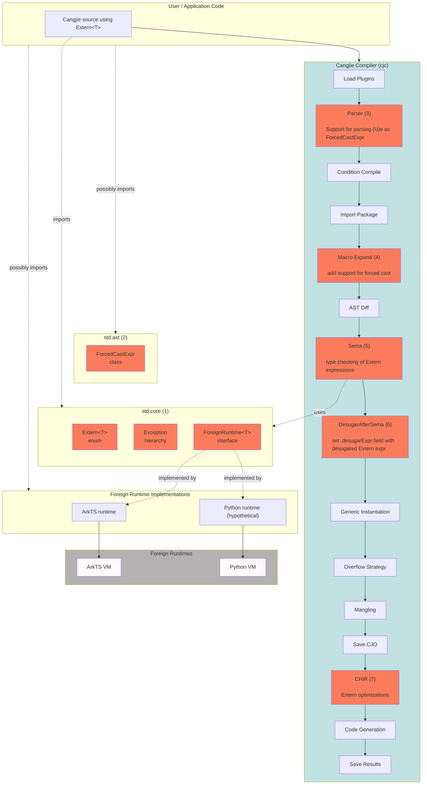

# Architecture/Feature Design Document: Cangjie `Extern<T>` Type

**Feature:** Language-level dynamic interoperability via `Extern<T>` and `ForeignRuntime<T>`

**Spec:** [The Cangjie Extern type](https://wiki.huawei.com/domains/4014/wiki/11230/WIKI2026040810696277)

---
# Changes/fixes since last architecture meeting (10/09/2026)


- Removed section about `T.fromExtern<R>(T.eval(t))` to `T.fromExtern<T>(t)` optimization. The desugaring of `(T)expr` is `T.fromExtern<T>(expr)`.

- `ExternCompoundAssignment` is now part of Extern enum. Before there was a dedicated section about different alternatives to deal with `ExternCompoundAssignment`.

- `evalDerived` is now a static method of `Extern` enum so that the user cannot override it. Before it was a static method of `ForeignRuntime`.

- Added more details on the [Position in the system section](#position-in-the-system), mostly on the table. This includes where the desugaring occurs.

- [Section Compiler Changes](#32-compiler-changes) divided in three sections: parsing, type checking rules, desugaring after SEMA.


---
# Changes/fixes since last architecture meeting (23/07/2026)

- Desugar extern expressions as trees.

- Section with possible optimizations in the foreign Runtime.

- Optimizations in CHIR.

---
# Changes/fixes since last architecture meeting (16/07/2026)


<details>
<summary> 1. Be more precise about implementation: diagram should mention all compilation stages. </summary>

<br/>

Fixed the diagram and added more details in [Feature Impact Analysis](#feature-impact-analysis)

<br/>
<br/>

</details>

<details>
<summary> 2. Implicit conversion to Extern </summary>

<br/>

Make it explicit what we mean by "is in a context where an expression of type Extern<T> is expected".

Made it clear in [Implicit conversion to Extern](#implicit-conversion-to-externt).

1. right-hand side of variable declaration
2. right-hand side of assignment
3. argument for function-like calls
4. argument to return
5. last expression of body of function

<br/>
<br/>

</details>

<details>

<summary> 3. Check if multiple assignment is compatible with Extern desugaring </summary>

<br/>

Yes, it does. it is now mentioned in [Multiple Assignment Expression](#multiple-assignment-expression).

<br/>
<br/>

</details>

<details>
<summary> 4. How to handle compound assignment? </summary>

<br/>

Desugaring proposal in [Compound Assignment](#compound-assignment).

</details>


<details>
<summary> 5. Forced cast: namespace for types is the same as namespace for expressions </summary>

<br/>


`If U is both an expression and a type (because U could be an identifier, and both the name of a type and a variable/function declaration) then (U)(e) is a function application`

is not allowed. Type and expression identifiers share the same namespace.

It's always known if an identifier refers to a `type` or `expression`. Fixed in [Support for forced cast `(U)e`.](#321-parsing)

<br/>
<br/>

</details>

<details>

<summary> 6. Is forced cast compatible with a possible proposal for generic forced cast? </summary>

<br/>

We don't expect any issues if the desugaring is as below.

<br/>

For a type `U` and an expression `exp`, `(U)exp` is desugared as

1. `T.fromExtern<U>(exp)`, if `exp: Extern<T>` for any `T <: ForeignRuntime`
2. `(exp as U).getOrThrow()`, otherwise

<br/>
<br/>

</details>

<details>
<summary> 7. Use intrinsics in Extern methods instead of compiler hacks </summary>

<br/>

Call intrinsic functions in the body of the constructor and `getPayload` instead of having the compiler handling them as a special case. Also specify explicitly that `getPayload(Extern<T>(x)) = x`.

Fixed. See [`Extern<T>` enum](#externt-enum).

<br/>
<br/>

</details>

<details>
<summary> 8. Rename Exception</summary>

<br/>

MemberAccessException -> ExternMemberAccessException	
FunctionAccessException	-> ExternFunctionAccessException
FunctionCallException -> ExternFunctionCallException
IndexAccessException -> ExternIndexedAccessException
ExternConversionException -> ExternConversionException
ExternDynamicException	-> ForeignRuntimeException

Fixed. See [Exception hierarchy](#exception-hierarchy-all-in-stdcore)

<br/>
<br/>

</details>


<details>
<summary> 9. Is extern_runtime.cj in line with std.core style? </summary>

<br/>

We believe it's in line with current style. Fine grained review will take place when PR is merged.

https://gitcode.com/claudio_/cangjie_runtime/blob/feature_extern_runtime/stdlib/libs/std/core/extern_runtime.cj

<br/>
<br/>

</details>


---


## 1. Source and Value of Feature Requirements/Problems/Motivation

### Background

Existing interoperability mechanisms are language-specific, reflection-based, and require significant boilerplate. The `Extern<T>` feature addresses this by providing a lightweight, generic representation of foreign objects that enables direct interaction with external runtimes while keeping runtime-specific behavior encapsulated.

`Extern<T>` introduces a runtime-agnostic abstraction for references to values managed outside the Cangjie runtime. Rather than assuming a foreign object's type system or memory layout, Cangjie treats these values as opaque references and relies on the associated ForeignRuntime implementation to define conversion semantics and dynamic operations. This approach provides a lightweight alternative to wrapper-based interop while remaining extensible to multiple foreign runtimes.

The requirements for improved interop are captured in [Dynamic and gradual types for improved Cangjie–ArkTS interop](https://onebox.huawei.com/v/13b0bf0281118cb4b9ac3bd0366436eb?type=0) and the proposal document [The Cangjie Extern type](https://wiki.huawei.com/domains/4014/wiki/11230/WIKI2026040810696277). Together they motivate a language-level mechanism inspired by C# `dynamic`, but scoped explicitly to foreign runtimes rather than suspending all static typing.

### Before vs after (user perspective)

**Before** — reflection-based ArkTS interop:

```cangjie
func testCJ(runtime: JSContext, callInfo: JSCallInfo): Unit {
    let api = callInfo[0].asObject()
    let addF = api["add"].asFunction()
    let args = [runtime.number(2).toJSValue(), runtime.number(3.5).toJSValue()]
    let receiver = runtime.null().toJSValue()
    let result = addF.call(args, thisArg: receiver).asNumber().toFloat64()
    println("Result: ${result}")
}
```

**After** — `Extern<T>` for some generic runtime `T`, e.g. ArkTS:

```cangjie
func testCJ(vm: Extern<T>): Unit where T <: ForeignRuntime<T> {
    let calculator: Extern<T> = vm.calculator
    let result: Float64 = (Float64)calculator.add(2, 3.5)
    println("Result: ${result}")
}
```

### Design philosophy

`Extern<T>` is inspired by C# `dynamic` but deliberately scoped:

- `T` must implement `ForeignRuntime<T>` — the type parameter distinguishes runtimes.
- Cangjie makes no assumptions about foreign value layout; the runtime owns semantics.
- Dynamic features (member access, call, index) are compiler-desugared to static `ForeignRuntime` calls.
- Cangjie values are implicitly converted to `Extern<T>` when an `Extern<T>` is expected.
- `e: Extern<T>` needs to be explicitly converted to Cangjie through a forced cast operator of the form `(U)e`.

### Major benefits

1. **Productivity:** Eliminate reflection-based API or IDLize-like approaches
2. **Ergonomics:** Idiomatic Cangjie syntax for member access, calls, and indexing on foreign values.
3. **Generality:** Same mechanism works for ArkTS, Python, SQL engines, JSON parsers, or any dynamically invocable evaluator.
4. **Safety vs `dynamic`:** `Extern<T>` is explicitly tied to runtime `T`, reducing the abuse surface of unconstrained dynamic typing.


---

## 2. Feature Impact Analysis <span id="feature-impact-analysis"></span>

### Position in the system <span id="position-in-the-system"></span>

Compilation stages according to [cangjie_compiler/src/Frontend/CompilerInstance.cpp](https://gitcode.com/Cangjie/cangjie_compiler/blob/main/src/Frontend/CompilerInstance.cpp).

This document is mostly about the boxes in red. More detailed information about the implementation can be found in [5. Detailed Implementation Details](#5-detailed-implementation-plan).



### Changes 

| Component | Role |
| --- | --- |
| `cangjie_runtime` - std.core | (1) New file [`extern_runtime.cj`](https://gitcode.com/claudio_/cangjie_runtime/blob/feature_extern_runtime/stdlib/libs/std/core/extern_runtime.cj) in `std.core` with `Extern<T>` enum, `ForeignRuntime<T>` interface, new exceptions, and documentation about new public declarations. |
| `cangjie_runtime` - std.ast | (2) New `ForcedCastExpr <: Expr` class. Class declaration, flatbuffers serialization. |
| `cangjie_compiler` - Parser | (3) Parse forced cast `(U)e` expressions as `ForcedCastExpr`. Note, that at this point we still don't know if we have a forced cast or a call expression of the form `(f)(x)` - this decision is postponed to SEMA. |
| `cangjie_compiler` - Macro Expand | (4) Add support for new ForcedCastExpr expressions, including flatbuffers serialization. |
| `cangjie_compiler` - Sema | (5) Type checking of Extern expressions and annotate Extern expression that need desugaring. Typing rules in section [3.2.2. Type Checking Rules](#322-type-checking-rules). Implementation details in [5.1. Type Checking](#51-type-checking). |
| `cangjie_compiler` - Desugar After Sema | (6) Additional pass to desugar annotated Extern expressions. Desugaring rules in section [3.2.3. Desugaring after sema](#323-desugaring-after-sema).  Implementation details in [5.2. Desugaring](#52-desugaring). |
| `cangjie_compiler` - CHIR | (7) Extern optimizations. Example in section [4.2](#42-compiler-optimizations). |
| `cangjie_tools` | Consequence of (1). Some LSP tests golden files need to be updated because of additional new public declarations in std.core. |

No changes in the compiler backend or any specific OS-specific features.

### ABI/API compatibility

- **New std.core API:** `Extern<T>`, `ForeignRuntime<T>`, exception classes — additive, no breaking change to existing APIs.
- **New syntax:** Forced cast `(U)e` — purely additive.
- **ABI:** `Extern<T>` is a `non-exhaustive enum`; adding constructors at the end of an `non-exhaustive enum` doesn't break API/ABI compatibility.
- **Backward compatibility:** Full compatible, including `ohos.ark_interop` code continues to work; migration is opt-in.

### External user perception

External developers will see new `Extern<T>`, `ForeignRuntime<R>` types and `(U)e` forced cast in the language documentation.

### Performance impact

| Aspect | Impact |
| --- | --- |
| **Compile time** | Parsing forced-cast, typing of Extern expressions and additional pass to desugar Extern expressions (~1500 loc); should negligible for typical projects |
| **Runtime** | Each dynamic operation is a static call to `ForeignRuntime` method; runtime implementer is responsible for the design, implementation, and optimization of these methods |
| **Space** | Extern expressions are captured in a tree and evaluated at runtime. |

---

## 3. High level design

Consider the following a motivational example for this section.

```cangjie
// vm: Extern<T>, T <: ForeignRuntime
let calculator : Extern<T> = vm.calculator
let sum        : Extern<T> = calculator.add(2, 3.5)
let result     : Float64   = (Float64)sum
```

During compilation, the example above is desugared as follows.

```cangjie
let calculator : Extern<T> = T.eval(ExternMemberAccess(vm, "calculator"))
let sum        : Extern<T> = T.eval(ExternFunctionCall(ExternMemberAccess(calculator, "add"), [2, 3.5]))
let result     : Float64   = T.fromExterrn<Float64>(sum)
```

The compiler builds a tree for the Extern typed expressions and calls `ForeignRuntime` static functions.

Section 3.1 introduces the changes to standard library core, and Section 3.2 introduces the changes required in the compiler.

### 3.1 Standard library (`std.core`)

We introduce a **new file**: `stdlib/libs/std/core/extern_runtime.cj` containing the following definitions.

#### `Extern<T>` enum <span id="externt-enum"></span>

```cangjie
public enum Extern<T> where T <: ForeignRuntime<T> {
    // primitive constructors
    | ExternPayload(Any)
    | ExternMemberAccess(Extern<T>,       /* field */ String)
    | ExternIndexedAccess(Extern<T>,      /* index */ Any)
    | ExternMemberUpdate(Extern<T>,       /* field */ String, /* value */ Any)
    | ExternIndexedUpdate(Extern<T>,      /* index */ Any,    /* value */ Any)
    | ExternFunctionCall(Extern<T>,       /* args  */ Array<Any>)
    | ExternCompoundAssignment(Extern<T>, /* opt   */ String, /* value */ Any)
    // derived constructors
    | ...

    public static func evalDerived(e: Extern<T>): Extern<T> {
        match(e) {
            case _ => throw ExternUnsupportedOperation()
        }
    }
}
```

The `Extern<T>` constructors above are said to be the primitive `Extern` constructors.

Even though we define `Extern<T>` as being non-exhaustive we require new constructors to be derived from the others. The `evalDerived` function is intended to implement how new constructors should be evaluated in terms of the primitive constructors. Adding a new constructor to `Extern<T>`, requires adding support for it in `evalDerived`. Example is shown in [Compiler Optimizations](#42-compiler-optimizations-needs-extern-tree-and-externseq).

#### `ForeignRuntime<T>` interface

```cangjie
public interface ForeignRuntime<T> where T <: ForeignRuntime<T> {
    static func fromExtern<R>(e: Extern<T>): R
    static func toExtern<R>(v: R): Extern<T>

    static func eval(t: Extern<T>): Extern<T>
}
```

Implementers of `ForeignRuntime<T>` are requested to handle `ExternPayload`, `ExternMemberAccess`, `ExternIndexedAccess`, `ExternMemberUpdate`, `ExternIndexedUpdate`, and `ExternFunctionCall`, and to call `Extern<T>.evalDerived` in the default case.

#### Exception hierarchy (all in `std.core`) <span id="exception-hierarchy-all-in-stdcore"></span>

| Exception | When raised |
| --- | --- |
| `ExternMemberAccessException` | Non-existing member access/update |
| `ExternFunctionAccessException` | Non-existing function access |
| `ExternFunctionCallException` | Wrong arguments to function call |
| `ExternIndexedAccessException` | Wrong index or out-of-bounds |
| `ExternCompoundAssignmentException` | Unsupported compound assignment |
| `ExternConversionException` | `fromExtern` / `toExtern` conversion failure |
| `ForeignRuntimeException` | Foreign runtime throws (includes foreign stack trace) |
| `ExternUnsupportedOperation` | Runtime implementer doesn't implement optimization |


#### API contract <span id="api-contract"></span>

`ForeignRuntime` implementers **must** implement the following functions:

1. `static func fromExtern<R>(e: Extern<T>): R`
    - must throw `ExternConversionException` if a conversion exception occurs.
2. `static func toExtern<R>(v: R): Extern<T>`
    - must throw `ExternConversionException` if a conversion exception occurs.
3. `static func eval(t: Extern<T>): Extern<T>`
    - must handle the `Extern` primitive constructors: `ExternPayload`, `ExternMemberAccess`, `ExternIndexedAccess`, `ExternMemberUpdate`, `ExternIndexedUpdate`, `ExternFunctionCall`, and `ExternCompoundAssignment`.
    - must call `Extern<T>.evalDerived(t)` in the default case.
    - must throw `ExternMemberAccessException`, `ExternFunctionAccessException`, `ExternFunctionCallException`, `ExternIndexedAccessException`, `ExternCompoundAssignmentException` if the respective dynamic operation fails.
    - must throw `ForeignRuntimeException` if the execution in the external runtime throws an exception.

Example:

```cangjie
public class MockRT <: ForeignRuntime<MockRT> {
    public static func eval(t: Extern<MockRT>): Extern<MockRT> {
        match (t) {
            case ExternPayload(_) => t
            case ExternMemberAccess(e, field) => /* specific implementation of ExternMemberAccess */ throw ExternMemberAccessException()
            case ExternIndexedAccess(e, index) => /* specific implementation of ExternIndexedAccess */ throw ExternIndexedAccessException()
            case ExternMemberUpdate(e, field, value) => /* specific implementation of ExternMemberUpdate */ throw ExternMemberAccessException()
            case ExternIndexedUpdate(e, index, value) => /* specific implementation of ExternIndexedUpdate */ throw ExternIndexedAccessException()
            case ExternFunctionCall(e, args) => /* specific implementation of ExternFunctionCall */ throw ExternFunctionAccessException()
            case ExternCompoundAssignment(e, op, value) => /* specific implementation of ExternCompoundAssignment */ throw ExternCompoundAssignmentException()
            case _ => Extern<MockRT>.evalDerived(t) // <==== Calling `evalDerived` from `Extern<T>`
        }
    }
    public static func fromExtern<R>(e: Extern<MockRT>): R { throw ExternConversionException() }
    public static func toExtern<R>(v: R): Extern<MockRT> { throw ExternConversionException() }
}
```

Note how the default case (`case _ => ...`) invokes `Extern<MockRT>.evalDerived(t)` so that new derived constructors are supported out of the box.

### 3.2 Compiler changes


#### 3.2.1 Parsing <span id="parsing"></span>

Support for forced cast `(U)e` requires the addition of an AST node. At parsing time the syntax is ambiguous and the
parser cannot decide between a forced cast or a call expression of the form `(f)(x)` - this decision is postponed to
SEMA. We add `struct AmbiguousForcedCastExpr : Expr` which holds both readings to `include/cangjie/AST/Node.h`.

```cpp
struct AmbiguousForcedCastExpr : Expr {
    OwnedPtr<Type> type;      /**< `U` parsed as a type (null if not a valid type). */
    OwnedPtr<Expr> leftExpr;  /**< `U` parsed as an expression (null if not a valid expr). */
    OwnedPtr<Expr> rightExpr; /**< Operand, shared by both readings. */
    ...
}
```

Support for the new AST node needs to be added in the compiler macro stage. That includes adding support for it in the
serialization/deserialization process and also adding it to the Cangjie AST library.

A preliminary implementation can be found
[here](https://gitcode.com/alksjhdgf/cangjie_compiler_fc/commit/409039511add9fbef51ccc8991ab2c58d8b1ae31?ref=extern_forced_cast).

#### 3.2.2 Type checking rules

##### Forced cast

| Condition for `(U)e` | Rule |
|---|---|
| `U` resolves to a type and `e: Extern<T>` with `T <: ForeignRuntime<T>` | Accept; result type is `U`. |
| `U` resolves to a function and `e` is a parenthesized argument list | Check as an ordinary function call. |
| Neither reading succeeds | Type error. |

Examples, with `e: Extern<R>` and `f` a function:

```cangjie
(Int64)e    // forced cast; type Int64
(f)(e)      // ordinary function call
(Int64)1    // type error: operand is not Extern
```

##### Extensions of `Extern`

An extension targeting `Extern<T>` is a type error, including through a type alias.

Examples:

```cangjie
extend<T> Extern<T> where T <: ForeignRuntime<T> {}

type ForeignValue<T> = Extern<T>
extend<T> ForeignValue<T> where T <: ForeignRuntime<T> {}
```

Both extensions report:

```bash
error: extending type 'Enum-Extern<Generics-T>' is not allowed
```

##### Implicit conversion

When `Extern<T>` is expected in a context that allows implicit conversion (listed below), accept a well-typed expression `exp: U` and retain `U` for later desugaring into `T.toExtern<U>(exp)`, if needed. Values that are already of type `Extern<T>` need no conversion.

| Context | Rule | Example |
|---|---|---|
| Initializer | declared type | `let x: Extern<T> = exp` |
| Assignment | type of the left-hand side variable | `x = exp` |
| Call argument | parameter type | `f(exp)` |
| Return | return type of the function | `return exp` |
| Function or lambda body | return type, for the last expression | `func f(): Extern<T> { exp }` |
| Default parameter value | parameter type | `func f(p!: Extern<T> = exp) {}` |
| Array or tuple literal element | element type of the literal | `let arr: Array<Extern<T>> = [exp1, exp2]`, `let tpl: (Extern<T>, Int64) = (exp, 1)` |
| Branch of `if`, `match` or `try`, including `catch` and effect handlers | expected type of the `if`, `match` or `try` | `let x: Extern<T> = if (c) { exp1 } else { exp2 }` |

The last two rows apply recursively, e.g. `[[1]]` is accepted as `Array<Array<Extern<T>>>`. Blocks, parenthesized expressions, `if`, `match`, `try` and loops are never converted as a whole: only the values they produce are. So loops, an `if` without `else`, a `try` with resources and a block ending with a declaration, whose type is `Unit`, are type errors as for any other expected type. Other expressions, including literals, lambdas, `spawn` and `synchronized`, are converted as a whole when they are themselves expected to be `Extern<T>`. For `synchronized`, the conversion thus runs after the lock is released.

In overload resolution, a candidate that needs no conversion of its arguments is preferred.

Examples of well typed expressions and type errors:

```cangjie
let x: Int64 = 42
let u: Extern<R> = ()    // OK, the unit value will be converted
let e: Extern<R> = x     // OK, x will be converted

func f(p: Extern<R>) { ... }
func g(): Int64 { 1 }

// Contexts
var a: Extern<R> = e                              // OK, no conversion needed
a = "s"                                           // OK, "s" will be converted
f(x + 1)                                          // OK, x + 1 will be converted
func h1(): Extern<R> { return 1 }                 // OK, 1 will be converted
func h2(): Extern<R> { x }                        // OK, x will be converted
let l: () -> Extern<R> = { => x }                 // OK, x will be converted
func h3(p!: Extern<R> = 1) {}                     // OK, default value will be converted
func h4(): Extern<R> { throw Exception() }        // OK, Nothing needs no conversion

// Literals
let b: Array<Extern<R>> = [x, "s"]                // OK, each element will be converted
let t: (Extern<R>, Int64) = (x, 1)                // OK, x will be converted
let n: Array<Array<Extern<R>>> = [[1], ["s"]]     // OK, 1 and "s" will be converted
let c: Extern<R> = [x, 12]                        // OK, whole literal will be converted

// Expressions made of blocks of code
let d: Extern<R> = if (x > 0) { 1 } else { "n" }  // OK, each branch will be converted
let m: Extern<R> = match (x) {                    // OK, each case will be converted
    case 0 => "zero"
    case _ => x
}
let tc: Extern<R> = try { x } catch (_: Exception) { "error" }  // OK, x and "error" will be converted
let u: Extern<R> = if (x > 0) { 1 }               // type error: an if without else has type Unit
let w: Extern<R> = while (x > 0) {}               // type error: a loop has type Unit

// No conversion
let ints: Array<Int64> = [3]
let arr: Array<Extern<R>> = ints                  // type error: expected Array<Extern<R>>, found Array<Int64>
let fn: () -> Extern<R> = g                       // type error: expected () -> Extern<R>, found () -> Int64
let sum: Extern<R> = x + "s"                      // type error: invalid binary operator '+' on Int64 and String
match (e) {
    case 5 => ()                                  // type error: expected Extern<R>, found Int64
    case _ => ()
}

// Overload resolution
func k(p: Int64) {}
func k(p: Extern<R>) {}
k(1)                                              // OK, calls k(p: Int64), which needs no conversion
```

##### Dynamic operations

For a value `e: Extern<T>`, all operations below have type `Extern<T>`.

| Operation | Rule |
|---|---|
| `e.f` | No static foreign-member lookup. |
| `e[idx]` | Index must be well-typed expressions of any type. |
| `e(a1, ..., an)` | Arguments must be well-typed expressions of any type; named and `inout` arguments are rejected. |
| `e.f = v`, `e[idx] = v`, `e.f op= v`, `e[idx] op= v` | Index and `v` must be well-typed expressions of any type. |

Indices, arguments and update values do not implicitly call `toExtern`. Assignment to an `Extern<T>` variable follows ordinary assignment rules. Operators rewritten as member calls follow the dynamic-call rules; `++` and `--` require integer operands. Multiple assignment checks each update independently.

Examples, with `e: Extern<R>` and `x: Int64`:

```cangjie
e.f                      // type Extern<R>
e.f.g.h                  // type Extern<R>; each member access is dynamic
e[0]["k"]                // type Extern<R>; each subscript is dynamic
e[x, "k"]                // type Extern<R>; indices of any type
e(1, "a")                // type Extern<R>; e is called as a function
e.f(1, "a")              // type Extern<R>; arguments will not be converted
e.f(1)(2)                // type Extern<R>; the result is called again
e.f { => 1 }             // type Extern<R>; the trailing lambda is an argument
e.f(e.g)                 // type Extern<R>; Extern<R> arguments are passed as they are
e.f = e.g                // type Extern<R>
e[0] = "a"               // type Extern<R>; value will not be converted
e.f += 1                 // type Extern<R>; literal 1 will not be converted
e[0] += 1                // type Extern<R>
(e.f, e[0]) = (1, "a")   // each update is checked independently
e + 1                    // type Extern<R>; desugared as `e.+(1)`
let i: Int64 = e.f       // type error: no implicit conversion from Extern<R>
if (e < 1) {}            // type error: condition must be Bool
e.f(p: 1)                // type error: named arguments are rejected
e.f(inout x)             // type error: inout arguments are rejected
e++                      // type error: integer required
```

#### 3.2.3 Desugaring after SEMA

##### Forced cast

At the desugaring stage the remaining operations `(U)e` are not ambiguous anymore and can be desugared as `T.fromExtern<U>(BUILD_TREE(e))`, for `e: Extern<T>` and `T <: ForeignRuntime<T>`. The desugaring function `BUILD_TREE` is defined below.

##### Implicit conversion to `Extern<T>` <span id="implicit-conversion-to-externt"></span>

`exp: U` accepted by the [implicit conversion](#implicit-conversion) rules, with `U` neither `Extern<T>` nor `Nothing`, becomes `T.toExtern<U>(exp)`, applied to:

- array or tuple literal: each element, to its element type; the whole literal if expected `Extern<T>`;
- block, `if`, `match`, `try`: the expressions giving its value, never the whole expression;
- `synchronized`: the whole expression, after the lock is released;
- function or lambda body: its last expression.

**Example 1**:
Assume `cjexp` has type `U` with `U != Extern<T>`. Then:

`let x: Extern<R> = cjexp` is desugared into `let x: Extern<R> = R.toExtern<U>(cjexp)`

**Example 2**:

```cangjie
func foo(..., x: Extern<R>, ...) {...}
foo(..., 42, ...)
```

is desugared into

```cangjie
func foo(..., x: Extern<R>, ...) {...}
foo(..., R.toExtern<Int64>(42), ...)
```

**Example 3**:

```cangjie
let a1: Array<Extern<R>> = [1, "a"]

let x: Int64 = 42
let a2: Array<Extern<R>> = [x, 12]

let b: Extern<R> = [x, 12]
```

is desugared into

```cangjie
let a1: Array<Extern<R>> = [R.toExtern<Int64>(1), R.toExtern<String>("a")]

let x: Int64 = 42
let a2: Array<Extern<R>> = [R.toExtern<Int64>(x), R.toExtern<Int64>(12)]

let b: Extern<R> = R.toExtern<Array<Int64>>([x, 12])
```

**Example 4**

```cangjie
let x: Extern<R> = if (c) { 1 } else { "a" }
let y: Extern<R> = match (n) {
    case 0 => println("zero"); 0
    case _ => e
}
```

is desugared into

```cangjie
let x: Extern<R> = if (c) { R.toExtern<Int64>(1) } else { R.toExtern<String>("a") }
let y: Extern<R> = match (n) {
    case 0 => println("zero"); R.toExtern<Int64>(0)
    case _ => e                                    // e: Extern<R> needs no conversion
}
```

##### Dynamic Extern expression desugaring

The desugaring of `Extern` expressions is performed according to the `DESUGAR` function defined below. It resorts to tree-building function `BUILD_TREE` and applies `T.eval` to the result.

```cangjie
DESUGAR((U)exp) =
    T.fromExtern<U>(BUILD_TREE(exp))
DESUGAR(e1.f) = // if e1 has type Extern<T>
    T.eval(ExternMemberAccess(BUILD_TREE(e1), "f"))
DESUGAR(e1.f = e2) = // if e1 has type Extern<T>
    T.eval(ExternMemberUpdate(BUILD_TREE(e1), "f", BUILD_TREE(e2)))
DESUGAR(e1[i]) = // if e1 has type Extern<T>
    T.eval(ExternIndexedAccess(BUILD_TREE(e1), BUILD_TREE(i)))
DESUGAR(e1[i] = e2) = // if e1 has type Extern<T>
    T.eval(ExternIndexedUpdate(BUILD_TREE(e1), BUILD_TREE(i), BUILD_TREE(e2)))
DESUGAR(e1(e2, e3, ...)) = // if e1 has type Extern<T>
    T.eval(ExternFunctionCall(BUILD_TREE(e1), [BUILD_TREE(e2), BUILD_TREE(e3), ...]))
DESUGAR(e1 op= e2) = // if e1 is e.f or e[i] with e of type Extern<T>
    T.eval(ExternCompoundAssignment(BUILD_TREE(e1), op, BUILD_TREE(e2)))
DESUGAR(x op= e2) = // if x is a variable of type Extern<T>
    x = DESUGAR(x.op(e2))
DESUGAR(exp.f op= e2) = // if exp has a non-Extern type and exp.f has type Extern<T>
    exp.f = DESUGAR(exp`.f.op(e2))   // exp is evaluated once, exp` is a reference to exp
DESUGAR(base) = // expressions without smaller subexpressions are preserved as they are
    base
DESUGAR(exp) = // otherwise, for desugar sub expressions and preserve structure
    MAP(DESUGAR, exp)
```

For `BUILD_TREE`, the following cases apply when `e1` has type `Extern<T>`:

```cangjie
BUILD_TREE(e1.f)            = ExternMemberAccess(BUILD_TREE(e1), "f")
BUILD_TREE(e1.f = e2)       = ExternMemberUpdate(BUILD_TREE(e1), "f", BUILD_TREE(e2))
BUILD_TREE(e1[i])           = ExternIndexedAccess(BUILD_TREE(e1), BUILD_TREE(i))
BUILD_TREE(e1[i] = e2)      = ExternIndexedUpdate(BUILD_TREE(e1), BUILD_TREE(i), BUILD_TREE(e2))
BUILD_TREE(e1(e2, e3, ...)) = ExternFunctionCall(BUILD_TREE(e1), [BUILD_TREE(e2), BUILD_TREE(e3), ...])
BUILD_TREE(e1 op= e2)       = ExternCompoundAssignment(BUILD_TREE(e1), op, BUILD_TREE(e2))
BUILD_TREE(exp)             = MAP(DESUGAR, exp)    // otherwise, desugar subexpressions and preserve structure
```

For `Extern` expressions, `BUILD_TREE` builds dynamic `Extern` trees. For non-`Extern` Cangjie expressions, `MAP(DESUGAR, exp)` preserves the outer expression and desugars its subexpressions. These are leaves of the tree and keep their own type: indices, arguments and update values are not converted with `toExtern`, as stated in [dynamic operations](#dynamic-operations).

The other dynamic operations of the type checking rules reduce to the cases above:
- `e1[i1, ..., in]` is desugared as `e1[i1]...[in]`, and `e1[i1, ..., in] = e2` as `e1[i1]...[in-1][in] = e2`;
- an operator is first rewritten as a member call by the type checker, as for any operator overloading: `e1 op e2` becomes `e1.op(e2)`, e.g. `e1 + 1` becomes `e1.+(1)`, and `op e1` becomes `e1.op()`, e.g. `-e1` becomes `e1.-()`, which are dynamic calls;
- a multiple assignment is desugared into single assignments before `DESUGAR` (see [Multiple Assignment Expression](#multiple-assignment-expression)).

**IMPORTANT**: For the `Extern` expression trees, the evaluation order is defined by the foreign-runtime implementation; for non-`Extern` Cangjie expressions, the standard Cangjie evaluation order applies. The specification must account for this distinction.

Example 1:

For `e1: Extern<T>`.

```cangjie
DESUGAR(e1.x.y) = T.eval(ExternMemberAccess(ExternMemberAccess(e1, "x"), "y"))
```

Example 2:

For `e1, e2: Extern<T>`.

```cangjie
DESUGAR(e1.x.y = e2.z) =
    T.eval( ExternMemberUpdate(
                ExternMemberAccess(e1, "x"),
                "y",
                ExternMemberAccess(e2, "z")
            )
    )
```

Example 3:

For `e1, e2: Extern<T>`.

```cangjie
DESUGAR(e1.x += e2) =
    T.eval( ExternCompoundAssignment(
                ExternMemberAccess(e1, "x"),
                "+",
                e2
            )
    )
```

Example 4:

For `e1, e2: Extern<T>`.

```cangjie
DESUGAR(e1.a[e2.b]) =
    T.eval( ExternIndexedAccess(
                ExternMemberAccess(e1, "a"),
                ExternMemberAccess(e2, "b")
            )
    )
```

Example 5:

For `e1, e2, e3: Extern<T>`.

```cangjie
DESUGAR(e1.a[e2.b] = e3.c) =
    T.eval( ExternIndexedUpdate(
                ExternMemberAccess(e1, "a"),
                ExternMemberAccess(e2, "b"),
                ExternMemberAccess(e3, "c")
            )
    )
```

Example 6:

For `e1, e2, e3: Extern<T>`.

```cangjie
DESUGAR(e1.a[e2].b -= e3.c) =
    T.eval( ExternCompoundAssignment(
                ExternMemberAccess(ExternIndexedAccess(ExternMemberAccess(e1, "a"), e2), "b"),
                "-",
                ExternMemberAccess(e3, "c")
            )
    )
```

Example 7:

For `e1, e2, e3: Extern<T>`, `n: Int64`.

```cangjie
DESUGAR(e1.a.b(e2.c, e3[0], n + 1)) =
    T.eval( ExternFunctionCall(
                ExternMemberAccess(ExternMemberAccess(e1, "a"), "b"),
                [ ExternMemberAccess(e2, "c"), 
                  ExternIndexedAccess(e3, 0),
                  n + 1
                ]
            )
    )
```

Example 9:

For a variable `x: Extern<T>` and a function `foo(): C`, where `C` has a field `f: Extern<T>`.

```cangjie
DESUGAR(x += 1)       =
    x = T.eval(ExternFunctionCall(ExternMemberAccess(x, "+"), [1]))
DESUGAR(foo().f *= 2) = 
    foo().f = T.eval(ExternFunctionCall(ExternMemberAccess(foo`.f, "*"), [2]))   // foo() is evaluated once, foo` is a reference for foo()
```

#### Other forms of assignment

##### Multiple Assignment Expression <span id="multiple-assignment-expression"></span>

Multiple assignment of the form `(x1, ..., x3) = ...` remains consistent with the current specification/implementation. This occurs naturally because the desugaring of multiple assignment occurs before the desugaring of Extern.

---

## 4. Optimizations

### 4.1. Runtime implementer possible optimizations

Because `eval` / `fromExtern` receive an `Extern` *tree* (nested operands are not pre-evaluated), the runtime can specialize common shapes.

#### Possible optimization 1: path access (needs Extern tree)

```cangjie
e.a.b.c
// T.eval(ExternMemberAccess(ExternMemberAccess(ExternMemberAccess(e, "a"), "b"), "c"))
```

A naive `eval` costs one FFI call and one intermediate handle per member access (3 of each here). The runtime can instead resolve the whole path `["a", "b", "c"]` on `e` in a single call, with no intermediate `Extern` / global handles.

A similar optimization is possible for member update with one path write:

```cangjie
e.a.b.c = e2
// T.eval(ExternMemberUpdate(ExternMemberAccess(ExternMemberAccess(e, "a"), "b"), "c", e2))
```

#### Possible optimization 2: short lifetime for intermediate values (needs Extern tree)

```cangjie
e.a.b(c.d, f[0]).g
// T.eval(ExternMemberAccess(
//     ExternFunctionCall(
//         ExternMemberAccess(ExternMemberAccess(e, "a"), "b"),
//         [ExternMemberAccess(c, "d"), ExternIndexedAccess(f, 0)]),
//     "g"))
```

A naive `eval` promotes every nested access, call, and argument to a global handle (6 here). Only the result of the whole expression is visible to Cangjie, so the intermediates can stay local and be released when `eval` returns.

#### Possible optimization 3: short lifetime for values that are immediately translated into Cangjie values (needs Extern tree)

```cangjie
let s: String = (String)e.a.b
// T.fromExtern<String>(ExternMemberAccess(ExternMemberAccess(e, "a"), "b"))
```

Because `fromExtern` receives the whole tree, it can evaluate and copy the final foreign string directly into Cangjie. Neither the intermediate object nor the final string needs to be promoted to a long-lived handle.

#### Possible optimization 4: intern field names

```cangjie
e.foo
e.foo
// T.eval(ExternMemberAccess(e, "foo"))
// T.eval(ExternMemberAccess(e, "foo"))
```

A naive `eval` converts the Cangjie string `"foo"` into a foreign string on every access. Interning it as a reusable foreign string removes that conversion from all later accesses of the same field name.

#### Possible optimization 5: cache converted strings

```cangjie
let e1: Extern<T> = "foo"
let e2: Extern<T> = "foo"
// T.toExtern<String>("foo")
// T.toExtern<String>("foo")
```

A naive `toExtern` allocates and converts the same Cangjie string twice. Caching the foreign string keyed by the Cangjie value turns the second conversion into a lookup; the dual is `fromExtern<String>(e)` on the same immutable foreign string.

#### Possible optimization 6: bulk conversion of aggregates

```cangjie
let a: Extern<T> = [1, 2, 3]
// T.toExtern<Array<Int64>>([1, 2, 3])
```

A naive `toExtern` builds the foreign array one element at a time. Copying the buffer in one go costs a single FFI call for the whole array; the dual is `(Array<Int64>)a` in `fromExtern`.

#### Possible optimization 7: send the whole tree in one FFI call (needs Extern tree)

```cangjie
e.a.b(c.d, f[0]).g
// T.eval(ExternMemberAccess(
//     ExternFunctionCall(
//         ExternMemberAccess(ExternMemberAccess(e, "a"), "b"),
//         [ExternMemberAccess(c, "d"), ExternIndexedAccess(f, 0)]),
//     "g"))
```

A naive `eval` crosses the FFI boundary once per constructor (6 times here), and optimization 1 fuses only pure member paths. Encoding the tree and evaluating it on the C / VM side handles a mixed member / index / call expression in a single crossing.

### 4.2. Compiler Optimizations (needs Extern tree and ExternSeq) <span id="42-compiler-optimizations-needs-extern-tree-and-externseq"></span>

The current implementation allows for compiler optimizations to be added without breaking backward compatibility. We propose the following:

```cangjie
T.eval(E1)
T.eval(E2)
```

The sequence of `T.eval` can be combined into a single operation so that there's one call to `T.eval` instead of two.

For this to be happen we extend the `Extern` enumeration by adding a constructor - this change is API/ABI compatible and must not break `ForeignRuntime`s implementation that adhere to the [Foreign Runtime API contract](#api-contract).

First of all, we add a new constructor to the `Extern<T>` enum and handle it in `evalDerived`:

```cangjie
public enum Extern<T> where T <: ForeignRuntime<T> {
    // primitive constructors
    | ExternPayload(Any)
    | ExternMemberAccess(Extern<T>,       /* field */ String)
    | ExternIndexedAccess(Extern<T>,      /* index */ Any)
    | ExternMemberUpdate(Extern<T>,       /* field */ String,  /* value */ Any)
    | ExternIndexedUpdate(Extern<T>,      /* index */ Any,     /* value */ Any)
    | ExternFunctionCall(Extern<T>,       /* args  */ Array<Any>)
    | ExternCompoundAssignment(Extern<T>, /* op    */ String, /* value */ Any)
    // derived constructors
    | ExternSequence(Extern<T>, Extern<T>)
    | ...

    public static func evalDerived(e: Extern<T>): Extern<T> {
        match(e) {
            case ExternSequence(e1, e2) =>
                T.eval(e1)
                return T.eval(e2)
            case _ => throw ExternUnsupportedOperation()
        }
    }
}
```

`ForeignRuntime`s implementations are not required to support the `ExternSequence` constructor in their `eval` function if they adhere to the API documentation.

The compiler can now optimize expressions of the form

```cangjie
T.eval(E1)
T.eval(E2)
```

into 

```cangjie
T.eval(ExternSequence(E1, E2))
```

Example 1:

Assigning two fields of the same object

```cangjie
e1.a = ea
e1.b = eb
// desugared as →
ArkTS.eval(ExternMemberUpdate(e1, "a", ea))
ArkTS.eval(ExternMemberUpdate(e1, "b", eb))
// optimized as →
ArkTS.eval(ExternSequence(
    ExternMemberUpdate(e1, "a", ea),
    ExternMemberUpdate(e1, "b", eb)))
```

Example 2:

Function call where the result of the call is not captured.

```cangjie
a.b.c()
d.e.f()
// desugared as →
ArkTS.eval(ExternFunctionCall(ExternMemberAccess(ExternMemberAccess(a, "b"), "c"), []))
ArkTS.eval(ExternFunctionCall(ExternMemberAccess(ExternMemberAccess(d, "e"), "f"), []))
// optimized as →
ArkTS.eval(ExternSequence(
    ExternFunctionCall(ExternMemberAccess(ExternMemberAccess(a, "b"), "c"), []),
    ExternFunctionCall(ExternMemberAccess(ExternMemberAccess(d, "e"), "f"), [])))
```

Note that in the optimized version, the runtime implementer knows that the result of `a.b.c()` doesn't need to be materialized into an `Extern`.

Once the foreign runtime is made aware of the new ExternSequence constructor, support for it can be implemented, potentially enabling new optimizations.

Example:

```cangjie
public class MockRT <: ForeignRuntime<MockRT> {
    public static func eval(t: Extern<MockRT>): Extern<MockRT> {
        match (t) {
            ...
            case ExternSequence(e1, e2) =>
                return evalSequence(e1, e2)
            case _ => Extern<MockRT>.evalDerived(t)
        }
    }

    // InternalValue is some short-lived value
    private evalInternal(t: Extern<MockRT>): InternalValue { ... }
    // promote a short-lived value to a 
    private retain(v: InternalValue) : Extern<MockRT> { ... }
    private func isTheSame(e1: Extern<MockRT>, e2: Extern<MockRT>) { ... }
    private func performMultipleFieldAssignment(e: Extern<MockRT>, fields: Array<String>, values: Array<Any>) { ... }
    private func performSingleFieldAssignment(e: Extern<MockRT>, fields: String, values: Any) { ... }   

    private static func evalSequence(e1: Extern<MockRT>, e2: Extern<MockRT>): Extern<MockRT> {
        match((e1, e2)) {
            case (ExternMemberUpdate(obj1, field1, value1), ExternMemberUpdate(obj2, field2, value2)) =>
                let obj1eval = eval(obj1)
                let obj2eval = eval(obj2)
                if (isTheSame(obj1eval, obj2eval)) {
                    /* Can optimize
                    e.a = v1
                    e.b = v2
                    */
                    performMultipleFieldAssignment(obj1eval, [field1, field2], [value1, value2])
                } else {
                    performSingleFieldAssignment(obj1eval, field1, value1)
                    performSingleFieldAssignment(obj2eval, field2, value2)
                }
            case _ =>
                // do not retain the result of evaluating e1
                evalInternal(e1)
                // the result of evaluating e2 still needs to be materialized
                return retain(evalInternal(e2))
        }
    }
}
```

---

## 5. Detailed Implementation Plan

The compiler introduces two rewrites:

| Rewrite | Source | Result |
|---|---|---|
| Implicit conversion | `e: U` where `Extern<T>` is expected | `T.toExtern<U>(e)` |
| Dynamic operation | `e.f`, `e[i]`, `e(args)`, `e.f = v`, `e[i] = v`, `e.f op= v` with `e: Extern<T>` | `T.eval(tree)` |

Sema only accepts these expressions and gives them their types. The rewrites happen in one pass after Sema, driven by the final types.

### 5.1. Type checking

#### 5.1.1. `Extern` cannot be extended

Extending `Extern` should result in a type error.

`CheckExtendedTypeValidity` in [TypeCheckExtend.cpp](https://github.com/CJPLUK/cangjie_compiler/compare/799e9f6545cc8a83355c5d77e777f8f571215815...feature_extern_with_enum#diff-6f0fdcb019a9c84eec322123375088e33baaf881deddc63a69a0412dfa74266a) should report `sema_illegal_extended_type` for `extend Extern<T>`, including through a type alias.

#### 5.1.2. Implicit conversions

##### Conversion in `Check`

Function `Check` in [`src/Sema/TypeChecker.cpp`](https://github.com/CJPLUK/cangjie_compiler/compare/799e9f6545cc8a83355c5d77e777f8f571215815...feature_extern_with_enum#diff-82ac4d96ac0e1970552e95b7d95d2a768441f87b06ac3fdfbff63a80f7b3d258) accepts an expression of any type when the target is `Extern<T>`:

```text
if target is Extern<T> and node is an Expr and !IsControlFlowExpr(node):
    synthesize node without a target
    succeed if the resulting type is a valid type
else:
    check as before
```

So the conversion applies wherever an expression is checked against `Extern<T>`: variable initializers, assignments, call arguments, `return`, function and lambda bodies, and default parameter values.

`IsControlFlowExpr(node)` (file-local in `TypeChecker.cpp`) is true for `if`, `match`, `try`, blocks, parenthesized expressions, and loops (`Node::IsLoopExpr`). These are checked as usual. The first five check the expressions giving their value against their own target, so the target `Extern<T>` reaches those values instead of converting the whole node. Loops check their type `Unit` against the target. `synchronized` is not included, so that it is converted as a whole and the conversion runs after the lock is released. A value of type `Unit` that doesn't come from a branch is therefore an error, as it is for any other target: a loop, an `if` without `else`, a `try` with resources, and a block ending with a declaration.

For a `try` with effect handlers, the try block and the handlers are lambdas checked against `() -> Extern<T>` and `(Cmd) -> Extern<T>`, so their values are converted like function bodies. `CreateSetHandler` in [EffectHandlers.cpp](https://github.com/CJPLUK/cangjie_compiler/compare/799e9f6545cc8a83355c5d77e777f8f571215815...feature_extern_with_enum#diff-f3f9ed3b121abc1843d0e57504b5a5016d8f66d5151a90e59d5dee3cad575083) wraps a handler's value in a `try` and synthesizes its type; when the handled `try` has type `Extern<T>`, it gives that wrapper `Extern<T>` instead, as `EncloseTryLambda` does for the try block, so that `HandleValues` converts the value.

| Example with expected type | Where is the implicit conversion applied? |
|---|---|
| `if (c) {1} else {"a"}` where `Extern<RT>` is expected | on each branch |
| `if (c) {e} else {"a"}` where `Extern<RT>` is expected, with `e: Extern<RT>` | on the else branch, on `"a"` |
| `if (c) {1}` where `Extern<RT>` is expected (no else) | type error: the `if` has type `Unit` |
| `while (c) {}` where `Extern<RT>` is expected | type error: the loop has type `Unit` |
| `synchronized (m) {1}` where `Extern<RT>` is expected | on the whole `synchronized` expression, after the lock is released |
| `try {perform Stop(); 1} handle (_: Stop) {"h"}` for `Extern<RT>` is expected | on the last expression of the try body and the last expression of the handler |
| `[1, 2]` where `Extern<RT>` is expected | the whole literal |
| `[1, "a"]` where `Array<Extern<RT>>` is expected | on each element of the array |
| `(1, 2)` where `(Extern<RT>, Int64)` is expected | on the first component |
| `func foo(x!: Array<Extern<RT>> = [1])` | the element of the default value |

##### Overload ranking

In [TypeCheckCall.cpp](https://github.com/CJPLUK/cangjie_compiler/compare/799e9f6545cc8a83355c5d77e777f8f571215815...feature_extern_with_enum#diff-36ccbd7dd55048aa23676a6b9aec5ab136d3d401aa045a885f59e40a15b50e9b):

Candidates that need no conversion are preferred. Among the remaining candidates the usual most-specific rule applies, and an ambiguity is an error.

#### 5.1.3. Dynamic operations

A dynamic node is typed `Extern<T>`, the type of its receiver.

| Source | Where | Rule |
|---|---|---|
| `e.f` | `InferMemberAccess` in [NameReferenceExpr.cpp](https://github.com/CJPLUK/cangjie_compiler/compare/799e9f6545cc8a83355c5d77e777f8f571215815...feature_extern_with_enum#diff-68404baccb39294994d0a12c925dc7850b44ecd820c33cea5d8b0fb7e4b7a338) | if `e: Extern<T>` then `ty = Extern<T>` |
| `e[idx]` | `ChkSubscriptExpr` in [SubscriptExpr.cpp](https://github.com/CJPLUK/cangjie_compiler/compare/799e9f6545cc8a83355c5d77e777f8f571215815...feature_extern_with_enum#diff-eef0bc9ab04cd78288c9c07c822f27d053e14fe59a00057179d43847b31cd8ee)  |  if `e: Extern<T>` then `ty = Extern<T>`, `idx` has any valid type |
| `e(args)`, `e.f(args)` | `ChkCallExpr` in [TypeCheckCall.cpp](https://github.com/CJPLUK/cangjie_compiler/compare/799e9f6545cc8a83355c5d77e777f8f571215815...feature_extern_with_enum#diff-36ccbd7dd55048aa23676a6b9aec5ab136d3d401aa045a885f59e40a15b50e9b), before candidate lookup | if `e: Extern<T>`/`e.f : Extern<T>` then `ty = Extern<T>`; arguments of any type; named and `inout` arguments are errors |
| `e.f = v`, `e[idx] = v` | `SynAssignExpr` in [AssignExpr.cpp](https://github.com/CJPLUK/cangjie_compiler/compare/799e9f6545cc8a83355c5d77e777f8f571215815...feature_extern_with_enum#diff-5ae1203f7e609f777aa6cc264f4cf36c822a8307bb3f79c63930ccad3a9fe4e3), before operator overloading | if `e : Extern<T>` then `ty = Extern<T>`; `v`, `idx` of any type |

The changes to these functions in pseudocode:

```cpp
InferMemberAccess(ma):                     // ma is e.f
    synthesize e
    if IsDynamicExternMemberAccess(ma):    // e is an Extern<T> value, e.f is not a left value
        ma.ty = e.ty                       // no member lookup, no target

ChkSubscriptExpr(se):                      // se is e[idx]
    synthesize e and the index             // already done for every subscript
    if IsDynamicExternSubscript(se):       // before the rewrite into e.[](idx)
        ChkExternSubscript(se):
            se.ty = e.ty

ChkCallExpr(ce):                           // ce is e(args) or e.f(args)
    synthesize the callee e                // a dynamic callee e.f is accepted as it is
    if IsDynamicExternCall(ce):            // before candidate lookup
        ChkExternCall(ce):
            report named and inout arguments
            synthesize the arguments without a target
            ce.ty = e.ty

SynAssignExpr(ae):                         // ae is e.f = v or e[idx] = v
    synthesize e                           // the receiver of the left value
    if IsDynamicExternUpdate(ae):          // before operator overloading
        SynExternUpdate(ae):
            synthesize the index and v without a target
            ae.leftValue.ty = ae.ty = e.ty
```

When one of these nodes is checked against an expected type, `Extern<T>` must be a subtype of it.

No other change is needed for:
- **Operators.** `e1 + e2` and `-e` are already rewritten into `e1.+(e2)` and `e.-()`, which are dynamic calls of type `Extern<T>`. So `if (e1 < e2)` is an error: the condition is not `Bool`.
- **`++` and `--`,** which stay errors: they need an integer type.
- **A multiple assignment `(e.x, b) = (1, 2)`,** which becomes one dynamic update per element.

### 5.2. Desugaring

#### 5.2.1. The pass

New file [ExternDesugaring.cpp](https://github.com/CJPLUK/cangjie_compiler/compare/799e9f6545cc8a83355c5d77e777f8f571215815...feature_extern_with_enum#diff-3971c90c7bf1422c4c5fb1fb2ef67a1ddbb0c276a6a0872958f5923f7f07b33f):

```cpp
void TypeCheckerImpl::DesugarExtern(ASTContext& ctx, Package& pkg);
```

It is called in `PerformDesugarAfterSema` in [AfterTypeCheck.cpp](https://github.com/CJPLUK/cangjie_compiler/compare/799e9f6545cc8a83355c5d77e777f8f571215815...feature_extern_with_enum#diff-f2caf9a20bfc8c2ab407f0ad580b899b143d43cab385b034b049658a9d4ca58a):

```cpp
for (auto& pkg : pkgs) {
    PerformDesugarAfterTypeCheck(*ci->pkgCtxMap[pkg], *pkg);
    TryDesugarForCoalescing(*pkg);
    DesugarExtern(*ci->pkgCtxMap[pkg], *pkg); // new
    AutoBoxing autoBox(typeManager);
    autoBox.AddOptionBox(*pkg);
}
```

`PerformDesugarAfterSema` is the `DESUGAR_AFTER_SEMA` stage: after `SEMA`, before `GENERIC_INSTANTIATION` (see [CompilerInstance.cpp](https://github.com/CJPLUK/cangjie_compiler/blob/feature_extern_with_enum/src/Frontend/CompilerInstance.cpp) and [CompileStrategy.cpp](https://github.com/CJPLUK/cangjie_compiler/blob/feature_extern_with_enum/src/Frontend/CompileStrategy.cpp)). So generic bodies are rewritten once, including calls on a generic runtime `T`. The stage doesn't run when Sema reported errors.

| # | Pass | Before | After |
|---|---|---|---|
| 1 | `PerformDesugarAfterTypeCheck`: interop, declarations, and per-node rewrites such as `is`/`as`, ranges, string interpolation | `e is T` | `match (e) { case _: T => true case _ => false }` |
| 2 | `TryDesugarForCoalescing` | `opt ?? 11` | `match (opt) { case Some(x) => x case None => 11 }` |
| 3 | `DesugarExtern` **(new)** | `let e: Extern<RT> = 1` | `let e: Extern<RT> = RT.toExtern<Int64>(1)` |
| 4 | `AutoBoxing::AddOptionBox` | `let o: ?Int64 = 1` | `let o: ?Int64 = Some(1)` |

`DesugarExtern` runs `ExternDesugaring::Run` ([ExternDesugaring.cpp](https://github.com/CJPLUK/cangjie_compiler/blob/feature_extern_with_enum/src/Sema/Desugar/AfterTypeCheck/ExternDesugaring.cpp)): a single pre-order walk of the package, rewriting nodes by setting their `desugarExpr`:

```text
visit(node):
    if node is a dynamic expression:                  // section 5.2.3
        node.desugarExpr = T.eval(tree of node)       // the tree holds clones of the children
        visit(node.desugarExpr)                       // the clones get desugared here
        skip the children of node                     // replaced by node.desugarExpr, never used
    else:
        if node expects Extern<T> for a value e: U:   // section 5.2.2
            e.desugarExpr = T.toExtern<U>(e)
        visit the children of node
```

`visit` is the pre-visit callback of the AST `Walker`, called on the package and on every node it reaches.

#### 5.2.2. Implicit conversions

The pass converts a value `e: U` wherever `Extern<T>` is expected in the following cases:

| Node | Value `e` | Expected type | Example | Desugared |
|---|---|---|---|---|
| `VarDecl` | `initializer expression` | type of the declaration | `let x: Extern<RT> = 1` | `let x: Extern<RT> = RT.toExtern<Int64>(1)` |
| `AssignExpr` | `rightExpr` | type of `leftValue` | `x = "a"` | `x = RT.toExtern<String>("a")` |
| `CallExpr` | each argument | the matching parameter type of `baseFunc` | `f(1)` with `func f(p: Extern<RT>)` | `f(RT.toExtern<Int64>(1))` |
| `ReturnExpr` | `expr` | return type of the enclosing function | `return true` in `func g(): Extern<RT>` | `return RT.toExtern<Bool>(true)` |
| `FuncBody` | last expression of `body` | return type | `func g(): Extern<RT> { 1 }` | `func g(): Extern<RT> { RT.toExtern<Int64>(1) }` |
| `ArrayLit` of type `Array<E>` | each element | `E` | `let arr: Array<Extern<RT>> = [1, "a"]` | `let arr: Array<Extern<RT>> = [RT.toExtern<Int64>(1), RT.toExtern<String>("a")]` |
| `TupleLit` of type `(E1, ..., En)` | each component | `Ei` | `let tpl: (Extern<RT>, Int64) = (1, 2)` | `let tpl: (Extern<RT>, Int64) = (RT.toExtern<Int64>(1), 2)` |
| `IfExpr`, `MatchExpr`, `TryExpr` | last expression of each branch | the type of the node | `if (c) {1} else {"a"}` | `if (c) {RT.toExtern<Int64>(1)} else {RT.toExtern<String>("a")}` |

```text
if NeedExternConversion(U, Extern<T>):
    e.desugarExpr = T.toExtern<U>(e.desugarExpr /* or a clone of e if e.desugarExpr == nullptr*/)
    e.ty          = Extern<T>
```

#### 5.2.3. Dynamic operations

A dynamic node is one of the expressions recognized by the `IsDynamicExtern*` predicates (section 5.3). It becomes `T.eval(tree)`, where `tree` is a value of `Extern<T>` that describes the operation with the constructors of `Extern<T>`. A chain of dynamic nodes, such as `e.a.b(1)`, gets a single `T.eval` around the tree of the whole chain.

##### Finding the outermost dynamic node

The walk visits parents before children:

```text
visit(node):
    if node is dynamic:
        node.desugarExpr = T.eval(BuildTree(node))
        visit(node.desugarExpr)      // the leaves of the tree may contain dynamic nodes of their own
        skip the children of node    // the nested dynamic nodes are already part of the tree
    else:
        visit the children of node
```

So the first dynamic node met on the way down is the outermost one:
- in `e.a.b(1)`, the call is visited before `e.a.b` and `e.a`;
- in `f(e.a)`, the call `f(...)` is a normal Cangjie call, so the walk goes on into its argument, and `e.a` is the outermost dynamic node there.

##### Compound assignment of a Extern variable or field

Sema rewrites `lhs op= v`, where `lhs: Extern<T>` is a variable `x` or a field `exp.f` with `exp` of a non-Extern type, into `lhs = lhs'.op(v)`, where the copy `lhs'` is mapped to `lhs` (`DesugarOperatorOverloadExpr`, as for any operator overloading). The pass needs nothing special for it: `lhs'.op(v)` is a dynamic call, and `lhs'` is copied into its tree as a leaf, keeping the mapping.

##### Building the tree

`BuildTree` turns a dynamic node into a constructor call of `Extern<T>`, and applies itself to the operands. An operand that is not dynamic (a variable, a literal, a normal call, a lambda, ...) is copied unchanged into the tree, as a leaf:

```text
BuildTree(x):
    if x is not dynamic:
        return clone(x)
    match x:
        e.f                  => ExternMemberAccess(BuildTree(e), "f")
        e(a1, ..., an)       => ExternFunctionCall(BuildTree(e), [BuildTree(a1), ..., BuildTree(an)])
        e[i]                 => ExternIndexedAccess(BuildTree(e), BuildTree(i))
        e.f = v              => ExternMemberUpdate(BuildTree(e), "f", BuildTree(v))
        e[i] = v             => ExternIndexedUpdate(BuildTree(e), BuildTree(i), BuildTree(v))
        a op= v              => ExternCompoundAssignment(<tree of the access a>, "op", BuildTree(v))   // "+" for +=
```

#### 5.2.4. The generated calls

The pass creates fully typed ASTs, which are not type checked again. The calls, their callees and the `Array` literal are marked `IMPLICIT_ADD`. The created nodes take the source position of the node they replace.

##### `T.toExtern<U>(e)`

```text
CallExpr [CALL_DECLARED_FUNCTION, resolvedFunction = toExtern, ty = Extern<T>]
├─ MemberAccess "toExtern" [target = toExtern, instTys = {U}, ty = (U) -> Extern<T>]
│  └─ RefExpr T [ty = T]    // the runtime's declaration, or the GenericParamDecl for a generic T
└─ FuncArg [ty = U]
   └─ e                     // its previous desugarExpr, or a clone of e
```

##### `T.eval(tree)`

```text
CallExpr [CALL_DECLARED_FUNCTION, resolvedFunction = eval, ty = Extern<T>]
├─ MemberAccess "eval" [target = eval, ty = (Extern<T>) -> Extern<T>]
│  └─ RefExpr T [ty = T]
└─ FuncArg [ty = Extern<T>]
   └─ tree
```

##### Tree nodes

Every node of the tree is a call of a constructor of `Extern<T>`:

```text
CallExpr [CALL_DECLARED_FUNCTION, resolvedFunction = C, ty = Extern<T>]
├─ RefExpr C [ty = the type of C with T substituted, e.g. (Extern<T>, String) -> Extern<T>]
└─ FuncArg [ty = type of the argument] x one per parameter of C
```

The arguments of each constructor:

| Constructor `C` | Arguments |
|---|---|
| `ExternMemberAccess` | `BuildTree(e)`; the name `f` as a `String` literal |
| `ExternIndexedAccess` | `BuildTree(e)`; `BuildTree(i)` |
| `ExternFunctionCall` | `BuildTree(e)`; an `Array<Any>` literal, with its constructor set, holding `BuildTree(a)` for each argument `a` |
| `ExternMemberUpdate` | `BuildTree(e)`; the name `f` as a `String` literal; `BuildTree(v)` |
| `ExternIndexedUpdate` | `BuildTree(e)`; `BuildTree(i)`; `BuildTree(v)` |
| `ExternCompoundAssignment` | the constructor call for the access `e.f` or `e[i]`; the operator without `=` as a `String` literal (`"+"` for `+=`); `BuildTree(v)` |

`BuildTree(x)` is a nested constructor call of type `Extern<T>` only when `x` is dynamic. Otherwise it is a clone of `x`, with its own type, even where the parameter is `Any`.

### 5.3. Helpers

- `Ty::IsCoreExternType()` in [Types.h](https://github.com/CJPLUK/cangjie_compiler/compare/799e9f6545cc8a83355c5d77e777f8f571215815...feature_extern_with_enum#diff-3b8d62be89ea010deabfa27a2963b2eb9195449fd5a32af7d011b8d811dfacb9) / [Types.cpp](https://github.com/CJPLUK/cangjie_compiler/compare/799e9f6545cc8a83355c5d77e777f8f571215815...feature_extern_with_enum#diff-669d698eb4a81aeb7ba1facd78340406f469343c213f9cd1bc1dfe9d81d54cc0): an enum of the core package named `Extern` with one type argument. It uses the new constants `STD_LIB_EXTERN` and `STD_LIB_FOREIGN_RUNTIME` from [ConstantsUtils.h](https://github.com/CJPLUK/cangjie_compiler/compare/799e9f6545cc8a83355c5d77e777f8f571215815...feature_extern_with_enum#diff-1dd21a2c4e972bc02b089d934e8abaf6258281e9146ffcbf3ec6cca3c5d25d85).

- `NeedExternConversion(from, to)` in [TypeCheckerImpl.h](https://github.com/CJPLUK/cangjie_compiler/compare/799e9f6545cc8a83355c5d77e777f8f571215815...feature_extern_with_enum#diff-5480a3f19492392ecda43d2cc60b2ababa30f16c4b7c70d23670a4c7a45cc1bc) / [TypeChecker.cpp](https://github.com/CJPLUK/cangjie_compiler/compare/799e9f6545cc8a83355c5d77e777f8f571215815...feature_extern_with_enum#diff-82ac4d96ac0e1970552e95b7d95d2a768441f87b06ac3fdfbff63a80f7b3d258), shared by Sema and the desugaring:
  ```cpp
  // `to` is `Extern<T>`, `from` is a valid type, not `Nothing`, and not the same as `to`
  bool NeedExternConversion(Ty& from, Ty& to);
  ```
- Dynamic-node predicates in [TypeCheckUtil.h](https://github.com/CJPLUK/cangjie_compiler/compare/799e9f6545cc8a83355c5d77e777f8f571215815...feature_extern_with_enum#diff-4863ec66d1d7b07c5185cd4285a265ffe2773f6dd5d8ddb6b49dc8bd94cd6385) / [TypeCheckUtil.cpp](https://github.com/CJPLUK/cangjie_compiler/compare/799e9f6545cc8a83355c5d77e777f8f571215815...feature_extern_with_enum#diff-d2d99371d589d2068ddf92784b2b3a3e5db6df68c68fab7d68c804e9ad67f152), shared by Sema and the desugaring:
  ```cpp
  // e is a value of type Extern<T>, not the type name Extern<T> itself
  // (so Extern<T>.ExternPayload(v) is a normal enum constructor call, not a dynamic access)
  bool IsExternValue(const Expr& e);

  // ma is a read of any member f of an Extern<T> value e: e.f
  // (a left value e.f in e.f = v is handled by IsDynamicExternUpdate)
  bool IsDynamicExternMemberAccess(const MemberAccess& ma);

  // se is a read of an index of any type on an Extern<T> value e: e[i]
  // (a left value e[i] in e[i] = v is handled by IsDynamicExternUpdate)
  bool IsDynamicExternSubscript(const SubscriptExpr& se);

  // ae assigns to a member or to an index of an Extern<T> value e:
  // e.f = v, e[i] = v, e.f op= v, e[i] op= v
  bool IsDynamicExternUpdate(const AssignExpr& ae);
  ```

---

## 6. Conclusion

The `Extern<T>` feature introduces a language-level interoperability mechanism that:

1. Replaces verbose reflection-based interop with idiomatic Cangjie syntax.
2. Desugars dynamic operations to static `ForeignRuntime<T>` calls at compile time.
3. Provides precise, typed exceptions for foreign operation failures.
4. Generalizes beyond ArkTS to any foreign runtime.

The compiler implementation ([Git code PR #1871](https://gitcode.com/Cangjie/cangjie_compiler/merge_requests/1871)) adds forced cast parsing, `DesugarExtern.cpp`, and Sema support. The standard library adds `Extern<T>`, `ForeignRuntime<T>`, and exception classes to `std.core`. CI validation has passed.
