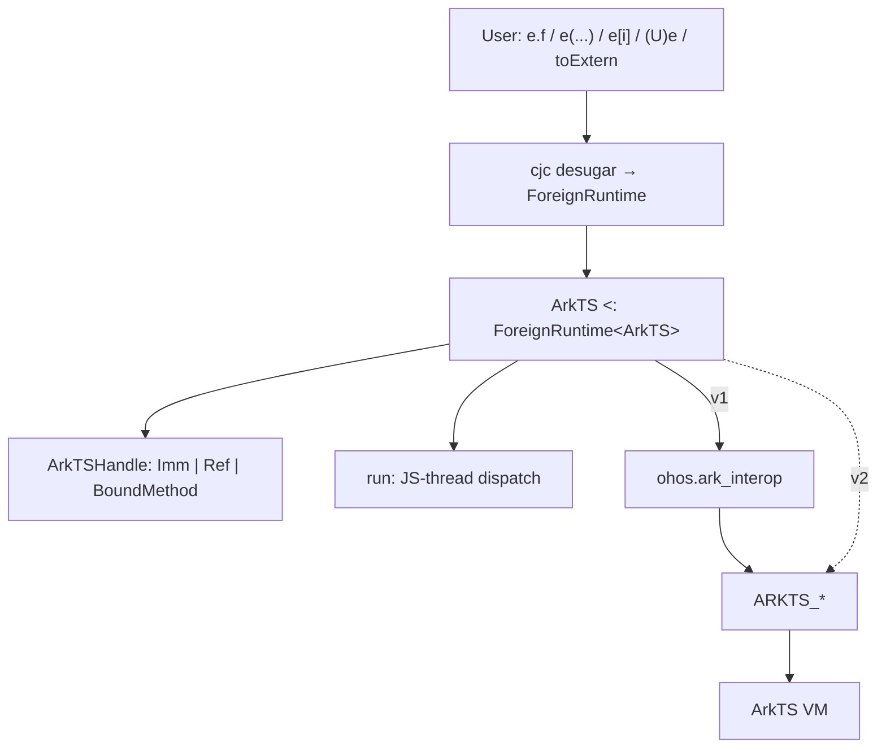
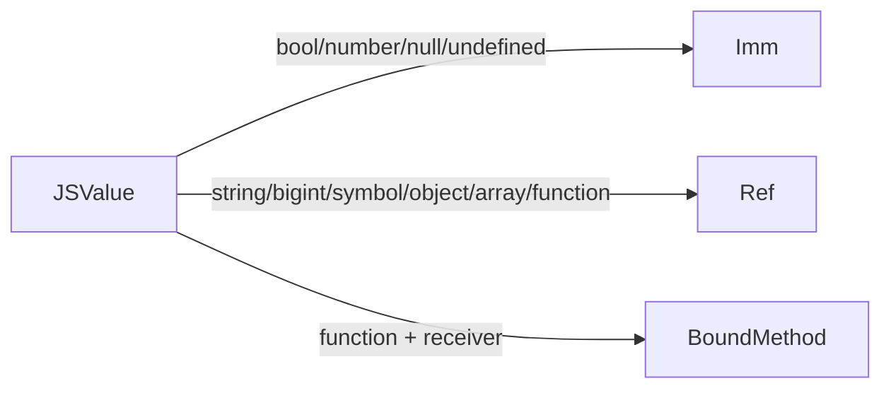
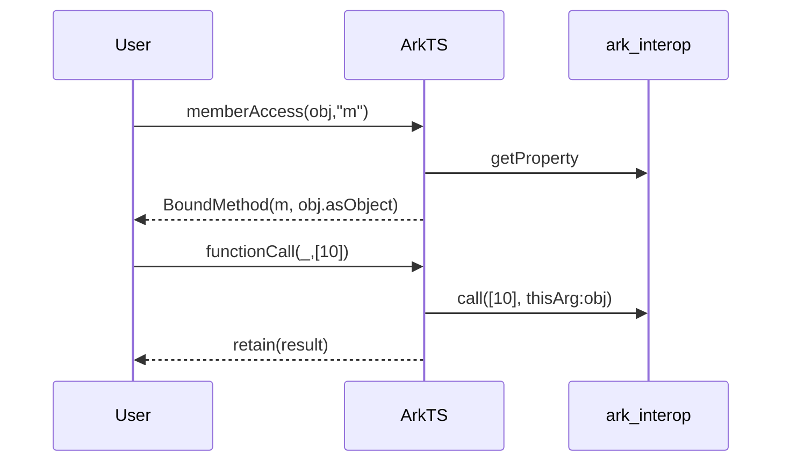

# ArkTS foreign runtime (v3 proposal)

Design of `ArkTS <: ForeignRuntime<ArkTS>`, as implemented in `arkTS.cj`.

**Background.** Cangjie’s `Extern<T>` is an opaque reference to a value that lives in a *foreign memory space* — memory managed by a different VM than Cangjie (here, the ArkTS/JS engine). The type parameter `T` must implement `ForeignRuntime<T>`; that interface is the set of static methods the compiler desugars dynamic syntax onto (`memberAccess`, `functionCall`, `toExtern`, …). This document is the ArkTS instance of that contract.

v1 sits on `ohos.ark_interop`; dynamic syntax is the existing Extern desugaring.

Throughout, code blocks are the actual `arkTS.cj` implementation (lightly trimmed), followed by an explanation. Nothing here uses invented shorthand.

---

## 1. Layering

User-facing dynamic syntax on `Extern<ArkTS>` never calls the VM directly. The compiler rewrites it to static `ForeignRuntime` methods on `ArkTS`. Those methods hold an internal handle (`ArkTSHandle`) and enter the JS engine only through the thread-safe `run` wrapper. v1 goes through `ohos.ark_interop`; v2 may call the `ARKTS_*` FFI directly.



```cangjie
ArkTS.bind(runtime)                    // once at entry
let api: Extern<ArkTS> = ...
let blob = api.createRectangle()
blob.width = 3.0
let a: Float64 = (Float64)blob.area()
```

In that snippet `api.createRectangle()` and `blob.width = …` are desugared `ForeignRuntime` ops; `(Float64)…` is a forced cast that desugars to `ArkTS.fromExtern<Float64>(…)`; assigning `3.0` where an `Extern` is expected desugars to `ArkTS.toExtern(3.0)`.

---

## 2. Context

`JSContext` is the ark_interop handle to one ArkTS/JS engine instance. `ArkTS` is a singleton runtime type: one process-wide context, installed once via `bind` at the Cangjie entry point that receives the host context. Every op reads it back through the private `context` property, which throws if `bind` was never called.

```cangjie
public class ArkTS <: ForeignRuntime<ArkTS> {
    private static var context_: ?JSContext = None

    public static func bind(context: JSContext): Unit {
        context_ = context
    }

    private static prop context: JSContext {
        get() {
            match (context_) {
                case Some(context) => context
                case None => throw Exception("ArkTS is not associated with a host JSContext")
            }
        }
    }
}
```

---

## 3. Thread dispatch

ArkTS FFI is *bind-thread-affine*: engine calls are only valid on the thread that bound the context (the JS thread). Every public op and helper therefore runs its engine work inside `run`, which looks synchronous to the caller no matter which Cangjie thread called it.

```cangjie
private static func run<T>(operation: () -> T): T {
    if (context.isInBindThread()) {
        return operation()                       // (a) already on JS thread: run inline
    }

    // (b) other thread: hand the work to the JS thread and block for its result
    let result = Box(None<ArkTSResult<T>>)
    let mutex = Mutex()
    let done: Condition
    synchronized(mutex) { done = mutex.condition() }

    context.postJSTask {
        let completed = try { ArkTSResult.Ok(operation()) }
                        catch (e: Exception) { ArkTSResult.Err(e) }
        synchronized(mutex) { result.value = Some(completed); done.notify() }
    }

    synchronized(mutex) {
        done.waitUntil({ => result.value.isSome() })
        match (result.value.getOrThrow()) {
            case Ok(value) => value              // return the JS-thread value, or…
            case Err(error) => throw error       // …rethrow the JS-thread exception here
        }
    }
}
```

Two cases:

- **(a) On the bind thread** — call `operation()` directly.
- **(b) Off the bind thread** — post `operation` with `postJSTask`, wait on a `Mutex`/`Condition`, and once the JS thread finishes, either return its value or rethrow the exception it captured. `ArkTSResult<T>` is the internal `Ok(T) | Err(Exception)` carrier used to move that outcome across threads.

---

## 4. Handle model

`Extern<T>` stores an opaque `payload: Any`. For ArkTS that payload is always an `ArkTSHandle`: the eager representation of one foreign value. “Eager” means the kind (immediate / heap / bound method) is decided the moment the value enters Cangjie, not deferred.

```cangjie
private enum ArkTSHandle {
    | Imm(JSValue)                          // undefined / null / boolean / number
    | Ref(JSHeapObject)                     // string / bigint / symbol / object / array / function / …
    | BoundMethod(JSFunction, JSHeapObject) // callable member + its receiver
}
```

| Variant | Holds | Why |
| --- | --- | --- |
| `Imm` | a `JSValue` | Immediates have no heap identity, so the value is stored as-is. |
| `Ref` | a `JSHeapObject` | Heap values are pinned as a process-global so they survive across calls. |
| `BoundMethod` | a `JSFunction` + its `JSHeapObject` receiver | A function read off an object, remembered together with the object to use as `this` on a later call. |

`JSValue` is ark_interop’s tagged engine value (an immediate, or a pointer into the heap). Three small helpers move between an `Extern`, its handle, and a `JSValue`:

```cangjie
// Extern<ArkTS> -> ArkTSHandle: read the payload back as a handle.
private static func handle(e: Extern<ArkTS>): ArkTSHandle {
    (Extern<ArkTS>.getPayload(e) as ArkTSHandle).getOrThrow()
}

// ArkTSHandle -> Extern<ArkTS>: wrap a handle as the opaque payload.
private static func extern(handle: ArkTSHandle): Extern<ArkTS> {
    Extern<ArkTS>(handle)
}

// ArkTSHandle -> JSValue: project a handle to a plain engine value for FFI.
private static func jsValue(handle: ArkTSHandle): JSValue {
    match (handle) {
        case Imm(value) => value
        case Ref(owner) => owner.toJSValue()
        case BoundMethod(function, _) => function.toJSValue()   // receiver dropped here; used only on call
    }
}
```

### Bringing engine values in: `retain`

`retain` is the single entry that turns a `JSValue` produced by the engine into an `Extern`. It inspects the value’s runtime type and picks the handle variant. An optional `receiver` (the object a function was read from) turns a function into a `BoundMethod`.

```cangjie
private static func retain(value: JSValue, receiver!: ?JSHeapObject = None): Extern<ArkTS> {
    if (value.isFunction()) {
        let function = value.asFunction()
        return match (receiver) {
            case Some(object) => extern(BoundMethod(function, object))  // remember `this`
            case None => extern(Ref(function))                         // plain function reference
        }
    }
    if (value.isArray())   { return extern(Ref(value.asArray()))  }
    if (value.isSymbol())  { return extern(Ref(value.asSymbol())) }
    if (value.isString())  { return extern(Ref(value.asString())) }
    if (value.isBigInt())  { return extern(Ref(value.asBigInt())) }
    if (value.isObject())  { return extern(Ref(value.asObject())) }
    extern(Imm(value))     // undefined / null / boolean / number: engine immediates
}
```

Read it top to bottom: functions (optionally bound), then array / symbol / string / bigint / object become `Ref` heap handles; everything left over (undefined, null, boolean, number) is an `Imm`.


---

## 5. Dynamic operations

These five methods are the `ForeignRuntime` hooks the compiler emits for dynamic surface syntax:

```cangjie
e.f       → memberAccess(e, "f")
e[i]      → indexedAccess(e, i)
e.f = v   → memberUpdate(e, "f", v)
e[i] = v  → indexedUpdate(e, i, v)
e(a, b)   → functionCall(e, [a, b])
```

### Member / index reads

A read projects the handle to a `JSValue`, fetches the property/element, and re-wraps the result with `retain`. If the fetched value is a function, `retain` is given the target object as receiver so the method stays bound.

```cangjie
public static func memberAccess(e: Extern<ArkTS>, field: String): Extern<ArkTS> {
    run {
        let target = jsValue(handle(e))
        let value = target.getProperty(field)
        if (value.isFunction()) {
            retain(value, receiver: target.asObject())   // bind receiver → BoundMethod
        } else {
            retain(value)
        }
    }
}

public static func indexedAccess(e: Extern<ArkTS>, index: Any): Extern<ArkTS> {
    run {
        let target = jsValue(handle(e))
        if (index is Int64) {
            retain(target.getElement((index as Int64).getOrThrow()))          // numeric element
        } else if (index is Int32) {
            retain(target.getElement(Int64((index as Int32).getOrThrow())))
        } else if (index is String) {
            let property = target.getProperty((index as String).getOrThrow()) // string key
            if (property.isFunction()) {
                retain(property, receiver: target.asObject())
            } else {
                retain(property)
            }
        } else if (index is Extern<ArkTS>) {
            let key = jsValue(handle((index as Extern<ArkTS>).getOrThrow())).asSymbol()  // Symbol key
            retain(target.getProperty(key))
        } else {
            throw Exception("Unsupported ArkTS index type")
        }
    }
}
```

So `indexedAccess` accepts three key shapes — an integer index, a `String` property name, or an `Extern` holding a JS `Symbol` — and rejects anything else.

### Member / index writes

Writes convert the right-hand side with `toJSValue` (§6) and store it through the same `JSValue` APIs. No new `Extern` is created.

```cangjie
public static func memberUpdate(e: Extern<ArkTS>, field: String, value: Any): Unit {
    run { jsValue(handle(e)).setProperty(field, toJSValue(value)) }
}

public static func indexedUpdate(e: Extern<ArkTS>, index: Any, value: Any): Unit {
    run {
        let target = jsValue(handle(e))
        let converted = toJSValue(value)
        if (index is Int64) {
            target.setElement((index as Int64).getOrThrow(), converted)
        } else if (index is Int32) {
            target.setElement(Int64((index as Int32).getOrThrow()), converted)
        } else if (index is String) {
            target.setProperty((index as String).getOrThrow(), converted)
        } else if (index is Extern<ArkTS>) {
            let key = jsValue(handle((index as Extern<ArkTS>).getOrThrow())).asSymbol()
            target.setProperty(key, converted)
        } else {
            throw Exception("Unsupported ArkTS index type")
        }
    }
}
```

### Call & receiver

Because `memberAccess` records the receiver, an extracted method keeps its `this` even if it is stored in a variable first — unlike bare JS, where `let x = obj.m; x()` loses the receiver.

```cangjie
a.m(10)           // MemberAccess → BoundMethod, then FuncCall → thisArg = a
let x = a.m; x()  // same BoundMethod; this preserved (≠ bare JS)
```

`functionCall` converts each argument with `toJSValue`, then dispatches on the handle variant:

```cangjie
public static func functionCall(e: Extern<ArkTS>, args: Array<Any>): Extern<ArkTS> {
    run {
        let converted = Array<JSValue>(args.size) { index => toJSValue(args[index]) }
        match (handle(e)) {
            case BoundMethod(function, receiver) =>
                retain(function.call(converted, thisArg: receiver.toJSValue()))     // call with saved this
            case Ref(owner) =>
                retain(owner.toJSValue().asFunction().call(
                    converted, thisArg: context.undefined().toJSValue()))           // plain function: this = undefined
            case Imm(_) =>
                throw Exception("Cannot call an ArkTS immediate value")             // numbers/booleans aren't callable
        }
    }
}
```

Example flow for `obj.m(10)`:



---

## 6. Conversions

Language rules (from the Extern design): a Cangjie value used where `Extern<ArkTS>` is expected desugars to `ArkTS.toExtern`; a forced cast `(U)e` on an `Extern` desugars to `ArkTS.fromExtern<U>(e)`. This section shows how ArkTS implements those two, plus the shared internal helper `toJSValue`.

### `toJSValue`: Cangjie value → `JSValue`

Bind-thread helper used wherever a Cangjie value must become a plain engine value (property/element sets, call args, and the core of `toExtern`). It matches on the *runtime* type of the input and builds the corresponding `JSValue` through `context`. It does **not** decide Imm vs Ref — that only happens later in `retain`.

```cangjie
private static func toJSValue(value: Any): JSValue {
    if (value is Extern<ArkTS>) {
        return jsValue(handle((value as Extern<ArkTS>).getOrThrow()))   // already foreign: reuse its handle
    }
    if (value is Bool)    { return context.boolean((value as Bool).getOrThrow()).toJSValue() }
    if (value is Int32)   { return context.number((value as Int32).getOrThrow()).toJSValue() }
    if (value is Int64)   { return context.number(Float64((value as Int64).getOrThrow())).toJSValue() }
    if (value is Float64) { return context.number((value as Float64).getOrThrow()).toJSValue() }
    if (value is String)  { return context.string((value as String).getOrThrow()).toJSValue() }
    if (value is BigInt)  { return context.bigint((value as BigInt).getOrThrow()).toJSValue() }
    // Arrays of the supported element types are converted element-by-element:
    if (value is Array<Int64>)         { return arrayJSValue((value as Array<Int64>).getOrThrow()) }
    if (value is Array<Float64>)       { return arrayJSValue((value as Array<Float64>).getOrThrow()) }
    if (value is Array<Bool>)          { return arrayJSValue((value as Array<Bool>).getOrThrow()) }
    if (value is Array<String>)        { return arrayJSValue((value as Array<String>).getOrThrow()) }
    if (value is Array<Extern<ArkTS>>) { return arrayJSValue((value as Array<Extern<ArkTS>>).getOrThrow()) }
    throw Exception("Unsupported conversion to ArkTS")
}
```

Notes:
- An existing `Extern<ArkTS>` is passed through by projecting its handle (no copy).
- `Int64` is widened to `Float64` because JS numbers are doubles.
- `arrayJSValue` maps each element through `toJSValue` and builds a `JSArray`; anything not listed throws.

### `toExtern`: Cangjie value → `Extern<ArkTS>`

The implicit-conversion hook. If the value is already an `Extern<ArkTS>`, return it unchanged; otherwise convert it to a `JSValue` and `retain` it (which is where the Imm/Ref decision is made).

```cangjie
public static func toExtern<R>(value: R): Extern<ArkTS> {
    run {
        if (value is Extern<ArkTS>) {
            return (value as Extern<ArkTS>).getOrThrow()   // pass-through
        }
        retain(toJSValue(value))                           // convert, then classify
    }
}
```

### `fromExtern`: `Extern<ArkTS>` → Cangjie type `R`

The forced-cast hook `(R)e`. It projects the handle to a `JSValue`, then reads it with the ark_interop reader that matches the **target type `R`**. Dispatching on a type parameter is done with the `match (None<R>)` idiom: `None<R>` is an `Option<R>`, and each `case _: Option<Bool>` etc. tests what `R` actually is at this instantiation. The result is a fresh Cangjie value; the original `Extern` is untouched.

```cangjie
public static func fromExtern<R>(e: Extern<ArkTS>): R {
    run {
        let value = jsValue(handle(e))
        match (None<R>) {
            case _: Option<Bool>    => (value.toBoolean() as R).getOrThrow()
            case _: Option<Int32>   => (Int32(value.toNumber()) as R).getOrThrow()   // read JS number, narrow to Int32
            case _: Option<Int64>   => (Int64(value.toNumber()) as R).getOrThrow()   // read JS number, narrow to Int64
            case _: Option<Float64> => (value.toNumber() as R).getOrThrow()
            case _: Option<String>  => (value.toString() as R).getOrThrow()
            case _: Option<BigInt>  => (value.toBigInt() as R).getOrThrow()
            case _: Option<Extern<ArkTS>> => (e as R).getOrThrow()                    // identity: no conversion
            case _ => throw Exception("Unsupported conversion from ArkTS")
        }
    }
}
```

Reading the cases: for `Bool`/`String`/`BigInt`/`Float64` the matching reader (`toBoolean` / `toString` / `toBigInt` / `toNumber`) is called directly. For `Int32`/`Int64` the JS value is read as a number (a double) and then narrowed to the integer type — this is the “integer narrowing” the old pseudocode mentioned. Casting `e` to `Extern<ArkTS>` is the identity case. Any other target type throws.

### Putting it together

```cangjie
let n: Extern<ArkTS> = 3.0          // toExtern(3.0) → retain(toJSValue(3.0)) → Imm
blob.width = n                      // memberUpdate → toJSValue(n) projects the handle
let s: String = (String)blob.name   // fromExtern<String> → value.toString()
```

---

## 7. Helpers

Extra ArkTS APIs that are **not** part of the desugared `ForeignRuntime` surface — value constructors, equality, object metadata, and module loading. Each still runs inside `run` for bind-thread safety, and each returns via `retain` when it produces a new foreign value.

```cangjie
public static func undefined(): Extern<ArkTS>  { run { retain(context.undefined().toJSValue()) } }
public static func null(): Extern<ArkTS>       { run { retain(context.null().toJSValue()) } }
public static func object(): Extern<ArkTS>     { run { retain(context.object().toJSValue()) } }
public static func symbol(description!: String = ""): Extern<ArkTS> {
    run { retain(context.symbol(description: description).toJSValue()) }
}

public static func strictEqual(lhs: Extern<ArkTS>, rhs: Extern<ArkTS>): Bool {
    run { jsValue(handle(lhs)).strictEqual(jsValue(handle(rhs))) }
}
public static func isNull(value: Extern<ArkTS>): Bool      { run { jsValue(handle(value)).isNull() } }
public static func isUndefined(value: Extern<ArkTS>): Bool { run { jsValue(handle(value)).isUndefined() } }
```

| API | Role |
| --- | --- |
| `undefined()` / `null()` / `object()` / `symbol(...)` | Construct a fresh JS value, then `retain` it. |
| `strictEqual(a, b)` | JS `===` on the two projected `JSValue`s. |
| `isNull` / `isUndefined` | Predicates on the projected `JSValue`. |
| `objectHasProperty` / `objectKeys` / `objectDefineOwnProperty` | Object metadata; `defineOwnProperty` converts its value with `toJSValue`. |
| `requireArkModule` / `requireSystemNativeModule` | Load a module, then `retain` the result. |

---

## 8. Lifetime (sketch)

Immediates need no disposal. Heap handles are held as engine globals and released when the owning Cangjie `Extern` is finalized. There is no scope-local `JSValue` mode in this design.

| Kind | Storage | Dispose |
| --- | --- | --- |
| `Imm` | engine immediate | none |
| `Ref` / `BoundMethod` | `JSHeapObject` global | finalizer → `ARKTS_DisposeGlobal` |
